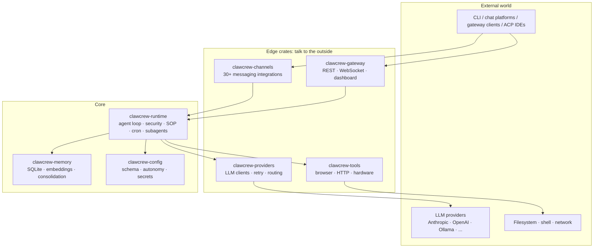
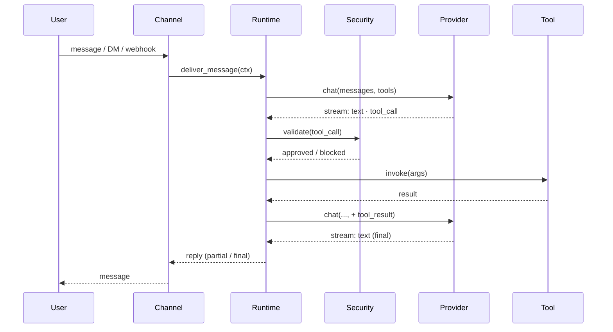

# Architecture Overview

ClawCrew is a layered Rust workspace. At the top is the agent runtime; below it are pluggable providers, channels, tools, and memory; supporting crates handle config, sandboxing, and hardware.

## High-level shape

## Crates in scope

| Crate | Role |
|---|---|
| `clawcrew-runtime` | Agent loop, security policy enforcement, SOP engine, cron scheduler, SubAgents, RPC layer for zerocode |
| `clawcrew-config` | TOML schema, secrets encryption, autonomy levels, workspace resolution |
| `clawcrew-api` | Public traits: `ModelProvider`, `Channel`, `Tool`, `Memory`, `Observer`, `RuntimeAdapter`, and `Peripheral`. The kernel ABI |
| `clawcrew-providers` | All LLM client impls (Anthropic, OpenAI, Ollama, ...) plus hint-based routing, retry, cooldown, and cross-profile fallback |
| `clawcrew-channels` | 30+ messaging integrations (Discord, Slack, Telegram, Matrix, email, voice, …) |
| `clawcrew-gateway` | HTTP / WebSocket gateway, web dashboard, webhook ingress |
| `clawcrew-tools` | Callable tool implementations the agent invokes (browser, HTTP, hardware probes) |
| `clawcrew-tool-call-parser` | Model-side tool-call syntax parsing and normalisation |
| `clawcrew-memory` | Conversation memory, embeddings, vector retrieval |
| `clawcrew-plugins` | Sandboxed WASM plugin host (WIT component model) |
| `clawcrew-hardware` | Hardware abstraction layer (GPIO, I2C, SPI, USB) |
| `clawcrew-infra` | Process-level support: SQLite session backend, debouncers, stall watchdog |
| `clawcrew-log` | The single log-emission surface: JSONL schema, attribution, `record!`/`scope!` macros, `/api/logs` reader, `Observer` bridge |
| `clawcrew-spawn` | Sanctioned `tokio::spawn` wrapper (`spawn!` macro) that propagates attribution |
| `clawcrew-macros` | Derive macros for config, tool registration |
| `zerocode` | Terminal UI |

The microkernel roadmap (RFC #5574) is actively splitting `clawcrew-runtime` further: the kernel layer will shrink to the agent loop and policy enforcement, with everything else moving behind feature flags.

## Request lifecycle (short)

Full detail: [Request lifecycle](./request-lifecycle.md).

## Core traits

Trait contracts live in `clawcrew-api`; the trait definitions in `crates/clawcrew-api/src/` are the source of truth for built-in providers, channels, tools, memory backends, and peripherals. For capabilities that should live outside the core binary, start with the [plugin guides](../plugins/index.md). The bullets below point to the closest adjacent docs.

- **`ModelProvider`**: use `custom` or an existing provider family for OpenAI-compatible endpoints; implement this trait when adding a new provider family, auth model, capability declaration, or wire protocol. See [Custom providers](../providers/custom.md).
- **`Channel`**: implement for a new messaging platform. Inbound and outbound are separate hooks. See [Channels overview](../channels/overview.md).
- **`Tool`**: implement for a new built-in agent capability. See [Tools overview](../tools/overview.md).
- **`Memory`**: implement for a memory backend that preserves agent/session scoping.
- **`Peripheral`**: implement for hardware boards and device surfaces. See [Hardware overview](../hardware/index.md).

Other public traits, including `Observer` and `RuntimeAdapter`, are lower-level contracts. Use the [architecture map](../contributing/architecture-map.md) and [RFC process](../contributing/rfcs.md) before changing them.

New implementations should stay behind the `clawcrew-api` trait contracts and wire through the owning factory, registry, or feature gate for that surface. RFC #5574 continues shrinking runtime implementation dependencies, so avoid adding new concrete runtime dependencies unless the design requires them.

## Where to read next

- [Crates](./crates.md): per-crate deep dive
- [Request lifecycle](./request-lifecycle.md): streaming, tool calls, approvals
- [Model Providers → Overview](../providers/overview.md)
- [Security → Overview](../security/overview.md)
