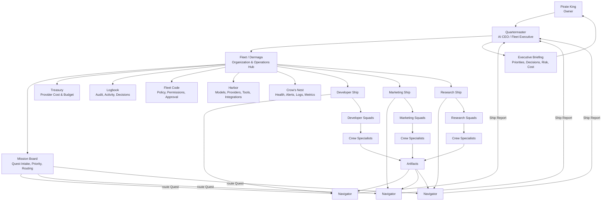

## 7. Fundamental Operating Model
## 7.1 Two intersecting hierarchies

### Organization hierarchy

```text
Fleet / Dermaga
└── Ship
    └── Squad
        └── Crew Member
            ├── Skills
            ├── Tool scope
            ├── Memory scope
            ├── Artifact contract
            └── Policy/budget boundary
```

### Work hierarchy

```text
Workspace
└── Project
    └── Quest
        └── Map
            └── Voyage
                └── Artifact
                    └── Discovery
                        └── Treasure
```

### Why Ship is not Workspace or Project

A Ship is not a project boundary and is not a Workspace.

> **A Ship is a persistent operational home for one specialist AI team.**

A Ship can serve many related Workspaces, Projects, and Quests as long as work is within its Charter, memory boundary, policy scope, and authority.

Examples:

```text
Workspace: Diezy Labs
Projects:
- Product launch
- Platform refactor
- Beta onboarding

Ships:
- Developer Delivery Ship
- Marketing Launch Ship
- Research Ship

Developer Delivery Ship can work on:
- Repository health
- CI triage
- PR impact review
- Refactor analysis
- Release readiness
- Documentation drift
```
## 7.2 Full operating diagram



---
## 8. Quartermaster: AI Executive
## 8.1 Definition

> Quartermaster is the user’s personal AI executive: a Fleet-level super-agent that understands Owner intent, coordinates Ships, receives reports, tracks cost and health, reads approved operational context, and brings important decisions back to the Owner.

Quartermaster is not merely a chat interface and not merely a parent agent that summarizes child-agent responses.

It has three responsibilities:

```text
Personal assistant
→ handles ordinary chat, planning, direct work, and ad-hoc artifacts.

Chief of staff
→ prioritizes objectives, turns intent into work plans, monitors progress, and escalates decisions.

Executive orchestrator
→ coordinates Fleet, Mission Board, Ships, Navigators, cost, health, policy, and cross-Ship work.
```
## 8.2 Quartermaster responsibilities

| Responsibility | Example |
|---|---|
| Goal intake | “Prepare our product launch next month.” |
| Strategic prioritization | Suggests whether release readiness or campaign planning should happen first |
| Ship recommendation | Proposes Marketing Ship when repeatable launch work appears |
| Quest routing | Routes release work to Developer Ship and campaign work to Marketing Ship |
| Executive briefing | Summarizes Ship reports into Owner-ready decisions |
| Artifact synthesis | Combines technical summary, research, and marketing artifacts into a launch brief |
| Cost visibility | Warns that weekly model budget is 82% consumed |
| Health interpretation | Explains that a GitHub permission issue is blocking CI analysis |
| Risk escalation | Requests approval before external write/publish/send action |
| Memory routing | Proposes whether a correction belongs to personal, Workspace, Ship, Squad, or Crew memory |
| Temporary delegation | Spawns bounded temporary research/analysis agents for one-off work |
| Organization learning | Reports recurring blockers, process gaps, or recommended Charter changes |
## 8.3 Executive authority, not unlimited authority

Quartermaster has broad situational awareness and orchestration authority, but narrow direct execution authority.

```text
Quartermaster can:
✓ Clarify goals and constraints
✓ Create plans and draft Quests
✓ Recommend Ships/Squads/Crew
✓ Route tasks and coordinate work
✓ Spawn bounded temporary agents
✓ Read permitted Artifact summaries, cost, health, and Logbook signals
✓ Create executive briefings and decision packets
✓ Propose memory, rules, budget, and policy changes
✓ Pause/cancel work within Owner-defined authority

Quartermaster cannot by default:
✕ Read raw secrets
✕ Access every raw memory object
✕ Send, publish, merge, deploy, delete, or pay externally
✕ Change Fleet Code without Owner confirmation
✕ Exceed budget caps
✕ Create unlimited Crew or Ships
✕ Share data between Ships without policy permission
```
## 8.4 Authority matrix

| Action | Pirate King | Quartermaster | Navigator | Crew Member |
|---|---|---|---|---|
| Define strategic goal | Final authority | Propose/clarify | Input | Input |
| Create Ship | Approve if capacity/cost impact | Propose/provision draft | Recommend | No |
| Activate Crew | Approve policy-impacting change | Validate/propose | Recommend | No |
| Create Quest | Override/final priority | Create/propose/route | Accept/plan | Receive task |
| Read Artifact | Full according to policy | Index/summary; full by grant | Relevant Ship artifacts | Own/relevant artifacts |
| Read raw logs | Full | Health summary and drill-down by policy | Relevant Ship scope | Own run scope |
| Read secret | Grant/revoke | Secret reference only | Scoped reference only | Scoped reference only |
| Run read-only work | Authorize by policy | Delegate | Coordinate | Execute |
| External write | Approve as policy requires | Request/route only | Prepare | Execute only after approval |
| Change Fleet Code | Final authority | Propose | Recommend | No |
| Change budget | Final authority | Forecast/propose | Request | No |
| Save memory/rule | Confirm scope | Propose | Propose | Propose |
| Delete data | Final authority | Request confirmation | Scoped request | No by default |

---
## 9. Ships, Navigators, Squads, and Crew
## 9.1 Ship definition

> A Ship is a persistent operational home for one specialist AI team. It contains a Navigator, one or more Squads, Crew Members, a Charter, scoped memory, skills, allowed tools, policy boundary, budget allocation, and Artifact history.

A Ship can accept many related Quests across multiple Projects and Workspaces.
## 9.2 Navigator definition

> Navigator is the Ship-level planner and orchestrator. It turns a routed Quest into a Map, selects the right Squad/Crew, controls sequencing and handoffs, manages Ship-level cost and policy, and produces a Ship Report for Quartermaster.

Navigator responsibilities:

1. Validate Quest fit against Ship Charter.
2. Estimate scope, required skills, cost, time, and policy constraints.
3. Build a Map before Crew begins work.
4. Delegate work to Squads/Crew using task contracts.
5. Collect Artifacts and manage quality/revision gates.
6. Escalate ambiguity, missing context, budget risk, or external action to Quartermaster.
7. Submit a Ship Report with status, evidence, discoveries, risk, cost, and recommendation.
## 9.3 Squad definition

A Squad is a functional group inside a Ship. Community may have one active Squad per Ship; Pro/Team can contain multiple Squads.

Examples:

```text
Developer Ship
├── Delivery Squad
├── CI Triage Squad
└── Release Squad

Marketing Ship
├── Research Squad
├── Content Squad
└── Brand Review Squad
```
## 9.4 Crew Member definition

A Crew Member is a persistent specialist, not merely a prompt or temporary sub-agent.

```text
Crew Member =
Role
+ skills
+ instructions
+ allowed tools
+ memory scope
+ artifact contract
+ quality checks
+ policy/approval rules
+ budget limits
+ model profile
+ evaluation fixtures
```
## 9.5 Example: Developer Ship Charter

```yaml
ship:
  name: Developer Delivery Ship
  purpose: Improve delivery quality, repository health, and release readiness.
  home_scope: engineering
  crew_capacity: 5
  supported_quest_types:
    - repository_health
    - ci_triage
    - pr_review
    - release_readiness
    - documentation_drift
    - refactor_analysis
  squads:
    - developer_delivery
  crew:
    - repository_analyst
    - engineering_planner
    - implementation_specialist
    - qa_risk_reviewer
    - docs_release_coordinator
  policies:
    read_only_default: true
    github_issue_create: approval_required
    pull_request_merge: denied
    deployment: denied
    secret_rotation: denied
  treasury:
    monthly_budget_usd: 25
    per_voyage_limit_usd: 2
  memory:
    scope: ship
    sharing: project_scoped
```
## 9.6 Example: Marketing Ship Charter

```yaml
ship:
  name: Marketing Launch Ship
  purpose: Research audiences, develop positioning, and prepare campaign assets.
  home_scope: marketing
  crew_capacity: 5
  supported_quest_types:
    - competitor_research
    - audience_research
    - positioning_strategy
    - content_calendar
    - content_draft
    - seo_review
  crew:
    - market_researcher
    - positioning_strategist
    - content_producer
    - seo_specialist
    - brand_reviewer
  policies:
    draft_only_default: true
    publishing: approval_required
    outbound_messaging: approval_required
  treasury:
    monthly_budget_usd: 20
    per_voyage_limit_usd: 2
```

---
