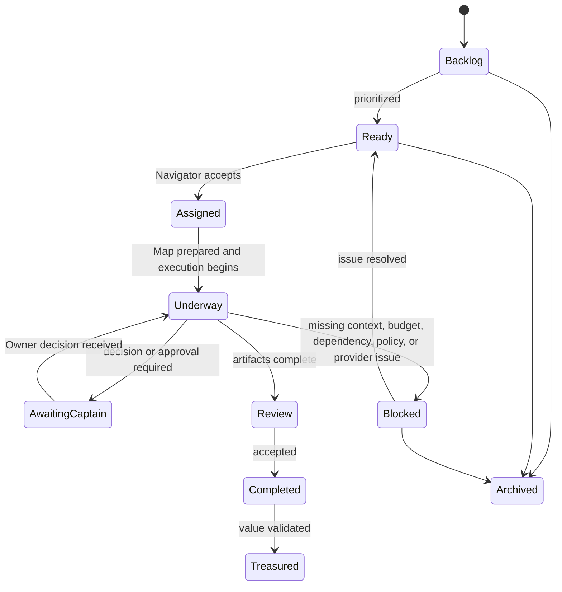
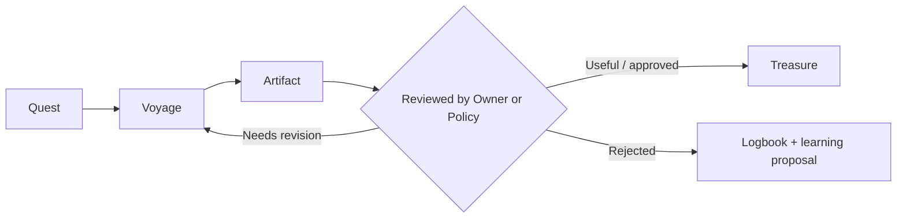

## 10. Mission Board and Quest System
## 10.1 Mission Board

Mission Board is not a simple to-do list. It is the Fleet-wide work queue and routing system.

It contains Quests from:

- Owner direct requests.
- Quartermaster proposals.
- Manual creation.
- Scheduled routines.
- Webhook/event triggers.
- Artifact follow-up recommendations.
- Recurring SOPs.
- Approval-resume events.

```text
Mission Board

Backlog
• Research competitor movement
• Prepare Q4 content plan
• Analyze repository health

Ready to Sail
• Prepare Release v1.4
• Draft product launch brief

Underway
• CI failure triage — Developer Ship
• Audience research — Marketing Ship

Awaiting Captain
• Approve GitHub issue draft
• Choose campaign positioning

Treasures Claimed
• Release Readiness Brief v1.3
• Approved Launch Campaign Direction
```
## 10.2 Quest structure

```text
Quest
├── Objective
├── Workspace and Project context
├── Trigger/source
├── Priority and deadline
├── Required Artifact contracts
├── Suggested Ship(s)
├── Fleet Code constraints
├── Budget allocation
├── Required approval gates
├── Map
├── Voyage history
├── Discoveries
└── Treasure definition
```
## 10.3 Quest lifecycle


## 10.4 Quest as living SOP

> A Quest is not a static task list. It is a living SOP that a Crew can run, review, improve, and repeat under Owner-defined rules.

Example:

```text
Quest: Prepare Release v1.4

Objective:
Prepare a complete release-readiness package.

Map:
1. Analyze merged changes.
2. Review CI and test status.
3. Identify release blockers.
4. Draft changelog.
5. Review documentation impact.
6. Produce release briefing.
7. Request Owner approval for external actions.

Assigned Ship:
Developer Delivery Ship

Artifacts:
- Release Change Summary
- CI & Test Evidence Brief
- Release Readiness Checklist
- Changelog Draft
- Documentation Impact Report

Treasure definition:
A reviewed release package with no unaddressed blockers,
or a documented go/no-go decision.

Fleet Code:
- No publishing, tagging, merging, or deployment without approval.
- Budget cap: US$2.00 per Voyage.
```

---
## 11. Maps, Voyages, Artifacts, Discoveries, and Treasures
## 11.1 Map

A Map is the visible route through a Quest.

It defines:

- Steps and dependencies.
- Assigned Ship/Squad/Crew.
- Input requirements.
- Tool/data access.
- Artifact contracts.
- Quality checkpoints.
- Approval gates.
- Budget/timeouts.
- Escalation conditions.
## 11.2 Voyage

A Voyage is one execution/run of a Quest or sub-Quest.

```text
Quest: Prepare Release v1.4
Voyage: Release v1.4 / 2026-09-28 / Run 03
```
## 11.3 Artifact

Artifacts are typed outputs with evidence, not transient chat responses.

Artifact examples:

- Repository Health Brief.
- CI Triage Report.
- Technical Design/ADR draft.
- Campaign Brief.
- Content Calendar.
- Release Readiness Checklist.
- Incident Timeline.
- Draft GitHub Issue.
- Decision Brief.

### Artifact contract example

```yaml
artifact:
  type: repository-impact-brief
  version: 1
  producer:
    ship: developer-delivery
    crew_member: repository-analyst
  purpose: Provide evidence and constraints for implementation planning.
  inputs:
    - repository_ref
    - branch
    - task_id
  findings:
    - summary
    - affected_areas
    - evidence_links
    - assumptions
    - unknowns
    - risks
  required_next_role:
    - engineering_planner
  quality_checks:
    - evidence_link_per_material_claim
    - unknowns_explicit
  policy:
    share_scope: ship_or_project_only
```
## 11.4 Discovery

A Discovery is a meaningful finding extracted from Artifact(s):

```text
Risk discovered:
CI timeout recurred three times in the integration suite.

Opportunity discovered:
Audience responds more strongly to ownership and control messaging.

Unknown discovered:
Release readiness cannot be confirmed because production migration status is missing.
```
## 11.5 Treasure

A Treasure is an Artifact, Discovery, decision, or outcome that has been validated as valuable by the Owner or an approved policy.



Treasure is not merely “task completed.” It means the work produced trusted value.

---
