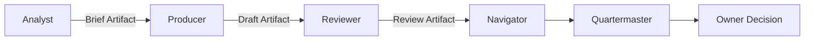
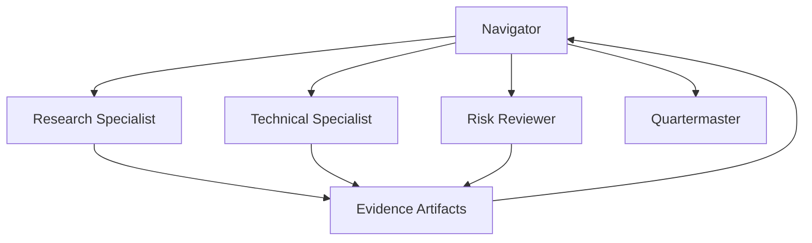
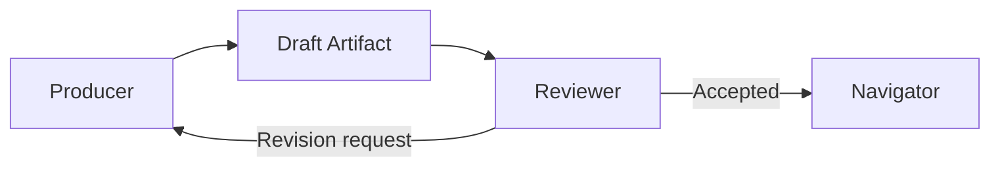
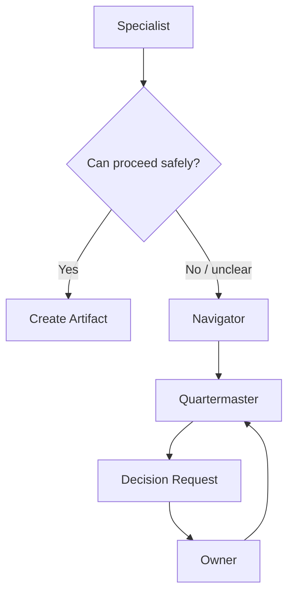
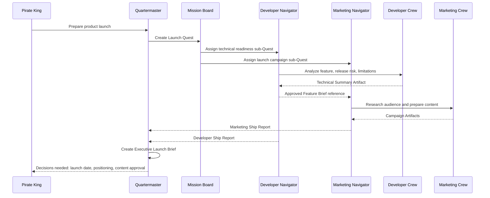
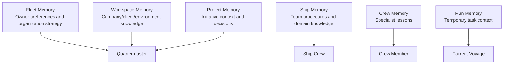
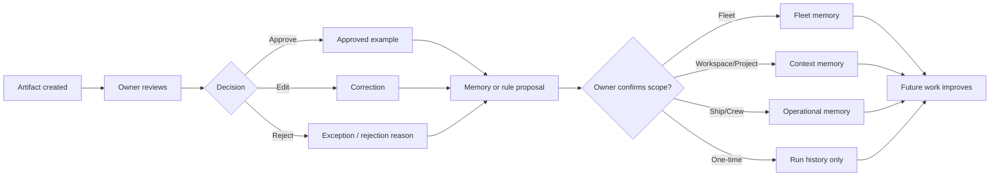

## 12. Inter-Agent Collaboration
## 12.1 Differentiation

The product’s core differentiation is not generic multi-agent delegation.

> **Persistent AI specialists collaborate through explicit Artifacts, controlled handoffs, quality gates, scoped memory, and shared objectives—not temporary sub-agents that only return a summary.**

Formula:

```text
Persistent roles
+ explicit artifacts
+ controlled handoffs
+ quality gates
+ scoped memory
+ approved learning
+ approval-gated action
= a real AI team, not a swarm of temporary agents
```
## 12.2 Collaboration patterns

### Sequential handoff



### Parallel investigation



### Producer-reviewer loop



Default rules:

- Maximum one or two revision cycles.
- Escalate to Quartermaster after the limit.
- Never allow endless agent-to-agent revisions.

### Owner escalation


## 12.3 Cross-Ship Quest example


## 12.4 Collaboration rules

- Use Artifact references, not unrestricted transcript forwarding.
- Share only the minimum context required by the next Ship/Squad/Crew.
- Cross-Ship memory sharing is blocked by default.
- Every delegation carries task ID, parent/child correlation, budget, timeout, allowed tools, and Artifact contract.
- Navigator controls Ship-level delegation; Crew Members do not recursively spawn unlimited agents.
- Default delegation depth for Community is one: Quartermaster/Navigator to Crew or temporary agent.

---
## 13. Memory and Learning Model
## 13.1 Learning principle

> The Fleet learns the Owner’s process through approved feedback—not through uncontrolled automatic self-modification.

Feedback may become:

- Personal preference memory.
- Workspace terminology/knowledge.
- Project decision record.
- Ship procedure/rule.
- Crew-specific lesson.
- One-time run note.
## 13.2 Memory hierarchy



| Scope | Example | Default access |
|---|---|---|
| Fleet | Owner preferences, global priorities, Fleet Code | Quartermaster; selectively summarized |
| Workspace | Client terminology, workspace documents, allowed integrations | Authorized Ships/Quartermaster |
| Project | Launch scope, milestone, decision history | Assigned Ship(s)/Quartermaster |
| Ship | Release conventions, reusable procedures, domain rules | Ship Crew; Quartermaster summary |
| Crew | Specialist lessons, quality patterns | Owning Crew; summary by policy |
| Voyage | Temporary task context | Relevant run only |
| Restricted | Sensitive people/finance/client data | Explicit policy/access grant only |
## 13.3 Proposed learning flow



Example UX:

```text
You changed the release brief.

What should the Developer Ship remember?

[ ] Always list blockers before recommended actions
[ ] Use this changelog structure for this project
[ ] Require evidence links for every risk
[ ] This was a one-time correction only

[Save proposed rule] [Not now]
```

---
