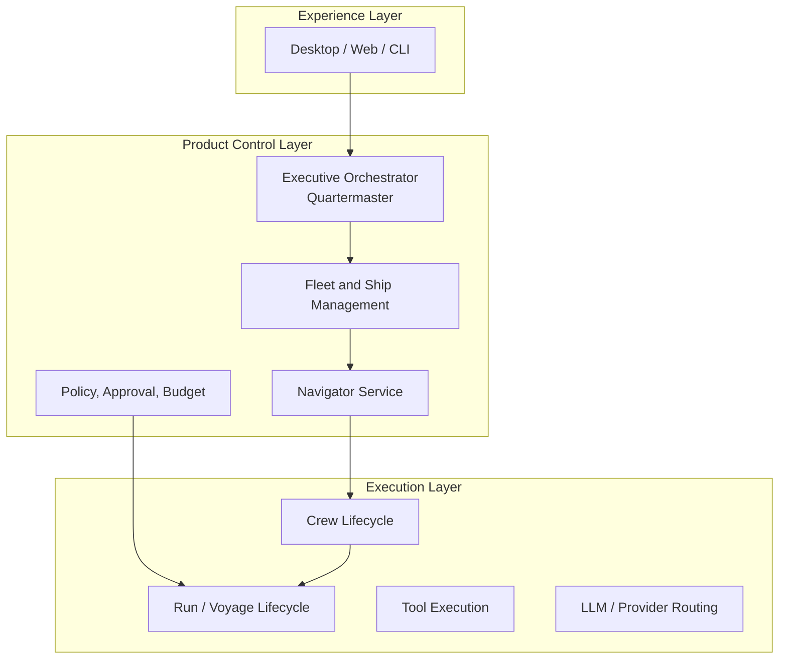

## 17. Technical Architecture
## 17.1 Existing repository fit & Separation of Concerns

Galleon maintains a strict separation of concerns across three primary technologies (Rust, Go, and React/Next.js) to maximize security, cognitive performance, and UI development speed:

1. **Host & Security Shield (Rust / Tauri)**
   - Responsible for OS Sandboxing (Linux Landlock, macOS Seatbelt).
   - Handles the native desktop application wrapper (Tauri).
   - Manages cryptographic tool receipts and local file system access.
   - *Why Rust?* Unmatched memory safety and low-level system access for running autonomous AI agents safely on local hardware.

2. **Cognitive Brain & Orchestration (Go Engine)**
   - Located in ngine/src/.
   - Runs the AI state machines (Quartermaster, Squads, Memory, LLM routing).
   - Acts as a local background daemon/service.
   - *Why Go?* Incredible concurrency (goroutines) for managing multiple agents simultaneously, fast compilation, and excellent cloud-native API capabilities.

3. **Visual Interface (React / Next.js / Tailwind)**
   - Responsible for the Web Dashboard and Desktop UI.
   - Consumes the API provided by the Go Engine.
   - Dual-compiled: Served via standard Web browser OR bundled inside the Rust Tauri webview for the desktop app.
   - *Why React?* Rapid UI development, rich ecosystem for building complex dashboards (Mission Board, Squad Builder).

The product extends these foundations rather than introducing a duplicate runtime.

## 17.2 Architectural layers



## 17.3 Canonical engine mapping & API Specs

To align with the existing Go code standards and structure in `engine/src/`, the following are the target interface and struct mappings for the new concepts.

```go
// [ ] Task: Define core domain interfaces and DTOs

package orchestrator

import "context"

// Quartermaster represents the product/application layer orchestrator
type Service interface {
    ProcessObjective(ctx context.Context, req ObjectiveRequest) (*ObjectiveResponse, error)
    CoordinateFleet(ctx context.Context, fleetID string) error
}

package fleet

// Fleet represents the aggregate control context
type Fleet struct {
    ID          string `json:"id"`
    OwnerID     string `json:"owner_id"`
    Name        string `json:"name"`
    ActiveShips []string `json:"active_ships"`
}

type Service interface {
    CreateFleet(ctx context.Context, req CreateFleetRequest) (*Fleet, error)
    GetFleet(ctx context.Context, id string) (*Fleet, error)
}

package ship

// Ship is a persistent operational team container
type Ship struct {
    ID          string `json:"id"`
    FleetID     string `json:"fleet_id"`
    CharterID   string `json:"charter_id"`
    SquadIDs    []string `json:"squad_ids"`
}

package mission

// Mission Board handles Quest queue/routing
type Quest struct {
    ID              string `json:"id"`
    Status          string `json:"status"` // backlog, ready, assigned, underway
    TargetShipID    string `json:"target_ship_id"`
    WorkflowID      string `json:"workflow_id"` // References existing workflow entity
}
```

## 17.4 Recommended bounded contexts

The following structure represents the desired layout in `engine/src/`. 
Tasks for scaffolding the new packages:

```text
engine/src/
├── orchestrator/       # [ ] Task: Scaffold Quartermaster implementation
├── fleet/              # [ ] Task: Scaffold Fleet aggregate
├── ship/               # [ ] Task: Scaffold Ship container
├── squad/              # [ ] Task: Scaffold Squad blueprint instantiation
├── charter/            # [ ] Task: Scaffold Charter definitions
├── mission/            # [ ] Task: Scaffold Mission Board intake/routing
├── navigator/          # [ ] Task: Scaffold Navigator planning
├── briefing/           # [ ] Task: Scaffold Ship reports & discoveries
├── policy/             # [ ] Task: Scaffold Authorization & risk class
├── approval/           # [ ] Task: Scaffold Approval lifecycle
├── treasury/           # [ ] Task: Scaffold Budget, cost, forecast
├── audit/              # [ ] Task: Scaffold Logbook audit event layer
├── entitlement/        # [ ] Task: Scaffold Capacity definitions
├── schedule/           # [ ] Task: Scaffold Routine triggers
├── integration/        # [ ] Task: Scaffold Webhook normalization
├── crew/               # (existing; extend, do not duplicate)
├── run/                # (existing; extend, do not duplicate)
├── workflow/           # (existing; extend, do not duplicate)
├── task/               # (existing)
├── tool/               # (existing)
├── llm/                # (existing)
├── memory/             # (existing)
├── artifact/           # (existing)
└── persistence/        # (existing)
```

## 17.5 Clean architecture rules

- [ ] Task: Enforce that Orchestrator calls narrow application ports/interfaces.
- [ ] Task: Ensure Policy decides action allowance before tool execution.
- [ ] Task: Implement Artifact references for handoffs instead of raw transcript sharing.
- [ ] Task: Plumb `correlation_id` across Quest, Voyage, Artifact, and Ship Report for tracing.
- [ ] Task: Implement race tests for all new bounded contexts.

---
## 18. Safety, Governance, and Autonomy
## 18.1 Risk tiers

The Risk tiers should be mapped to the `tool` and `policy` packages in Go.

```go
package policy

// RiskClass defines the danger level of a tool or action
type RiskClass string

const (
    RiskClassReadOnly    RiskClass = "read_only"
    RiskClassDraft       RiskClass = "draft"
    RiskClassWrite       RiskClass = "write"
    RiskClassSensitive   RiskClass = "sensitive"
    RiskClassDestructive RiskClass = "destructive"
)
```

## 18.2 Fleet Code example

```go
// [ ] Task: Implement Fleet Code constraints in the Policy Engine
type FleetCode struct {
    RequireApprovalForWrite bool `json:"require_approval_for_write"`
    MaxWeeklySpendUSD       float64 `json:"max_weekly_spend_usd"`
    CrossShipMemorySharing  bool `json:"cross_ship_memory_sharing"` // Default: false
}
```

## 18.3 Community guardrails

```go
// [ ] Task: Implement Community guardrails in the Entitlement package
var CommunityEntitlement = Entitlement{
    MaxActiveShips:       1,
    MaxCrewPerShip:       5,
    MaxConcurrentVoyages: 2,
    MaxDelegationDepth:   1,
}
```

## 18.4 Approval binding

Approval must bind to the exact intended action. Any change invalidates the approval.

```go
package approval

// ActionDigest creates a cryptographic or deterministic hash of the intended action
// [ ] Task: Implement ActionDigest generation and validation
type ActionDigest struct {
    PolicyVersion   string `json:"policy_version"`
    Identity        string `json:"identity"` // Fleet/Ship/Crew ID
    ToolName        string `json:"tool_name"`
    TargetResource  string `json:"target_resource"`
    RedactedArgs    string `json:"redacted_args"`
    CredentialScope string `json:"credential_scope"`
}
```
