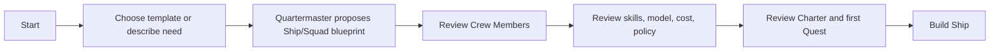

## 7. Core Screen Specifications

## 7.1 Quartermaster Office

### Purpose

The home screen and main conversation surface. It combines direct assistance, executive briefing, Mission Board context, pending decisions, and visible Fleet health.

### Desktop layout

```text
┌──────────────────────────────────────────────────────────────────────────────┐
│ Context bar: Realm › Fleet › Workspace › Project               ⌘K  Profile   │
├───────────────┬───────────────────────────────────────────────┬─────────────┤
│ Navigation    │ Quartermaster conversation / executive canvas │ Fleet pulse │
│               │                                               │             │
│ COMMAND       │ Good evening, Pirate King.                    │ Treasury    │
│ Quartermaster │ What should your Fleet accomplish next?       │ $3.84/$8.00│
│ Mission Board │                                               │             │
│ Artifacts     │ [Composer: Ask / create quest / attach files]│ Approvals 1 │
│ Approval (2)  │                                               │             │
│               │ Suggested starts                              │ Ship health │
│ FLEET         │ [Prepare release] [Analyze repo] [New Quest] │ 2 healthy   │
│ Ships         │                                               │ 1 attention │
│ Crew          │ Executive briefing                            │             │
│ Workspaces    │ • Release blocker needs review                │ Quick links │
│               │ • 3 artifacts ready                           │ Developer  │
│ OPERATIONS    │ • Weekly cost forecast within budget          │ Mission Bd │
│ Treasury      │                                               │ Logbook    │
│ Logbook       │ Recent artifacts                              │             │
│ Harbor        │ [Repository Health Brief] [CI Triage] ...     │             │
└───────────────┴───────────────────────────────────────────────┴─────────────┘
```

### Components

| Component | Behavior |
|---|---|
| Executive greeting | Changes based on local time, but remains concise and not overly role-played |
| Command composer | Supports normal chat, `/quest`, file attachment, context mention, Ship mention, Artifact reference |
| Suggested starts | Three to four context-aware actions; never generic “try anything” cards after onboarding |
| Executive briefing | Highest-priority decisions, blockers, cost/health risks, and completed outcomes |
| Recent Artifacts | Shows durable work outputs, not only chat history |
| Fleet Pulse | Compact right rail for Treasury, approval count, Ship health, active Voyages |
| Quick actions | Create Quest, Make Me a Squad, Connect Harbor, Review Approval |

### Chat-to-work actions

Every assistant response should expose relevant actions:

```text
[Save as Artifact]
[Create Quest]
[Assign to Ship]
[Ask a temporary agent]
[Remember this]
[Share to Mission Board]
```

### Empty state

```text
Welcome, Pirate King.

Quartermaster is ready to help you command your first Fleet.
Start with a goal, connect a model provider, or build your first Ship.

[Describe a goal] [Connect intelligence] [Build first Ship]
```

## 7.2 Mission Board

### Purpose

Fleet-wide work intake, priority, routing, and lifecycle visibility.

### Layout

```text
┌──────────────────────────────────────────────────────────────────────────────┐
│ Mission Board                                           [+ New Quest] Filter │
│ All Quests in your Fleet — prioritize work, route it to Ships, review it.    │
├──────────────┬────────────────┬────────────────┬──────────────┬─────────────┤
│ Backlog      │ Ready to Sail  │ Underway       │ Awaiting You │ Treasures   │
│              │                │                │              │             │
│ Quest cards  │ Quest cards    │ Voyage cards   │ Approval/    │ Validated   │
│              │                │ with progress  │ decision     │ outcomes    │
│              │                │                │ cards        │             │
└──────────────┴────────────────┴────────────────┴──────────────┴─────────────┘
```

### Quest card

```text
Prepare Release v1.4                                      High priority
Product Platform · Developer Ship suggested

Goal
Prepare a complete release-readiness package.

Required
3 Artifacts · Budget US$2.00 · Approval for external write

Status
Ready to Sail

[View Map] [Assign Ship] [Set Sail]
```

### Detail panel

Selecting a Quest opens a right panel, not a separate page by default:

```text
Quest Summary
- Objective
- Workspace / Project
- Suggested Ship and why
- Map preview
- Required Artifacts
- Fleet Code constraints
- Budget
- Dependencies
- Activity timeline
- Decisions / approvals
```

### Board behavior

- Drag-and-drop is optional and never the only interaction.
- Status transitions obey state machine/policy; moving a Quest cannot bypass approval or routing constraints.
- Filtering: Ship, Workspace, Project, priority, status, owner, date, risk, cost threshold.
- Keyboard users can create, route, and update a Quest without drag-and-drop.

## 7.3 Ship Overview

### Purpose

The operational home for a persistent specialist AI team.

### Layout

```text
┌──────────────────────────────────────────────────────────────────────────────┐
│ Developer Ship                                         [Run Quest] [•••]     │
│ Persistent specialist team for delivery quality and release readiness.       │
│ Charter: Read-first · GitHub issue requires approval · Budget $25/month     │
├───────────────────────────────┬──────────────────────────────────────────────┤
│ Ship status                   │ Navigator briefing                            │
│ • Navigator: active           │ “2 Quests underway. One CI blocker needs      │
│ • Crew: 3 / 5                 │  your decision before release work continues.” │
│ • Voyages: 1 active           │ [Review blocker] [Open Mission Board]         │
│ • Treasury: $4.10 / $25       │                                              │
├───────────────────────────────┼──────────────────────────────────────────────┤
│ Crew Members                  │ Active Quests                                 │
│ cards with role/status        │ quest list / progress / latest artifact       │
├───────────────────────────────┼──────────────────────────────────────────────┤
│ Latest Artifacts              │ Charter & capabilities                         │
│ artifact cards                │ accepted quest types / skills / policy summary │
└───────────────────────────────┴──────────────────────────────────────────────┘
```

### Tabs

```text
Overview | Crew | Quests | Artifacts | Charter | Memory | Voyages | Settings
```

### Charter panel

Use a readable, not YAML-first, view:

```text
What this Ship does
Maintain delivery quality, repository health, and release readiness.

Accepted Quests
Repository health · CI triage · PR review · Release readiness

Crew authority
Read repository and run tests. External write requires approval.

What this Ship cannot do
Merge code · deploy software · rotate credentials.

[View advanced Charter manifest]
```

## 7.4 Make Me a Squad / Build a Ship Wizard

### Purpose

Transform an intention into a reviewable Ship/Squad blueprint without forcing user to manually configure agents from scratch.

### Flow



### Step 1: intent

```text
Build a Ship

How would you like to start?

[ Developer Delivery ]
Repository health, CI triage, release readiness.

[ Marketing Launch ]
Audience research, content drafts, SEO review.

[ Research & Decision ]
Evidence gathering, comparisons, decision briefs.

[ Describe what you need ]
Tell Quartermaster the outcome you want.

[ Advanced: Start from a blank Charter ]
```

### Step 2: Quartermaster proposal

```text
Recommended Ship
Developer Delivery Ship

Why this Ship?
You want to keep a repository healthy and prepare releases safely.

Suggested Crew
1. Repository Analyst
2. Engineering Planner
3. QA & Risk Reviewer

Estimated capacity
• 3 persistent Crew berths
• 2 parallel Voyages max on Community
• Recommended monthly provider budget: US$10–25

[Customize] [Continue]
```

### Step 3: Crew review

Each Crew card shows:

```text
Repository Analyst

Purpose
Maps repository structure, evidence, and delivery risks.

Skills
Repository analysis · documentation review · dependency mapping

Tools
Repository read · local files · GitHub read

Model profile
Balanced Engineering Model

Memory
Ship-scoped, reviewable, proposed learning

Authority
Read-only

[Edit] [Replace] [Remove]
```

### Step 4: Charter / Fleet Code

```text
How should this Ship operate?

Quality
○ Fast
● Balanced (recommended)
○ Highest quality

External actions
● Ask before any external change
○ Draft only — never act externally
○ Advanced policy configuration

Learning
● Propose lessons for approval
○ Remember automatically within Ship
○ Keep no persistent learning

Budget
Per Voyage: $2.00     Monthly: $25.00
```

### Step 5: confirmation

```text
Your Ship is ready to build.

Developer Delivery Ship
• 3 Crew Members
• Read-first Charter
• $25 monthly Treasury budget
• First Quest: Repository Health Check

[Build Ship and start first Quest]
```

## 7.5 Crew Members

### Purpose

Manage persistent specialists across Ships.

```text
Crew Members                                         [+ Make Me a Squad]

Search Crew                                 Filter: All Ships · Active

Developer Ship
• Repository Analyst             Active      Last Voyage: 12m ago
• Engineering Planner            Active      Last Artifact: Plan & Risk Brief
• QA & Risk Reviewer             Active      Needs review: 1

Marketing Ship
• No Crew yet                    [Build Marketing Ship]
```

### Crew detail drawer

- Role and purpose.
- Current Ship/Squad.
- Skills.
- Model/provider profile.
- Tool scope.
- Memory summary and edit history.
- Recent Artifacts.
- Cost/usage snapshot.
- Policy/approval boundary.
- Pause, archive, duplicate, replace controls.

## 7.6 Artifact Gallery

### Purpose

Make outcomes discoverable, durable, reviewable, exportable, and shareable.

### Layout

```text
Artifacts

[Search artifacts] [Filter: Ship | Quest | Type | Status | Date]

Featured / Needs Review
┌──────────────────────────┐ ┌──────────────────────────┐
│ Release Readiness Brief  │ │ Repository Health Brief  │
│ Developer Ship           │ │ Developer Ship           │
│ Needs Owner review       │ │ Treasure claimed         │
│ 12 evidence sources      │ │ Updated 2h ago           │
└──────────────────────────┘ └──────────────────────────┘

Recent
[Artifact list with status, source, Ship, Quest, cost, and review state]
```

### Artifact detail

```text
Release Readiness Brief
Prepared by Developer Ship · Coordinated by Quartermaster
Quest: Prepare Release v1.4

Status: Needs review
Evidence: 12 sources
Voyage cost: US$0.62

Summary
[Executive summary]

Discoveries
• CI timeout recurred in integration suite
• Documentation lacks migration note
• Release candidate is otherwise ready

Evidence
[Linked sources / run artifacts / trace references]

Decision request
Approve a GitHub issue draft for the CI blocker?

[Approve] [Edit] [Request revision] [Mark as Treasure] [Export]
```

## 7.7 Captain’s Approval

### Purpose

A calm, focused review surface for external side effects.

```text
Captain’s Approval
Review actions before they affect external systems.

Pending (2)

Create GitHub issue
Developer Ship · Release Readiness Quest

Target
 diezy-labs/claw-crew

Action
 Create draft issue: “Investigate integration-test timeout”

Why now
 Repeated across 3 Voyages; blocks release readiness.

Effect
 Creates one issue. Does not modify source code, merge, deploy, or notify external users.

Cost
 No additional provider call required.

[Approve action] [Edit draft] [Reject] [Always ask for similar actions]
```

Approval UX must never use game vocabulary alone. `Captain’s Approval` always includes the explanatory subtitle and clear impact statement.

## 7.8 Treasury

### Purpose

Make BYOK/BYOM cost transparent without resembling a credit store.

```text
Treasury
Provider Cost & Budget

This month
US$4.10 spent of US$25.00 Ship budget
████████░░░░░░░░░░░░ 16%

Cost by Ship
Developer Ship      $3.22
Research Ship       $0.88

Cost by Quest
Release Readiness   $0.62
Repository Health   $0.41

Recommendations
• Use the economical model for recurring repository summaries.
• Current schedule is projected to stay within monthly budget.

[Set budget] [View usage ledger] [Manage provider profiles]
```

Rules:

- Never call costs “credits” unless they are actual external provider credits owned by user.
- Do not encourage unnecessary usage through streaks or progress gimmicks.
- Show estimated vs actual distinctly.
- Model/provider cost must be attributable to Ship, Quest, and Voyage where possible.

## 7.9 Logbook

### Purpose

Human-readable audit/activity history.

```text
Logbook
Audit & Activity History

Today
• Quartermaster routed “Prepare Release v1.4” to Developer Ship
• Repository Analyst completed Repository Health Brief
• QA Reviewer flagged repeated CI timeout
• Captain’s Approval requested for GitHub issue draft
• Owner approved Ship learning rule: “Show blockers first”

[Filter] [Export] [Open technical trace]
```

Detail history should expose:

- Actor: Owner / Quartermaster / Navigator / Crew Member / system.
- Entity: Quest / Voyage / Artifact / Ship / policy / integration.
- Action/outcome.
- Timestamp.
- Correlation link.
- Technical trace shortcut only for authorized/advanced users.

## 7.10 Harbor

### Purpose

Connect model providers, local endpoints, tools, integrations, channels, and data sources.

```text
Harbor
Connect the intelligence and tools your Fleet can use.

Intelligence
• Anthropic — connected — default: Claude Sonnet
• OpenAI-compatible local endpoint — connected
• Ollama — available locally

Work connections
• GitHub — connected to Developer Ship
• Local workspace files — enabled
• Webhooks — 1 active route

[Connect provider] [Connect tool] [Manage scopes]
```

Provider selection belongs in Harbor but the user can quickly change a model profile contextually from a Ship, Crew, or Quest.

## 7.11 Fleet Code

### Purpose

Readable governance system, not raw policy syntax by default.

```text
Fleet Code
Policies, permissions, and safety rules

External actions
• Require Owner approval before publishing, sending, merging, deploying, or deleting.

Data boundaries
• Crew Members may only access memory assigned to their Ship or Quest.

Treasury
• Pause work that exceeds a Voyage hard cap of US$2.00.

Learning
• All persistent learning requires an Owner-approved proposal.

[Edit policy] [View policy history] [Open advanced policy editor]
```

## 7.12 Crow’s Nest

### Purpose

Advanced technical monitoring and recovery.

```text
Crow’s Nest
Fleet Health & Technical Monitoring

Overview
• Gateway healthy
• 1 provider warning
• 0 failed scheduled Quests in last 24h
• GitHub integration token expires in 14 days

Panels
[Health] [Runs] [Logs] [Metrics] [Traces] [Provider Health] [Recovery] [Doctor]
```

This surface consolidates existing Logs, Metrics, Doctor, Recovery, Provider Health, Sessions Health, and related operational pages.

---

