# Claw Crew Community Control Plane — PRD, Technical Specification, API Specification, C4, and Implementation Plan

> Status: Proposed implementation specification
>
> Branch assessed: `main`
>
> Repository: `diezy-labs/claw-crew`
>
> Date: 28 September 2026
>
> Scope: Community control plane and commercial-ready foundations for **1 Ship / 5 active Crew Slots**.

---

## 1. Purpose and Decision Summary

This document turns the Community, pricing, governance, and monetization strategy into an implementation-ready technical plan. It is intentionally aligned with the current repository rather than proposing a parallel agent runtime.

### Product decision

**Claw Crew Community** is a self-hosted product tier with:

- One active Ship.
- Up to five active Crew Slots.
- Two concurrent Missions.
- Five active schedules.
- Three active webhook endpoints.
- Bring-your-own model provider/API key.
- Local-first persistence, basic policy, approval, budget controls, audit events, and kill switch.

A **Ship** is the operational boundary for configuration, Crew, policy, integrations, budget, audit, memory scopes, queues, and future billing/entitlements. A **Crew Slot** is one enabled agent configuration with a role, instructions, tool scope, memory scope, budget, and policy reference.

### Architecture decision

Do **not** create a second runtime or duplicate existing domains. The repository already contains:

- A Rust workspace with runtime, gateway, API, memory, providers, plugins, tools, SOP graph, channels, relay, and deployment layers.
- A Go engine with cleanly separated `app`, `cmd`, `core`, `pkg`, and `src` layers.
- Existing Go bounded contexts for `crew`, `run`, `workflow`, `task`, `tool`, `llm`, `memory`, `artifact`, and `persistence`.
- Existing dependency injection through Google Wire, and existing core modules for configuration, errors, IDs, interceptors, logging, metrics, and tracing.

The proposed control-plane capability must be implemented as incremental bounded contexts in `engine/src`, with reusable cross-cutting facilities in `engine/core`, and composition only in `engine/app`. It must not be implemented as a new `engine/common`, `engine/utils`, god service, or cross-domain import graph.

---

## 2. Repository Assessment and Non-Redundancy Rules

### 2.1 Existing implementation structure

The Go engine currently uses the following layout:

```text
engine/
├── app/                         # Application composition and Wire generation
├── cmd/                         # Process entrypoints
├── core/
│   ├── config/                  # Configuration
│   ├── errors/                  # Shared error semantics
│   ├── id/                      # Identifier generation
│   ├── interceptors/            # Cross-cutting interception
│   ├── logger/                  # Logging
│   ├── metrics/                 # Metrics
│   └── tracing/                 # Tracing
├── pkg/                         # Public/reusable adapters only when justified
└── src/
    ├── artifact/                # Artifact domain
    ├── crew/                    # Crew lifecycle and delivery
    ├── llm/                     # Model interaction
    ├── memory/                  # Memory domain
    ├── persistence/             # Disk store implementation
    ├── run/                     # Run lifecycle and delivery
    ├── task/                    # Task domain
    ├── tool/                    # Tool domain
    └── workflow/                # Workflow domain
```

Observed conventions that must be retained:

- Each domain has focused files such as `dto.go`, `interfaces.go`, `services.go`, `delivery.go`, and `wire.go`.
- Tests live beside the domain implementation.
- Existing crew coverage includes state-machine, ordering, idempotency, cancellation propagation, concurrent finalization, and stress tests.
- Existing run/workflow modules have service, DTO, delivery, interfaces, wire, and tests.
- Composition uses Google Wire through `engine/app/wire.go` and generated `wire_gen.go`.
- `engine/core` is reserved for true cross-cutting concerns; business concepts do not belong there.

### 2.2 Existing domains to extend, not duplicate

| Existing domain | Existing responsibility | Proposed usage |
|---|---|---|
| `src/crew` | Crew lifecycle, delivery, state behavior, idempotency/concurrency tests | Add Ship association, active/inactive status, policy/budget/memory references; retain lifecycle ownership here |
| `src/run` | Mission/run lifecycle and contracts | Add Ship quota checks, approval wait state/reason, policy decision references, budget/cost summary |
| `src/workflow` | Workflow definition and execution coordination | Keep workflow definition/execution here; attach Ship scoping and policy references rather than creating another workflow engine |
| `src/task` | Task-level work units | Keep task orchestration here; do not duplicate task state in `mission` package |
| `src/tool` | Tool execution and contracts | Enforce authorization through a policy decision before existing tool invocation |
| `src/llm` | Provider/model interaction | Consume budget/routing inputs; do not create a second provider abstraction |
| `src/memory` | Memory handling | Add Ship/Crew scoping via metadata/interface extensions; do not create duplicate long-term memory store |
| `src/persistence` | Local disk persistence | Extend with repositories/serialization or introduce storage adapters without replacing existing disk behavior |
| `core/interceptors` | Cross-cutting execution interceptors | Use for observability/correlation and possibly authorization interception where it remains generic |
| `core/metrics`, `core/tracing`, `core/logger` | Operational visibility | Emit standardized events/metrics from new contexts |

### 2.3 New bounded contexts

Create only the following new business domains:

```text
engine/src/
├── ship/                        # Ship aggregate, quotas, membership, lifecycle
├── policy/                      # Authorization, risk classification, approval policy
├── approval/                    # Approval requests and decisions
├── schedule/                    # Schedule registration/triggering; no workflow duplication
├── audit/                       # Append-only audit event model and query service
├── entitlement/                 # Tier limits and license entitlement abstraction
└── integration/                 # Webhook registration/inbound event normalization
```

These contexts exist because the current engine has no explicit Ship boundary, policy/approval state, entitlement/limits, audit log, or schedule/webhook control-plane domain. They should call existing crew/run/workflow/tool services through interfaces, not own their internal state.

### 2.4 Dependencies and clean-code rules

Allowed dependency direction:

```text
cmd -> app -> delivery/application services -> domain interfaces -> infrastructure adapters
                     ↓
                 core facilities
```

Rules:

1. `src/ship` must not import concrete implementations from `src/crew`, `src/run`, or `src/persistence`; it depends on interfaces.
2. `src/policy` must produce a decision. It must not invoke a concrete tool directly.
3. `src/approval` owns approval lifecycle only. It does not reimplement Run lifecycle.
4. `src/audit` records immutable events and exposes query ports. It must not become a general event bus.
5. `src/entitlement` owns tier limits. Quota enforcement occurs at domain entry points via ports/interceptors.
6. `src/schedule` triggers a workflow/run through a port; it does not contain workflow execution business logic.
7. `delivery.go` owns HTTP/transport concerns; `services.go` owns application use cases; `dto.go` contains request/response/domain transfer contracts; `interfaces.go` contains dependency ports.
8. Avoid package names such as `common`, `shared`, `helpers`, `utils`, `manager`, and `service` without a domain qualifier.
9. No global mutable singletons. Inject clock, ID generator, repositories, event sink, and external clients.
10. Every state transition that can be retried must carry an idempotency key or deterministic duplicate-handling behavior.

---

## 3. Product Requirements Document

## 3.1 Problem statement

Individual developers and small engineering teams can run AI agents, but struggle to operate them safely over time. Common gaps include:

- No stable boundary separating one project/client/environment from another.
- No transparent limit or cost control for agent work.
- No safe default for write actions into external systems.
- No structured approval mechanism.
- No clear record of who/what initiated, approved, and executed an action.
- No simple path from a personal setup to a governed team setup.

Claw Crew Community solves this by turning a single project into a controlled **Ship** that hosts up to five persistent Crew Slots and their recurring Missions.

## 3.2 Personas

| Persona | Goal | Pain | Primary capability |
|---|---|---|---|
| Solo senior developer | Reduce engineering toil in one active project | Context switching, CI/PR/docs/release repetitive work | One Ship, five specialized Crew Slots |
| Indie maker | Keep a product repository maintained while building features | Limited time, irregular release/process discipline | Scheduled engineering workflows and approval-gated actions |
| Consultant | Run operations for one client/project safely | Needs separation, proof of work, predictable scope | Ship boundary, audit history, upgrade to multi-Ship Pro |
| Team operator | Coordinate Crew that affect shared systems | Requires role boundaries, approvals, traceability | Team tier future: RBAC, approval routing, shared policy |

## 3.3 Jobs to be done

- When CI fails, I want a Crew to collect evidence and propose likely causes so I can triage faster.
- When a PR opens, I want a Crew to summarize it and validate non-destructive checks so review starts with context.
- When a release is planned, I want a Crew to assemble a checklist and changelog draft so I do not miss routine steps.
- When a Crew wants to write externally, I want to review its exact proposed action so I remain accountable.
- When I operate more than one project/client, I want separate boundaries so data, credentials, policies, and costs cannot mix.

## 3.4 Goals

1. A user can install Community and obtain a useful result from a starter workflow in less than 60 minutes.
2. A Community user can create exactly one active Ship.
3. A Community Ship can operate up to five active Crew Slots.
4. All actions are scoped to a Ship and traceable through an audit event.
5. Low-risk read actions can execute automatically when policy permits.
6. External write actions can require explicit human approval.
7. High-risk/destructive actions are blocked by default or require stronger policy.
8. Usage limits are visible, deterministic, and enforceable server-side.
9. The model supports future Pro/Team/Business entitlements without a destructive migration.
10. The implementation reuses existing Go engine modules rather than duplicating run, workflow, task, LLM, memory, or tool logic.

## 3.5 Non-goals for Community v1

- Multi-Ship management.
- Full multi-tenant SaaS control plane.
- SSO/SAML/SCIM.
- Organization-wide RBAC and delegated administration.
- Fleet-wide policy inheritance.
- Marketplace for unreviewed third-party workflow packs.
- Managed model inference or reselling tokens.
- Autonomous destructive actions.
- A new task/workflow/agent runtime parallel to existing engine or Rust runtime.
- A complete enterprise billing system; entitlement must be abstracted but may be locally configured in v1.

## 3.6 Functional requirements

### FR-001: Ship lifecycle

- The system must create, read, update, archive, and suspend a Ship.
- Community entitlement permits one active Ship; archived Ships do not count as active.
- A Ship has a stable immutable ID, display name, slug, status, plan/tier reference, timestamps, and configuration references.
- Ship deletion must be asynchronous/explicit and must preserve audit requirements or provide export before purge.

### FR-002: Crew Slot lifecycle

- A Crew belongs to exactly one Ship.
- A Crew can be `draft`, `active`, `paused`, `archived`, or `suspended`.
- Community permits at most five active Crew Slots within its active Ship.
- Existing Crew lifecycle semantics must remain backward-compatible where feasible.
- Activating a Crew must validate Ship status, entitlement, tool scope, policy reference, and budget configuration.

### FR-003: Mission/Run execution

- A Mission is represented by the existing `run` domain; no new run engine is introduced.
- Runs must carry `ship_id`, `crew_id`, `trigger_type`, `correlation_id`, and `idempotency_key`.
- Community permits at most two concurrent Runs in a Ship.
- Run admission must reject/schedule/queue safely when quota is reached.
- Run state must support waiting for approval without losing cancellation semantics.

### FR-004: Policy and risk

- Before any tool action, the system must create a policy evaluation request.
- Policy evaluates actor/Crew, Ship, tool, resource, action, trigger, budget, and risk classification.
- Default risk classes: `read_only`, `write`, `sensitive`, `destructive`.
- Policy outcome: `allow`, `require_approval`, or `deny`.
- Community defaults to `allow` only for scoped read-only actions; write actions require approval unless user changes a permitted local policy; destructive actions are denied by default.

### FR-005: Approval

- A policy decision may create an Approval Request.
- An Approval Request contains the exact action proposal, resource target, arguments after redaction, risk, policy reason, expiration, and actor identity.
- User may approve or reject with optional reason.
- A consumed, expired, rejected, cancelled, or superseded approval cannot be reused.
- Approval decision must bind to an immutable action digest to prevent approval mismatch.

### FR-006: Budget and cost control

- A Ship has a periodic budget and per-Mission budget cap.
- A Crew may have a lower budget cap than its Ship.
- Budget is checked before provider/tool invocation and updated from usage events.
- If hard cap is exceeded, the Run must stop safely and emit audit/metrics.
- Community defaults may be locally configurable, but must be explicit.

### FR-007: Schedule and webhooks

- Community permits five enabled schedules and three enabled webhook endpoints per Ship.
- Schedules must have timezone, cron/interval expression, enabled state, target workflow/Crew, and idempotency strategy.
- Inbound webhooks must validate a configured secret/signature when supported by source.
- Webhook events are normalized and dispatched into an existing workflow/run entry port.

### FR-008: Audit and observability

- Every Ship lifecycle mutation, Crew lifecycle mutation, policy decision, approval decision, run transition, tool action, budget event, schedule event, and webhook acceptance/rejection must emit an audit event.
- Audit records are append-only at the application contract level.
- Sensitive data and raw secrets must be redacted before storage or telemetry.
- Community provides local filtering by Ship, Crew, Run, event type, and time range.

### FR-009: Starter pack

- Ship creation can optionally install an Engineering Operations Starter Pack.
- The pack creates at most five Crew definitions and associated workflows, fitting Community limits.
- Pack installation is idempotent and versioned.
- Pack updates must not silently overwrite user customization; they must create a diff/upgrade proposal.

## 3.7 Acceptance criteria

| ID | Acceptance criteria |
|---|---|
| AC-001 | Creating a second active Ship under Community returns a deterministic quota error without creating partial resources. |
| AC-002 | Activating a sixth Crew in a Community Ship returns a deterministic quota error; archiving/pausing an existing active Crew frees its active slot according to stated policy. |
| AC-003 | A third concurrent Run is queued or rejected according to configuration, and an audit event is written. |
| AC-004 | A read-only GitHub query with permitted scope executes without approval and has a policy/audit trace. |
| AC-005 | A GitHub comment/create/update action requires an Approval Request under the default policy. |
| AC-006 | A rejected, expired, or already-used approval cannot cause the proposed external action to run. |
| AC-007 | Secrets are absent from API responses, audit payloads, logs, metrics labels, and approval previews. |
| AC-008 | A Run cancelled while awaiting approval terminates cleanly and cannot resume after later approval. |
| AC-009 | A schedule with the same idempotency window does not create duplicate Runs. |
| AC-010 | Starter pack installation remains within 1 Ship and 5 active Crew Slots. |

---

## 4. Domain Model and State Machines

## 4.1 Aggregates and ownership

| Aggregate | Owner context | Key responsibility |
|---|---|---|
| Ship | `src/ship` | Operational boundary, status, plan/tier, quota configuration, membership reference |
| Crew | `src/crew` | Crew role/configuration/lifecycle; belongs to one Ship |
| Run | `src/run` | Execution lifecycle; belongs to a Ship and Crew/workflow invocation |
| Workflow | `src/workflow` | Reusable workflow definition and execution coordination |
| Policy | `src/policy` | Evaluate an intended action and return a deterministic decision |
| ApprovalRequest | `src/approval` | Approval lifecycle bound to one action digest |
| Schedule | `src/schedule` | Trigger definition and dispatch rules |
| WebhookEndpoint | `src/integration` | Endpoint authentication, normalization, dispatch configuration |
| AuditEvent | `src/audit` | Immutable operational record |
| Entitlement | `src/entitlement` | Plan limits and features; never source of mutable operational data |

## 4.2 Core identifiers

All IDs must be opaque strings generated by the existing `engine/core/id` facility.

```text
ship_id       shp_<opaque>
crew_id       crw_<opaque>
run_id        run_<opaque>
workflow_id   wfl_<opaque>
approval_id   apr_<opaque>
schedule_id   sch_<opaque>
webhook_id    whk_<opaque>
audit_id      aud_<opaque>
policy_id     pol_<opaque>
```

Identifiers are not business secrets and may appear in logs/audit records. Secrets, tokens, raw credentials, and unredacted tool arguments must never appear in IDs or labels.

## 4.3 Ship states

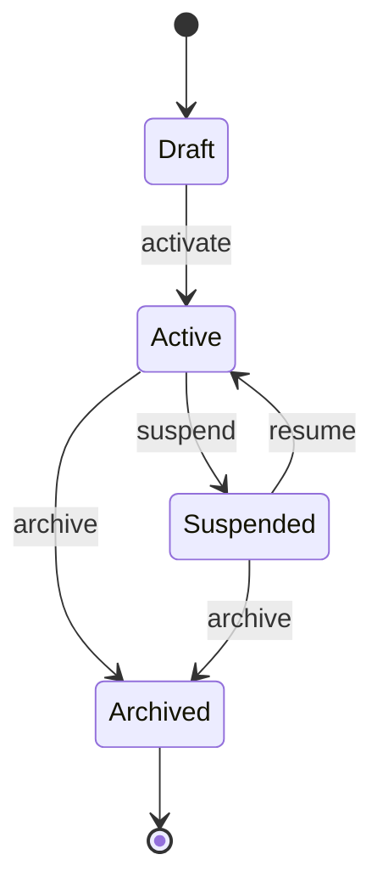

Rules:

- Only `active` Ships admit new Crew activation, schedules, webhooks, and Runs.
- Suspending a Ship cancels/blocks future dispatches; active Runs follow a configurable graceful cancellation period.
- Archiving a Ship disables its Crew, schedules, and webhooks; it is not counted against active-Ship quota.

## 4.4 Crew states

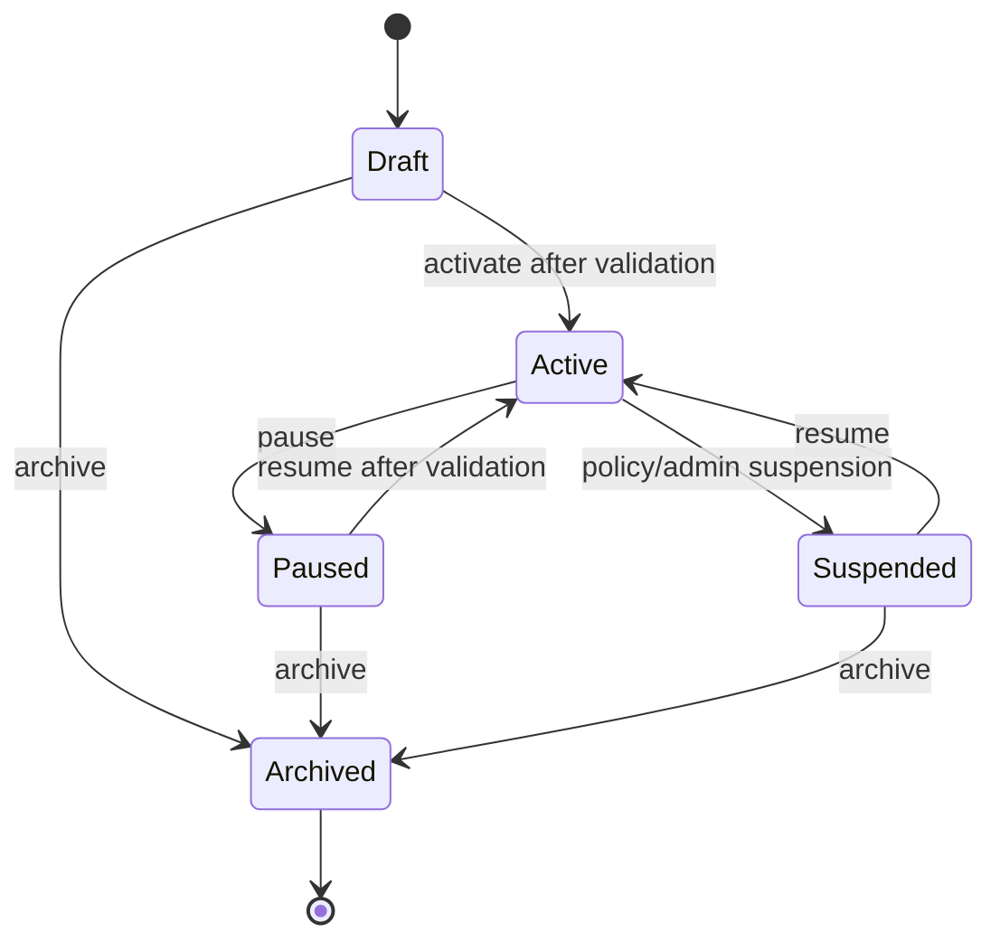

Existing Crew states and state-machine behavior must be inspected before final naming changes. If existing lifecycle terminology differs, preserve backward compatibility at API/domain mapping boundaries and avoid a broad rename in the first control-plane release.

## 4.5 Run states

Existing run lifecycle must remain authoritative. The following logical state extension is required:

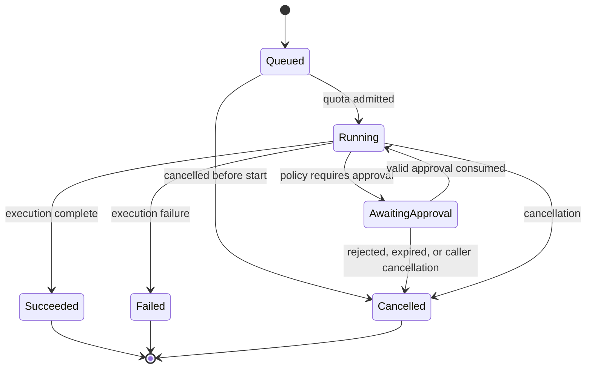

Implementation note: if the current `run` domain already has a waiting/blocked state, reuse it and attach a reason/type rather than adding duplicate states. If not, add `awaiting_approval` through the current state machine with migration and concurrency tests.

## 4.6 Approval states

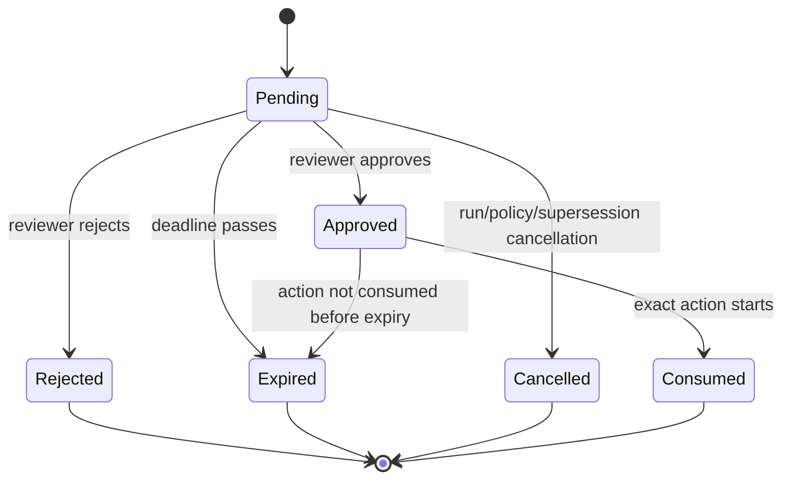

## 4.7 Policy outcome matrix

| Risk class | Default Community outcome | Example |
|---|---|---|
| `read_only` | Allow if tool/resource scope is permitted | Read GitHub issue, inspect CI log, query local project file |
| `write` | Require approval | Comment on issue, create PR draft, update remote record |
| `sensitive` | Require approval plus explicit policy scope | Access customer data, invoke privileged cloud API |
| `destructive` | Deny by default | Delete production resource, rotate credentials, force-push branch |

---

## 5. Technical Architecture

## 5.1 System context — C4 Level 1

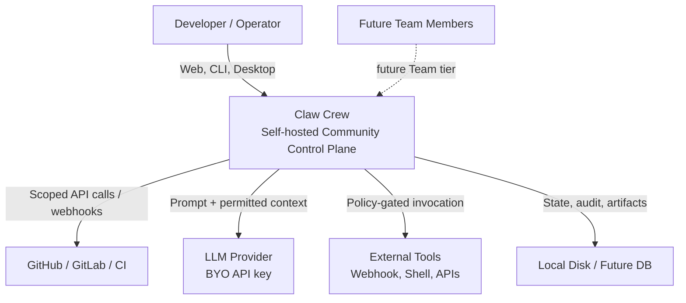

System boundary:

- Claw Crew owns orchestration, Crew/Ship configuration, policy decision, approval state, local audit data, and dispatch.
- The user owns deployment, model provider account/API key, external integrations, infrastructure, and final responsibility for permissions granted.
- Third-party providers own their own service availability, retention, and privacy behavior.

## 5.2 Container diagram — C4 Level 2

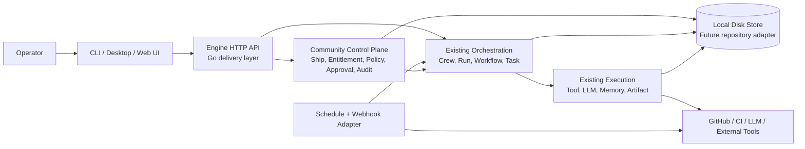

Container responsibilities:

| Container | Responsibility | Technology direction |
|---|---|---|
| CLI/Desktop/Web UI | Configuration, mission visibility, approval actions, audit browsing | Existing product surface; not specified as a new runtime |
| Engine HTTP API | Versioned external contract, auth, request validation, error translation | Go `delivery.go` modules |
| Community Control Plane | Ship/entitlement/policy/approval/audit business rules | New Go `src/*` bounded contexts |
| Existing Orchestration | Crew, Run, Workflow, Task state and dispatch | Existing Go contexts |
| Existing Execution | Tool/LLM/Memory/Artifact operations | Existing Go contexts / adapters |
| Schedule + Webhook Adapter | Trigger intake and normalized dispatch | New `schedule` and `integration` contexts |
| Local Disk Store | Local state, audit append log, snapshots | Extend existing `persistence` behind interfaces |

## 5.3 Component diagram — C4 Level 3, Engine

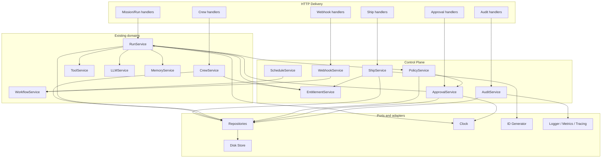

### 5.4 Code/module layout — C4 Level 4 direction

```text
engine/
├── app/
│   ├── app.go
│   ├── wire.go
│   └── wire_gen.go
├── cmd/
│   └── clawcrew-engine/
│       └── main.go
├── core/
│   ├── config/
│   ├── errors/
│   ├── id/
│   ├── interceptors/
│   ├── logger/
│   ├── metrics/
│   └── tracing/
├── pkg/
│   └── ...                      # only stable/public adapters, not domain dumping ground
└── src/
    ├── ship/
    │   ├── dto.go
    │   ├── interfaces.go
    │   ├── services.go
    │   ├── delivery.go
    │   ├── repository_disk.go   # if local adapter belongs in domain; otherwise persistence adapter
    │   ├── wire.go
    │   └── *_test.go
    ├── entitlement/
    │   ├── dto.go
    │   ├── interfaces.go
    │   ├── services.go
    │   ├── local_entitlement.go
    │   ├── wire.go
    │   └── *_test.go
    ├── policy/
    │   ├── dto.go
    │   ├── interfaces.go
    │   ├── services.go
    │   ├── evaluator_default.go
    │   ├── wire.go
    │   └── *_test.go
    ├── approval/
    │   ├── dto.go
    │   ├── interfaces.go
    │   ├── services.go
    │   ├── delivery.go
    │   ├── wire.go
    │   └── *_test.go
    ├── audit/
    │   ├── dto.go
    │   ├── interfaces.go
    │   ├── services.go
    │   ├── delivery.go
    │   ├── wire.go
    │   └── *_test.go
    ├── schedule/
    │   ├── dto.go
    │   ├── interfaces.go
    │   ├── services.go
    │   ├── worker.go
    │   ├── wire.go
    │   └── *_test.go
    ├── integration/
    │   ├── dto.go
    │   ├── interfaces.go
    │   ├── services.go
    │   ├── delivery.go
    │   ├── verifier.go
    │   ├── wire.go
    │   └── *_test.go
    ├── crew/                    # extend, do not fork
    ├── run/                     # extend, do not fork
    ├── workflow/                # extend, do not fork
    ├── task/
    ├── tool/
    ├── llm/
    ├── memory/
    ├── artifact/
    └── persistence/
```

### 5.5 Go implementation guidance

- Use `context.Context` as the first parameter for every public application service and external adapter method.
- Inject `Clock` and `IDGenerator`; do not invoke `time.Now()` or random IDs directly in domain services.
- Prefer small interfaces owned by the consumer package, e.g. `approval.RunResumer`, rather than a global repository interface.
- Keep DTOs separate from persistence records if storage evolution is expected.
- Use typed enums/constants for states, risk classes, outcomes, and event types.
- Return domain errors that delivery maps to stable error codes; do not expose raw storage/provider errors through HTTP.
- Require `Idempotency-Key` for write/run trigger endpoints; retain key/result mapping for a bounded period.
- Test race-sensitive state transitions with `go test -race`.
- Generate/update Wire composition intentionally; do not hand-edit `wire_gen.go` except through the generator workflow.

---

## 6. Data Model

## 6.1 Entity relationship diagram

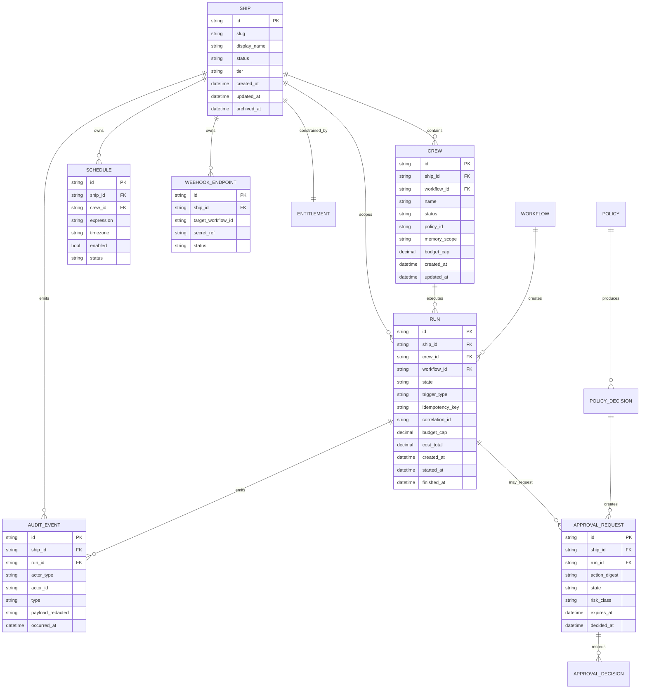

## 6.2 Ship

```json
{
  "id": "shp_01J...",
  "slug": "engineering-operations",
  "display_name": "Engineering Operations",
  "description": "Automation for one repository and its delivery workflow.",
  "status": "active",
  "tier": "community",
  "timezone": "Asia/Jakarta",
  "budget": {
    "currency": "USD",
    "period": "monthly",
    "soft_limit": "10.00",
    "hard_limit": "20.00",
    "per_run_hard_limit": "2.00"
  },
  "created_at": "2026-09-28T08:00:00Z",
  "updated_at": "2026-09-28T08:00:00Z"
}
```

## 6.3 Crew extension

The existing Crew DTO should be extended additively:

```json
{
  "id": "crw_01J...",
  "ship_id": "shp_01J...",
  "name": "PR Triage",
  "status": "active",
  "role": "Summarize pull requests and run non-destructive checks.",
  "workflow_id": "wfl_01J...",
  "policy_id": "pol_default_community",
  "tool_scope": [
    "github.pull_request.read",
    "github.issue.read",
    "github.checks.read"
  ],
  "memory_scope": "ship:engineering-operations/crew:pr-triage",
  "budget": {
    "per_run_hard_limit": "0.50"
  },
  "created_at": "2026-09-28T08:00:00Z",
  "updated_at": "2026-09-28T08:00:00Z"
}
```

Do not introduce a second `Agent` entity if `Crew` already represents the active worker configuration. Use `Crew` consistently in APIs and persistence.

## 6.4 Run extension

```json
{
  "id": "run_01J...",
  "ship_id": "shp_01J...",
  "crew_id": "crw_01J...",
  "workflow_id": "wfl_01J...",
  "state": "awaiting_approval",
  "trigger": {
    "type": "webhook",
    "source": "github",
    "event_id": "evt_123"
  },
  "idempotency_key": "github:delivery:evt_123",
  "correlation_id": "cor_01J...",
  "budget": {
    "hard_limit": "0.50",
    "spent": "0.11",
    "currency": "USD"
  },
  "approval_id": "apr_01J...",
  "created_at": "2026-09-28T08:00:00Z",
  "started_at": "2026-09-28T08:00:05Z"
}
```

## 6.5 Policy decision

```json
{
  "id": "pdec_01J...",
  "ship_id": "shp_01J...",
  "run_id": "run_01J...",
  "crew_id": "crw_01J...",
  "policy_id": "pol_default_community",
  "requested_action": {
    "tool": "github.issue.comment.create",
    "resource": "github:diezy-labs/claw-crew#123",
    "arguments_redacted": {
      "issue_number": 123,
      "body_preview": "CI failed because..."
    },
    "action_digest": "sha256:..."
  },
  "risk_class": "write",
  "outcome": "require_approval",
  "reason_codes": ["community.default.write_requires_approval"],
  "decided_at": "2026-09-28T08:03:00Z"
}
```

## 6.6 Approval request

```json
{
  "id": "apr_01J...",
  "ship_id": "shp_01J...",
  "run_id": "run_01J...",
  "policy_decision_id": "pdec_01J...",
  "state": "pending",
  "risk_class": "write",
  "action_digest": "sha256:...",
  "summary": "Post a CI failure summary to GitHub issue #123.",
  "target": {
    "tool": "github.issue.comment.create",
    "resource": "github:diezy-labs/claw-crew#123"
  },
  "arguments_redacted": {
    "issue_number": 123,
    "body_preview": "CI failed because..."
  },
  "expires_at": "2026-09-29T08:03:00Z",
  "created_at": "2026-09-28T08:03:00Z"
}
```

## 6.7 Audit event envelope

```json
{
  "id": "aud_01J...",
  "occurred_at": "2026-09-28T08:03:00Z",
  "type": "approval.requested.v1",
  "ship_id": "shp_01J...",
  "run_id": "run_01J...",
  "crew_id": "crw_01J...",
  "actor": {
    "type": "crew",
    "id": "crw_01J..."
  },
  "correlation_id": "cor_01J...",
  "payload": {
    "approval_id": "apr_01J...",
    "risk_class": "write",
    "action_digest": "sha256:..."
  },
  "schema_version": 1
}
```

Audit payload must be redacted and schema-versioned. Event types must be append-only; fields can be added only in backward-compatible form.

---

## 7. API Specification

## 7.1 General API conventions

- Base path: `/api/v1`.
- Content type: `application/json`.
- All timestamps: RFC 3339 UTC strings.
- All mutation endpoints require `Idempotency-Key` except approval decision endpoints where the approval state/action digest already acts as an idempotency boundary; an idempotency key is still recommended.
- Authentication for Community v1 may be local single-owner auth; design all API contracts with an `actor` abstraction for future Team roles.
- Authorization must be evaluated server-side. UI limits alone are not security controls.
- List endpoints use cursor pagination: `?limit=50&cursor=...`.
- API errors use a stable envelope.

### Error envelope

```json
{
  "error": {
    "code": "quota_exceeded",
    "message": "Community tier permits at most 5 active Crew Slots per Ship.",
    "details": {
      "limit": 5,
      "current": 5,
      "resource": "active_crew_slots",
      "tier": "community"
    },
    "request_id": "req_01J..."
  }
}
```

### Standard error codes

| HTTP | Code | Meaning |
|---:|---|---|
| 400 | `validation_failed` | Request structure/values invalid |
| 401 | `unauthenticated` | Missing/invalid authentication |
| 403 | `forbidden` | Actor lacks permission |
| 404 | `not_found` | Resource does not exist or is hidden |
| 409 | `conflict` | Version/state/idempotency conflict |
| 409 | `approval_state_conflict` | Approval cannot transition from current state |
| 422 | `policy_denied` | Policy blocks requested action |
| 422 | `quota_exceeded` | Tier/Ship quota prevents operation |
| 422 | `budget_exceeded` | Budget prevents operation |
| 429 | `rate_limited` | Request/trigger rate limited |
| 500 | `internal_error` | Unexpected server condition |
| 503 | `dependency_unavailable` | LLM/tool/provider/storage unavailable |

## 7.2 Ship APIs

### Create Ship

`POST /api/v1/ships`

Request:

```json
{
  "display_name": "Engineering Operations",
  "slug": "engineering-operations",
  "description": "One repository operational crew.",
  "timezone": "Asia/Jakarta",
  "budget": {
    "currency": "USD",
    "period": "monthly",
    "soft_limit": "10.00",
    "hard_limit": "20.00",
    "per_run_hard_limit": "2.00"
  },
  "install_starter_pack": "engineering-operations-v1"
}
```

Responses:

- `201 Created`: Ship created.
- `422 quota_exceeded`: an active Community Ship already exists.
- `409 conflict`: duplicate slug/idempotency mismatch.

### List Ships

`GET /api/v1/ships?status=active&limit=50`

Community returns at most one active Ship but must retain a general list contract for paid tiers.

### Get Ship

`GET /api/v1/ships/{ship_id}`

### Update Ship

`PATCH /api/v1/ships/{ship_id}`

Editable fields: `display_name`, `description`, `timezone`, `budget` within entitlement-safe values.

### Archive Ship

`POST /api/v1/ships/{ship_id}:archive`

Semantics:

- Idempotent transition to `archived`.
- Disable schedules/webhooks.
- Prevent new runs.
- Cancel/allow graceful cancellation for active runs according to policy.
- Emit `ship.archived.v1` audit event.

## 7.3 Crew APIs

Existing Crew endpoints should be extended rather than replaced. If exact existing routes differ, maintain backward compatibility and add Ship-scoped routes as canonical v1.

### Create Crew

`POST /api/v1/ships/{ship_id}/crews`

```json
{
  "name": "PR Triage",
  "role": "Summarize pull requests and execute read-only validation.",
  "workflow_id": "wfl_01J...",
  "policy_id": "pol_default_community",
  "tool_scope": [
    "github.pull_request.read",
    "github.issue.read",
    "github.checks.read"
  ],
  "memory_scope": "ship/engineering-operations/crew/pr-triage",
  "budget": {
    "per_run_hard_limit": "0.50"
  },
  "status": "draft"
}
```

### Activate Crew

`POST /api/v1/ships/{ship_id}/crews/{crew_id}:activate`

Validations:

- Ship is active.
- Crew belongs to Ship.
- Community active Crew limit is not exceeded.
- Policy/tool/budget references are valid.
- Crew state transition is legal.

### Pause Crew

`POST /api/v1/ships/{ship_id}/crews/{crew_id}:pause`

### Archive Crew

`POST /api/v1/ships/{ship_id}/crews/{crew_id}:archive`

### List Crew

`GET /api/v1/ships/{ship_id}/crews?status=active`

## 7.4 Mission/Run APIs

### Trigger Mission

`POST /api/v1/ships/{ship_id}/runs`

```json
{
  "crew_id": "crw_01J...",
  "workflow_id": "wfl_01J...",
  "trigger": {
    "type": "manual",
    "source": "dashboard"
  },
  "input": {
    "repository": "diezy-labs/claw-crew",
    "branch": "main"
  },
  "budget_override": {
    "hard_limit": "0.50"
  }
}
```

Response `202 Accepted`:

```json
{
  "run": {
    "id": "run_01J...",
    "ship_id": "shp_01J...",
    "crew_id": "crw_01J...",
    "state": "queued",
    "correlation_id": "cor_01J...",
    "created_at": "2026-09-28T08:00:00Z"
  }
}
```

The server may return `202` for queued work. A synchronous endpoint must not pretend the full agent result is immediately available.

### Get Run

`GET /api/v1/ships/{ship_id}/runs/{run_id}`

### List Runs

`GET /api/v1/ships/{ship_id}/runs?crew_id=...&state=...&limit=50&cursor=...`

### Cancel Run

`POST /api/v1/ships/{ship_id}/runs/{run_id}:cancel`

Cancellation must be idempotent. If run is awaiting approval, cancellation invalidates the pending approval.

### Stream run events

`GET /api/v1/ships/{ship_id}/runs/{run_id}/events`

Recommended transport: Server-Sent Events initially; WebSocket only if bi-directional UI requirements justify it.

SSE event examples:

```text
event: run.state_changed.v1
data: {"run_id":"run_01J...","from":"queued","to":"running"}

event: approval.requested.v1
data: {"approval_id":"apr_01J...","run_id":"run_01J..."}
```

## 7.5 Approval APIs

### List approval requests

`GET /api/v1/ships/{ship_id}/approvals?state=pending&limit=50`

### Get approval request

`GET /api/v1/ships/{ship_id}/approvals/{approval_id}`

### Decide approval

`POST /api/v1/ships/{ship_id}/approvals/{approval_id}:decide`

```json
{
  "decision": "approve",
  "action_digest": "sha256:...",
  "comment": "Approved after reviewing the CI summary."
}
```

Rules:

- The submitted digest must equal stored digest.
- Only a pending, unexpired request can transition.
- An approved request can be consumed by only the matching Run/action.
- Rejection must resume/terminate the Run according to current Run behavior; default is cancellation with `approval_rejected` reason.

## 7.6 Policy APIs

### Get effective policy

`GET /api/v1/ships/{ship_id}/policies/effective?crew_id={crew_id}`

### Evaluate action preview

`POST /api/v1/ships/{ship_id}/policies:evaluate`

This endpoint enables UI preview. It must not invoke the tool.

```json
{
  "crew_id": "crw_01J...",
  "action": {
    "tool": "github.issue.comment.create",
    "resource": "github:diezy-labs/claw-crew#123",
    "arguments": {
      "issue_number": 123,
      "body": "Draft CI summary"
    }
  }
}
```

Response:

```json
{
  "outcome": "require_approval",
  "risk_class": "write",
  "reason_codes": ["community.default.write_requires_approval"],
  "action_digest": "sha256:..."
}
```

## 7.7 Schedule APIs

### Create schedule

`POST /api/v1/ships/{ship_id}/schedules`

```json
{
  "name": "Daily repository health",
  "crew_id": "crw_01J...",
  "workflow_id": "wfl_01J...",
  "schedule": {
    "kind": "cron",
    "expression": "0 9 * * 1-5",
    "timezone": "Asia/Jakarta"
  },
  "input": {
    "repository": "diezy-labs/claw-crew",
    "branch": "main"
  },
  "idempotency_window": "PT10M",
  "enabled": true
}
```

Community permits five enabled schedules. Disabled schedules do not count, provided they do not retain active reserved execution capacity.

### Enable/disable schedule

`POST /api/v1/ships/{ship_id}/schedules/{schedule_id}:enable`

`POST /api/v1/ships/{ship_id}/schedules/{schedule_id}:disable`

### List schedules

`GET /api/v1/ships/{ship_id}/schedules`

## 7.8 Webhook APIs

### Create webhook endpoint

`POST /api/v1/ships/{ship_id}/webhooks`

```json
{
  "name": "GitHub pull request",
  "provider": "github",
  "event_types": ["pull_request.opened", "pull_request.synchronize"],
  "target": {
    "crew_id": "crw_01J...",
    "workflow_id": "wfl_01J..."
  },
  "verification": {
    "mode": "hmac_sha256",
    "secret_ref": "secret://ship/shp_01J/github-webhook"
  },
  "enabled": true
}
```

Community permits three enabled endpoints.

### Receive inbound webhook

`POST /api/v1/webhooks/{webhook_id}`

- Verify signature before parsing/dispatch.
- Apply replay protection if provider supplies delivery identifiers.
- Normalize source event to internal trigger.
- Use provider delivery ID as or within idempotency key.
- Return fast acknowledgment; dispatch asynchronously.

## 7.9 Audit APIs

### List audit events

`GET /api/v1/ships/{ship_id}/audit-events?type=approval.requested.v1&run_id=run_...&from=...&to=...&limit=50`

### Export audit events

`POST /api/v1/ships/{ship_id}/audit-events:export`

Community may offer local JSONL export. Exports must be asynchronous for large result sets and must never include raw secrets.

## 7.10 Entitlement/usage APIs

### Get current entitlement and utilization

`GET /api/v1/entitlements/current`

```json
{
  "tier": "community",
  "limits": {
    "active_ships": 1,
    "active_crews_per_ship": 5,
    "concurrent_runs_per_ship": 2,
    "enabled_schedules_per_ship": 5,
    "enabled_webhooks_per_ship": 3
  },
  "usage": {
    "active_ships": 1,
    "active_crews_by_ship": {
      "shp_01J...": 5
    },
    "concurrent_runs_by_ship": {
      "shp_01J...": 1
    },
    "enabled_schedules_by_ship": {
      "shp_01J...": 4
    },
    "enabled_webhooks_by_ship": {
      "shp_01J...": 2
    }
  }
}
```

This API supports transparent UI metering and future plan upgrades.

---

## 8. Event Contracts

## 8.1 Event envelope

All internal domain events and outward audit/event stream messages use:

```json
{
  "id": "evt_01J...",
  "type": "crew.activated.v1",
  "occurred_at": "2026-09-28T08:00:00Z",
  "correlation_id": "cor_01J...",
  "causation_id": "cmd_01J...",
  "ship_id": "shp_01J...",
  "actor": {
    "type": "user",
    "id": "usr_local_owner"
  },
  "data": {},
  "schema_version": 1
}
```

## 8.2 Minimum event catalog

| Event | Producer | Required use |
|---|---|---|
| `ship.created.v1` | Ship | Audit, provisioning |
| `ship.archived.v1` | Ship | Audit, schedule/webhook disablement |
| `crew.created.v1` | Crew | Audit |
| `crew.activated.v1` | Crew | Quota/accounting/audit |
| `crew.paused.v1` | Crew | Audit |
| `run.queued.v1` | Run | Dashboard/event stream |
| `run.started.v1` | Run | Metrics, audit |
| `run.awaiting_approval.v1` | Run | UI notification |
| `run.succeeded.v1` | Run | Metrics, audit |
| `run.failed.v1` | Run | Metrics, audit |
| `run.cancelled.v1` | Run | Metrics, audit |
| `policy.evaluated.v1` | Policy | Explainability/audit |
| `approval.requested.v1` | Approval | Notification/audit |
| `approval.approved.v1` | Approval | Resume matching run |
| `approval.rejected.v1` | Approval | Stop matching run |
| `approval.expired.v1` | Approval | Stop matching run |
| `tool.invocation.started.v1` | Tool | Trace/audit |
| `tool.invocation.completed.v1` | Tool | Trace/cost/audit |
| `budget.threshold_reached.v1` | Budget/Run | User notification |
| `budget.exceeded.v1` | Budget/Run | Stop execution |
| `schedule.triggered.v1` | Schedule | Trace/idempotency |
| `webhook.accepted.v1` | Integration | Trace |
| `webhook.rejected.v1` | Integration | Security audit |

## 8.3 Event compatibility rules

- Never change the semantic meaning of an event type.
- Additive data fields are permitted.
- Breaking changes require a new event type suffix or a new version suffix.
- Do not place raw secret data, full prompts, unredacted provider responses, or source code blobs into generic audit events.
- Store large payloads as artifacts; events reference artifact IDs and redacted summaries.

---

## 9. Quotas, Entitlements, and Billing Readiness

## 9.1 Community entitlement constants

```go
const (
    CommunityMaxActiveShips            = 1
    CommunityMaxActiveCrewPerShip      = 5
    CommunityMaxConcurrentRunsPerShip  = 2
    CommunityMaxEnabledSchedules       = 5
    CommunityMaxEnabledWebhookEndpoints = 3
)
```

Do not scatter these constants through handlers. Define them in `src/entitlement` behind a `LimitProvider`/`EntitlementService` interface.

## 9.2 Entitlement interface sketch

```go
type Limits struct {
    MaxActiveShips               int
    MaxActiveCrewPerShip         int
    MaxConcurrentRunsPerShip     int
    MaxEnabledSchedulesPerShip   int
    MaxEnabledWebhookEndpoints   int
    Features                     map[string]bool
}

type EntitlementService interface {
    Current(ctx context.Context, subject Subject) (Entitlement, error)
    LimitsForShip(ctx context.Context, shipID string) (Limits, error)
    Check(ctx context.Context, request CheckRequest) error
}
```

`Check` returns a typed quota/feature error. It must be called inside application service transactions/critical sections where appropriate to avoid race conditions on concurrent creation/activation.

## 9.3 Concurrency-safe quota enforcement

Quota checks are correctness logic, not UI convenience. For storage implementations:

- Use transaction/lock/CAS semantics when creating an active resource.
- Count only resources that qualify for the entitlement state, such as `active` Crew.
- Make state transition plus quota reservation atomic.
- Ensure idempotent retries return the original result rather than consume a second slot.
- Release reservation only after a valid pause/archive/deactivation transition commits.

For the current local disk store, use a single-process lock and atomic write/rename discipline. Document that multi-process/multi-node deployment needs a transactional database adapter before claiming HA support.

---

## 10. Policy, Approval, and Tool Execution Design

## 10.1 Enforcement sequence

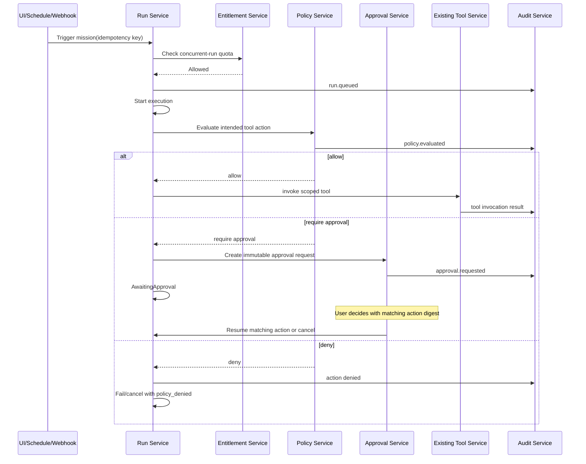

## 10.2 Action digest

An approval must bind to a canonical action digest:

```text
SHA-256(
  policy_version + "\n" +
  ship_id + "\n" +
  crew_id + "\n" +
  tool_name + "\n" +
  canonical_resource + "\n" +
  canonical_redacted_arguments + "\n" +
  credential_scope_reference
)
```

Important:

- Digest input must use canonical JSON/serialization.
- Do not include raw secret values; include a stable secret reference/scope identifier.
- Tool execution must recompute the digest immediately before invocation and match it with the consumed approval.
- Any change in tool, target, arguments, credential scope, or relevant policy invalidates approval and requires a new request.

## 10.3 Tool authorization port

The existing `tool` domain should expose/consume a narrow authorization port, for example:

```go
type Authorizer interface {
    Authorize(ctx context.Context, request AuthorizationRequest) (AuthorizationDecision, error)
}
```

Avoid embedding policy logic in each individual tool adapter. Tool adapters declare metadata and execute; policy service decides; run/orchestrator coordinates approval/resumption.

---

## 11. Persistence Strategy

## 11.1 Community v1 storage

Current repository includes `engine/src/persistence/disk_store.go`. Community v1 may retain local disk storage if the following are met:

- Atomic write/rename semantics.
- Process-level lock around state transition and quota reservation.
- Schema versioning and migrations.
- Corruption handling/backup strategy.
- Append-only audit log or write-once segment strategy.
- Encryption or OS/keychain/vault-backed secret references; raw secrets must not be placed in normal state files.

Suggested local layout:

```text
~/.clawcrew/
├── config/
│   └── config.yaml
├── state/
│   ├── ships/
│   │   └── shp_*.json
│   ├── crews/
│   │   └── crw_*.json
│   ├── runs/
│   │   └── run_*.json
│   ├── approvals/
│   │   └── apr_*.json
│   ├── schedules/
│   │   └── sch_*.json
│   └── webhooks/
│       └── whk_*.json
├── audit/
│   ├── 2026-09-28.jsonl
│   └── checkpoints/
├── artifacts/
├── secrets/
│   └── references-only.json
└── backups/
```

Actual path/configuration must use existing engine configuration conventions; this layout is conceptual.

## 11.2 Future storage adapter

Do not lock API/domain contracts to disk persistence. Use consumer-owned repositories/ports such as:

```go
type ShipRepository interface {
    Create(ctx context.Context, ship Ship) error
    Get(ctx context.Context, id string) (Ship, error)
    Update(ctx context.Context, expectedVersion int64, mutate ShipMutation) (Ship, error)
    CountActive(ctx context.Context, subject Subject) (int, error)
}
```

For Business/HA later, add a PostgreSQL adapter with transaction isolation/row locking. Do not introduce it in Community v1 unless multi-process deployment is explicitly supported.

## 11.3 Secret handling

- Persist only `secret_ref`, never secret material, in Crew/Ship/webhook records.
- Resolve secrets as late as possible at invocation time.
- Redact secret-like values in logs/audit payloads using deterministic keys and content scanning.
- Include secret access in audit records as references, not values.
- Make secret rotation invalidate affected action digests and optionally pause affected Crew until revalidated.

---

## 12. Observability, Reliability, and Security

## 12.1 Metrics

Use existing `engine/core/metrics`; keep label cardinality bounded.

| Metric | Type | Labels |
|---|---|---|
| `clawcrew_ship_active_total` | Gauge | `tier` |
| `clawcrew_crew_active_total` | Gauge | `tier` |
| `clawcrew_run_total` | Counter | `trigger_type`, `outcome` |
| `clawcrew_run_duration_seconds` | Histogram | `workflow_type`, `outcome` |
| `clawcrew_run_concurrent` | Gauge | `tier` |
| `clawcrew_policy_decision_total` | Counter | `risk_class`, `outcome` |
| `clawcrew_approval_total` | Counter | `decision`, `risk_class` |
| `clawcrew_tool_invocation_total` | Counter | `tool`, `outcome` |
| `clawcrew_budget_exceeded_total` | Counter | `scope` |
| `clawcrew_schedule_trigger_total` | Counter | `outcome` |
| `clawcrew_webhook_total` | Counter | `provider`, `outcome` |

Never label metrics with `ship_id`, `crew_id`, user prompt, URL, issue number, or arbitrary error text.

## 12.2 Tracing

Use existing `engine/core/tracing`:

- Start one root trace for incoming HTTP request/webhook/schedule trigger.
- Propagate `correlation_id` through Run, policy, approval, tool, and provider operations.
- Annotate span with low-cardinality fields: run state, risk class, policy outcome, provider name, tool name.
- Do not attach raw prompts, secrets, full tool input, or unredacted provider responses.

## 12.3 Logging

Structured logging fields:

```text
request_id, correlation_id, ship_id, crew_id, run_id, approval_id,
workflow_id, tool_name, policy_outcome, risk_class, error_code
```

Apply redaction before serialization. Do not log authorization headers, API keys, webhook secrets, or complete model inputs by default.

## 12.4 Security requirements

- Use constant-time verification for webhook secret signatures where applicable.
- Apply rate limiting to inbound webhooks and API mutations.
- Use replay protection keyed by provider delivery IDs when provided.
- Validate resource ownership (`crew.ship_id == route.ship_id`) on every nested resource route.
- Require explicit permission escalation for write/destructive tools.
- Treat tool output as untrusted input; do not allow tool output to redefine policy/permissions.
- Enforce SSRF protections for URL-fetching tools: allowlist/deny private ranges as appropriate for deployment model.
- Sandbox shell/filesystem tools and default to project-scoped paths.
- Give outbound integrations least-privilege token scopes.
- Use dependency scanning, SBOM generation, secret scanning, and vulnerability reporting process in CI/release.

---

## 13. Testing Strategy

## 13.1 Test pyramid

| Layer | Focus | Examples |
|---|---|---|
| Unit | Pure business/state rules | quota calculation, policy outcome, action digest canonicalization |
| Domain/service | State transitions and orchestration | crew activation, approval consume, run resume/cancel |
| Repository/adapter | Persistence correctness | atomic update, disk corruption/recovery, audit append |
| Contract | HTTP/event compatibility | JSON schema, error envelope, pagination, SSE event type |
| Integration | Real bounded-context collaboration | trigger → policy → approval → run → tool mock |
| E2E | Community user journey | install/create Ship/install starter pack/run/read action/request approval |
| Security | Abuse/negative paths | signature failure, replay, secret redaction, cross-Ship access |
| Load/race | Concurrency | two simultaneous crew activations at slot 5; duplicate webhook delivery |

## 13.2 Required test cases

### Ship and entitlement

- Creating a first Community Ship succeeds.
- Creating a second active Ship fails deterministically.
- Archiving first Ship permits creating another active Ship only if product policy explicitly allows replacement.
- Parallel Ship create attempts result in exactly one active Ship.

### Crew

- Five Crew can activate successfully.
- Sixth activation fails without partial state.
- Two simultaneous activation attempts when four are active result in exactly one fifth active Crew.
- Pause/archive frees capacity according to defined active-state counting.
- Cross-Ship Crew access returns not found/forbidden without data leak.

### Runs

- Two runs can execute concurrently; third behaves according to selected queue/reject behavior.
- Idempotent trigger with same key returns same run/result reference.
- Cancellation propagates through awaiting approval and active tool operation.
- Existing Crew cancellation/finalization/order tests remain green after changes.

### Policy and approval

- Read-only action is allowed only within declared scope.
- Write action creates approval under default Community policy.
- Changed arguments/resource/action digest invalidate approval.
- Approval race: only one decision/consume wins.
- Expired approval cannot resume run.
- Rejected approval cancels/rejects action and records audit.

### Schedule/webhooks

- More than five enabled schedules are rejected.
- More than three enabled webhooks are rejected.
- Duplicate webhook delivery does not create duplicate run.
- Invalid webhook signature is rejected and audited without dispatch.
- Schedule idempotency window prevents duplicate run after scheduler restart.

### Security/redaction

- API responses never return secret values.
- Audit/log fixture scanner finds no API keys, authorization headers, or configured secret values.
- Unsafe URL or cross-boundary filesystem target is blocked by tool policy.

## 13.3 CI gates

Minimum CI checks for this feature:

```text
gofmt -w -l .                 # no output expected after formatting check
go vet ./...
go test ./...
go test -race ./...
staticcheck ./...             # if adopted in repository tooling
govulncheck ./...             # if applicable
license/SBOM check
secret scan
API contract tests
```

Follow repository CI conventions if existing commands differ. Do not introduce a second formatter/linter configuration that conflicts with current Go/Rust tooling.

---

## 14. Implementation Roadmap

## Phase 0 — Contract and migration design

Deliverables:

- Confirm exact existing Crew/Run/Workflow DTO and state names.
- Add `ship_id` as additive field with backward-compatible migration behavior.
- Define typed domain errors and API error mapping.
- Define entitlement interfaces and Community local implementation.
- Produce test fixtures for current/next schema.

Exit criteria:

- No ambiguous ownership between Ship/Crew/Run/Workflow.
- Existing tests stay green before new feature implementation.

## Phase 1 — Ship and entitlement foundation

Deliverables:

- `src/ship` aggregate/service/repository/delivery.
- `src/entitlement` local Community plan.
- Ship-scoped Crew routes and `ship_id` validation.
- Atomic quota enforcement for one Ship/five active Crew.
- Audit events for Ship and Crew lifecycle.

Exit criteria:

- AC-001 and AC-002 pass, including race tests.
- UI/CLI can show limits and current utilization.

## Phase 2 — Mission quota, budget, and audit

Deliverables:

- Extend Run admission with Ship ownership and concurrent-run limit.
- Per-Ship/per-Crew/per-Run budget structures.
- Append-only audit model/query/export.
- Existing observability integration.

Exit criteria:

- AC-003 and budget exceed behavior pass.
- Every run state transition emits a redacted audit event.

## Phase 3 — Policy and approval

Deliverables:

- `src/policy` default evaluator and action digest.
- `src/approval` lifecycle, API, and run integration.
- Tool authorization port/interceptor integration.
- Default Community read/write/destructive policy templates.

Exit criteria:

- AC-004 through AC-008 pass.
- No action can execute after altered approved arguments.

## Phase 4 — Schedule, webhook, and starter pack

Deliverables:

- `src/schedule` with durable schedule state, idempotency, and worker.
- `src/integration` webhook verifier/normalizer/dispatch.
- Community limits: five schedules and three webhooks.
- Engineering Operations Starter Pack install/update behavior.

Exit criteria:

- AC-009 and AC-010 pass.
- End-to-end installation produces useful read-only output within onboarding target.

## Phase 5 — Paid-tier readiness without paid-tier scope

Deliverables:

- Plan/feature abstraction verified with test plan overrides.
- Usage endpoint and upgrade-safe quota errors.
- Data migrations that support future multi-Ship, users, and RBAC.
- Documentation for Pro/Team feature flags, without implementing unvalidated enterprise modules.

Exit criteria:

- Community functions independently.
- Pro/Team can be enabled by configuration/entitlement adapter in a test environment without rewriting domain logic.

---

## 15. Operational Flows

## 15.1 Community creation flow

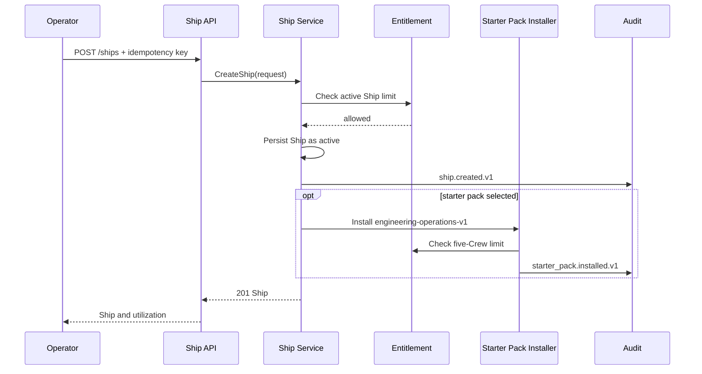

## 15.2 Webhook to approved action flow

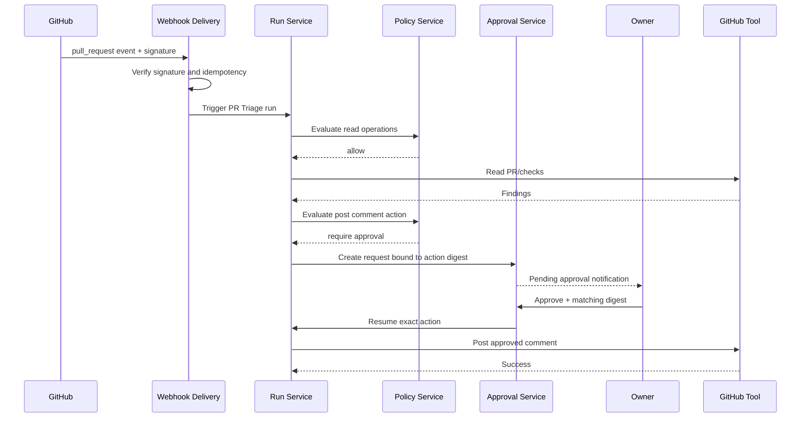

---

## 16. Documentation and Developer Experience

Create/update documentation only where it adds information not already present in `docs/re-branding`.

Recommended documentation artifacts after implementation:

```text
docs/
├── community-control-plane-spec.md       # this single-source specification initially
├── community-quickstart.md               # install → Ship → starter pack → first mission
├── policy-and-approvals.md                # risk classes, approval behavior, examples
├── ship-and-crew-limits.md                # entitlement behavior and migration/upgrade FAQ
├── webhook-security.md                    # signing, replay protection, local exposure guidance
├── audit-and-data-retention.md            # local audit, export, redaction
├── starter-packs/
│   └── engineering-operations.md
└── maintainers/
    └── engine-control-plane-architecture.md
```

Avoid duplicating existing rebranding documents such as broad C4 architecture, policy/governance, system design, API contracts, event contracts, operational flows, technical specification, data model, testing strategy, and roadmap. This document should be the **implementation delta** specifically for the Community Ship control plane. Any durable architecture change should link back to the relevant existing document rather than rewrite it in a conflicting form.

---

## 17. Open Questions and Explicit Decisions Needed

| Question | Recommendation | Owner/decision point |
|---|---|---|
| What is exact legal relationship to upstream ZeroClaw? | Audit license/NOTICE; preserve required attribution; publish independent-project statement | Maintainer + legal counsel |
| Is the Go engine the primary control plane or experimental adjunct to Rust runtime? | Declare one source of truth before exposing stable public API; avoid duplicate orchestration | Product/architecture |
| Does existing Run state machine already support paused/waiting? | Reuse existing equivalent state; add `awaiting_approval` only if absent | Engine maintainer |
| Should third concurrent Community run queue or reject? | Queue only if durable queue behavior is already reliable; otherwise reject with clear quota error in v1 | Product/engine |
| Where are secrets stored locally? | Use OS keychain/vault adapter where possible; state records contain references only | Security/engine |
| What auth is supported for Community local control plane? | Start local owner/session/token; retain actor abstraction for Team | Product/security |
| Is Community data retention a product limit? | Prefer storage-based user control; do not destroy local data automatically without explicit user action | Product/legal |
| Will Team be per Ship or per organization? | Start per Ship for pricing; design identity/membership so an organization layer can be added later | Product |
| Does every approval need a human user identity in Community? | Yes; local owner identity may be minimal but must be recorded in audit | Security |
| How are workflow packs signed/versioned? | Begin first-party only, versioned manifests and upgrade diff; no open marketplace initially | Product/security |

---

## 18. Definition of Done

The Community Control Plane v1 is done when:

- A clean self-hosted installation can create one Community Ship.
- The Ship can activate no more than five Crew Slots, with race-safe enforcement.
- Existing Crew, Run, Workflow, Tool, LLM, and Memory modules are reused rather than reimplemented.
- Runs are Ship-scoped, idempotent, observable, and limited to two concurrent Community runs.
- Policy evaluates every external tool action.
- Default policy automatically permits only scoped read-only actions.
- Write actions create immutable, expiring approval requests bound to an action digest.
- Rejected/expired/cancelled approvals cannot execute an external action.
- A basic budget guardrail can stop a Run safely.
- Up to five schedules and three webhooks work with durable/idempotent behavior.
- Audit events cover key lifecycle and security-sensitive events, with redaction verified by tests.
- API contracts, error envelopes, SSE event contracts, and persistence schemas are versioned/documented.
- `go test ./...` and `go test -race ./...` pass with new state/concurrency/security tests.
- Existing engine behavior and test suite remain compatible.
- Starter Pack onboarding reaches a useful read-only engineering outcome without exceeding Community limits.
- The entitlement abstraction supports future Pro/Team upgrade without replacing Community domain data.

---

## 19. Summary of Recommended First Implementation Slice

The smallest valuable, non-redundant slice is:

1. Ship aggregate with local Community entitlement.
2. Add `ship_id` to existing Crew and Run contracts.
3. Enforce one active Ship, five active Crew Slots, and two concurrent Runs atomically.
4. Add audit events and correlation IDs around existing lifecycle transitions.
5. Add default policy evaluator around existing tool invocation.
6. Add approval state/service and one `awaiting_approval` Run path.
7. Deliver one read-first Engineering Operations workflow: PR/CI summary.
8. Add a write proposal example: posting a GitHub comment requires approval.

This slice proves the core product thesis: **persistent AI work with control**, rather than just another agent runtime. It produces a Community product that is useful for a mini–medium project while establishing the exact foundations needed for Pro, Team, and Business tiers.
