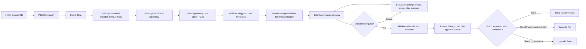
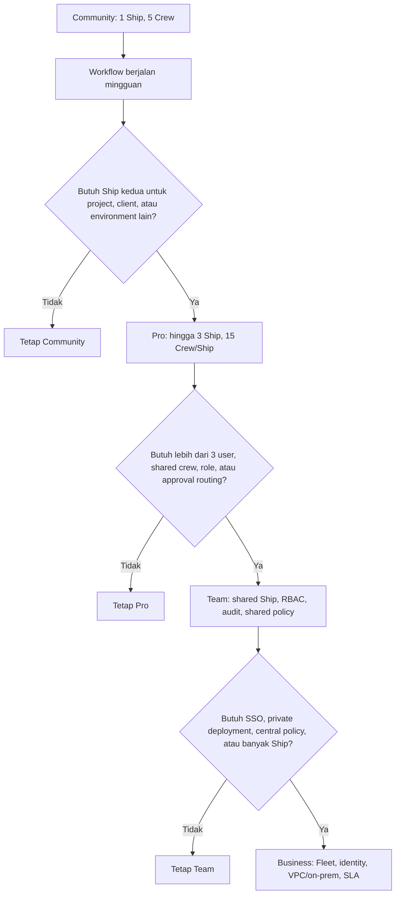
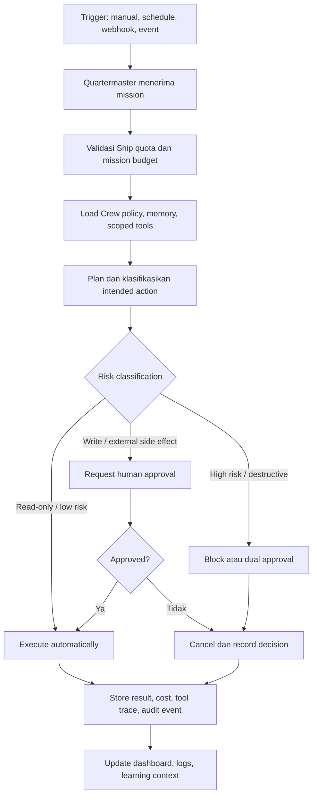

# Claw Crew — Community, Pricing, Monetization, Legalitas, dan Identitas Produk

> Status: Draft strategi bisnis dan produk
>
> Tanggal: 28 September 2026
>
> Tujuan: Menetapkan model Community, paket harga, alur upgrade, batas produk, arah monetisasi, prinsip legalitas/copyright, serta identitas merek untuk Claw Crew.

---

## 1. Ringkasan Eksekutif

Claw Crew sebaiknya diposisikan sebagai **self-hosted, governed AI workforce runtime** untuk menjalankan pekerjaan agentic yang aman, dapat diaudit, dan dapat diukur.

Produk ini bukan sekadar personal AI assistant atau fork ZeroClaw dengan antarmuka lain. Nilai utamanya adalah membuat pengguna dan tim mampu:

- Menjalankan agent yang persisten dan berbasis workflow/SOP.
- Mengatur batas authority, tool permissions, memory, budget, dan approval.
- Mengoperasikan agent sebagai **Crew** dalam satu **Ship**, kemudian berkembang menjadi **Fleet** saat kebutuhan organisasi meningkat.
- Tetap memiliki kendali atas model provider, deployment, data, dan credential.

Model komersial yang disarankan adalah **open-core, self-hosted-first, dan BYO-model/provider**:

- Community harus benar-benar bermanfaat dan dapat dipakai untuk pekerjaan produksi skala personal/proyek kecil.
- Monetisasi utama datang dari kapasitas multi-Ship, kolaborasi, governance, audit, policy, deployment enterprise, dukungan, serta workflow/SOP packs.
- Keamanan fundamental tidak boleh menjadi paywall. Basic policy, approval, scoped credential, budget guardrail, audit lokal, dan kill switch harus tersedia pada Community.

Keputusan produk inti yang direkomendasikan:

> **Claw Crew Community memberikan 1 Ship dan maksimal 5 Crew Slots aktif.**

Batas tersebut cocok untuk proyek mini hingga sedang. Batas ini cukup rendah untuk menciptakan jalur upgrade yang jujur, tetapi cukup tinggi agar pengguna bisa merasakan manfaat produk sebelum membayar.

---

## 2. Konteks Produk dan Aset yang Ada

Claw Crew berasal dari fork ZeroClaw yang dimodifikasi, dengan inspirasi konsep persistent workspace dan crew orchestration seperti Kiro Crew.

Aset teknis repository menunjukkan fondasi yang lebih luas daripada agent CLI sederhana:

- Workspace Rust modular.
- Runtime agent, gateway, API, channels, providers, tools, plugins, memory, dan evaluasi.
- SOP graph untuk workflow terstruktur.
- Relay protocol dan aplikasi relay.
- Aplikasi Tauri/desktop serta komponen web.
- Container build, Docker Compose, opsi deployment Kubernetes.
- Dokumentasi rebranding dengan konsep Fleet, Ship/Crew/Squad, Quartermaster, authority model, policy/security/governance, API contracts, event contracts, UX, operational flows, testing, dan roadmap.

Aset tersebut mendukung arah produk berupa operational control plane untuk AI agents.

### 2.1 Masalah yang diselesaikan

Banyak framework agent mampu melakukan tool calling atau menjalankan workflow. Namun, saat agent dipakai untuk pekerjaan nyata, pengguna membutuhkan jawaban atas pertanyaan berikut:

- Agent mana yang boleh mengakses repository, production tool, atau credential tertentu?
- Kapan agent dapat bertindak otomatis, dan kapan harus meminta approval manusia?
- Bagaimana biaya model, reliability, dan hasil kerja agent diukur?
- Bagaimana workflow dijalankan berulang tanpa kehilangan konteks?
- Bagaimana tim berbagi agent, secrets, SOP, dan audit trail secara aman?
- Bagaimana organisasi memisahkan environment, customer, atau business unit?

Claw Crew seharusnya menjawab pertanyaan-pertanyaan itu melalui Ship, Crew, Quartermaster, policy, memory, audit, dan workflow packs.

---

## 3. Identitas Produk dan Vocabulary

### 3.1 Positioning

> **Claw Crew is a self-hosted control plane for governed AI work. It turns recurring operational work into persistent crews that execute with policy, approval, memory, observability, and cost control.**

Versi Indonesia:

> **Claw Crew adalah control plane self-hosted untuk pekerjaan AI yang terkelola. Produk ini mengubah pekerjaan operasional berulang menjadi crew persisten yang bekerja dengan policy, approval, memory, observability, dan pengendalian biaya.**

### 3.2 Elevator pitch

Untuk developer dan operator:

> Build a crew of persistent AI workers for your repository, operations, and workflows—without surrendering control of your data, tools, models, or approvals.

Untuk buyer/team lead:

> Claw Crew helps teams automate recurring technical work while keeping every agent action scoped, auditable, cost-aware, and approval-gated when necessary.

### 3.3 Product vocabulary

| Istilah | Definisi produk | Terjemahan UX yang disarankan |
|---|---|---|
| Ship | Boundary kerja/tenant/workspace yang memiliki Crew, policy, integrations, secrets references, budgets, dan mission queue sendiri | Ship (Workspace) |
| Crew Slot | Identitas agent aktif dengan role, memory, tools, policy, schedule, dan budget sendiri | Crew |
| Quartermaster | Control-plane/orchestrator yang menerima mission, menerapkan quota/policy, menugaskan Crew, dan mencatat hasil | Orchestrator / Quartermaster |
| Mission | Satu unit pekerjaan agentic dari manual run, schedule, webhook, atau event | Mission / Run |
| Fleet | Kumpulan Ship yang dikelola secara terpusat | Fleet |
| SOP Pack | Workflow template/versioned playbook yang menyatukan crew, tool permissions, policy, dan evaluasi | Workflow Pack |
| Authority | Batas wewenang Crew terhadap tools, data, dan tindakan eksternal | Permissions / Authority |
| Approval | Persetujuan manusia sebelum action dengan side effect dijalankan | Approval |

### 3.4 Prinsip merek

- **Controlled autonomy:** Agent harus produktif, tetapi tidak beroperasi tanpa batas.
- **Ownership:** User memiliki data, model provider choice, deployment, serta workflow mereka.
- **Operational clarity:** Semua action penting dapat ditelusuri, dijelaskan, dihentikan, dan dievaluasi.
- **Composable by design:** Ship, Crew, tools, model providers, channels, dan SOP packs dapat dikomposisikan.
- **Useful before paid:** Community wajib memberikan nilai nyata sebelum kebutuhan komersial muncul.
- **No fake magic:** Hindari janji “fully autonomous” tanpa penjelasan risk boundary, approval, dan biaya.

---

## 4. Model Community

### 4.1 Definisi paket Community

> **Claw Crew Community adalah runtime self-hosted gratis untuk satu Ship pribadi, dengan maksimal lima Crew Slots aktif.**

Community didesain untuk developer individual, indie maker, consultant dengan satu proyek aktif, homelab user, dan eksperimen agentic yang tetap dapat dipakai untuk pekerjaan nyata.

### 4.2 Batas Community yang direkomendasikan

| Elemen | Batas Community | Rasional |
|---|---:|---|
| Ship aktif | 1 | Menjaga Community sebagai workspace tunggal untuk satu proyek/lingkungan utama |
| Crew Slots aktif | 5 | Cukup untuk proyek mini–sedang sekaligus menciptakan trigger upgrade yang jelas |
| Mission berjalan paralel | 2 | Melindungi resource lokal dan menjaga throughput sebagai nilai paket Pro |
| Human member | 1 owner + 1 collaborator opsional | Memungkinkan pasangan founder/dev tanpa menggantikan kebutuhan Team |
| Scheduled missions aktif | 5 | Memadai untuk daily check, weekly report, CI digest, dan monitoring dasar |
| Webhook endpoints aktif | 3 | Memadai untuk GitHub, CI, atau sistem notifikasi utama |
| Model/provider | Bring Your Own provider/API key | Menghindari beban inference cost pada vendor dan mempertahankan pilihan user |
| Deployment | Self-hosted | Docker Compose/CLI sebagai jalur standar |
| History lokal | 14 hari default | Cukup untuk debugging; storage tetap berada di infra user |
| Support | GitHub Discussions, issue tracker, docs | Menjaga biaya support agar realistis bagi solo founder |

**Definisi Crew Slot:** sebuah Crew Slot adalah identitas agent aktif yang memiliki role, prompt/instruction, tool allowlist, permissions, memory boundary, schedule, budget, dan policy sendiri. Crew yang di-archive atau tidak aktif tidak dihitung terhadap limit lima slot.

### 4.3 Kemampuan Community yang tidak boleh dipotong

Community harus tetap memiliki:

- Self-hosting dan local-first deployment.
- BYO model/provider/API key.
- Mission manual, schedule dasar, dan webhook trigger dasar.
- Basic memory per Crew.
- Basic logs dan run history lokal.
- Tool allowlist dan scoped permissions.
- Budget cap per mission/Ship.
- Kill switch per Ship dan per Crew.
- Basic approval gate untuk external write action.
- Export/import konfigurasi dan data yang reasonable.
- Core Engineering Operations workflow pack.

Jangan menjadikan security baseline sebagai fitur berbayar. Yang berbayar adalah skala governance dan collaboration, bukan kemampuan pengguna melindungi data atau menghentikan agent.

### 4.4 Contoh Ship Community

```text
Ship: Engineering Operations

1. Repo Watcher
   - Memonitor CI gagal, issue baru, dependency/security signals.

2. PR Triage
   - Membuat ringkasan pull request, memeriksa checklist, menyarankan label/reviewer.

3. Release Mate
   - Menyiapkan changelog draft, release checklist, dan catatan risiko.

4. Docs Keeper
   - Menemukan potensi dokumentasi yang tertinggal dari perubahan kode.

5. Incident Scribe
   - Menyusun timeline serta draft status update dari event incident.
```

Konfigurasi tersebut sudah memberikan outcome nyata untuk satu repository atau satu proyek mini–sedang. Bila pengguna membutuhkan project/client/environment lain, mereka membutuhkan Ship baru dan mempunyai alasan natural untuk upgrade.

---

## 5. Pricelist dan Packaging

### 5.1 Strategi harga

Gunakan **Ship sebagai unit nilai dan billing utama**, bukan hanya jumlah agent.

Alasan:

- Ship merupakan boundary alami untuk project, client, environment, department, atau business unit.
- Ship memiliki policy, budget, integrations, crew, audit, dan context sendiri.
- Pelanggan akan lebih mudah memahami “saya butuh Ship kedua untuk customer lain” dibanding “saya butuh 10 agent lagi”.
- Pricing per Ship sejalan dengan peningkatan kebutuhan governance dan risiko operasional.

Harga menggunakan USD agar konsisten dengan pasar developer tool internasional. Kurs rupiah bersifat referensi dan harus dihitung ulang saat invoice atau pembayaran diterbitkan.

### 5.2 Daftar harga publik yang disarankan

| Paket | Bulanan | Tahunan | Target | Nilai utama |
|---|---:|---:|---|---|
| Community | Gratis | Gratis | Solo dev, learner, personal project | 1 Ship, 5 Crew Slots, self-hosted, BYO model |
| Pro | US$29/bulan | US$290/tahun | Power user, indie maker, consultant | Multi-Ship, kapasitas lebih besar, advanced operations |
| Team | US$149/bulan per Ship | US$1.490/tahun per Ship | Team kecil engineering/product/ops | Shared Ship, collaboration, governance, audit |
| Business | Mulai US$750/bulan | Mulai US$7.500/tahun | Organisasi dengan kebutuhan private deployment | Fleet, identity, central policy, support |

Harga tahunan memberi diskon sekitar dua bulan dibanding pembayaran bulanan:

- Pro: US$348/tahun bila dibayar bulanan, dibanding US$290/tahun.
- Team: US$1.788/tahun bila dibayar bulanan, dibanding US$1.490/tahun.
- Business: kontrak tahunan sebaiknya dibayar di muka, dengan scope dan SLA yang tertulis.

### 5.3 Perbandingan capability

| Kapabilitas | Community | Pro | Team | Business |
|---|---:|---:|---:|---:|
| Ship aktif | 1 | 3 | 10 | Custom / Fleet |
| Crew Slots aktif per Ship | 5 | 15 | 30 | Custom |
| Concurrent missions per Ship | 2 | 5 | 15 | Custom |
| Human members per Ship | 1 + 1 collaborator | 3 | 10 included | Custom |
| Scheduled missions aktif | 5 | 30 | 200 | Custom |
| Webhook endpoints aktif | 3 | 15 | 50 | Custom |
| BYO model/provider | Ya | Ya | Ya | Ya |
| Self-hosted deployment | Ya | Ya | Ya | Ya |
| Managed cloud | Tidak pada fase awal | Opsional nanti | Opsional nanti | Private/VPC/on-prem |
| Basic approval gates | Ya | Ya | Ya | Ya |
| Advanced approval routing | Tidak | Terbatas | Ya | Ya |
| Local run history | 14 hari | 90 hari | 365 hari | Configurable |
| Searchable audit trail | Basic local | Ya | Ya, team-scoped | Immutable/exportable |
| Shared team memory | Tidak | Terbatas | Ya | Ya, policy-scoped |
| Roles/RBAC | Owner + collaborator | Basic roles | Granular RBAC | Granular + delegated admin |
| Secret/integration policy | Basic scoped config | Advanced templates | Shared secret references | Central policy + external vault |
| Cost analytics | Basic per-Crew | Per-Ship + budget caps | Per-Crew/member/team | Fleet/showback/chargeback |
| Premium workflow packs | Community pack | Included | Included | Included + private packs |
| Support | Community | Priority async | Onboarding + priority | SLA + security/deployment support |
| SSO/OIDC/SAML | Tidak | Tidak | OIDC kemudian | Ya |
| Fleet control plane | Tidak | Tidak | Basic multi-Ship | Ya |

### 5.4 Add-on yang dapat dijual

| Add-on | Harga indikatif | Target | Nilai |
|---|---:|---|---|
| Extra Ship Pro | US$9/bulan/Ship | Pro | Ship tambahan untuk project/client/environment |
| Extra Crew Pack | US$10/bulan per 10 Crew Slots | Pro/Team | Kapasitas tambahan setelah package core terbukti |
| Engineering Ops Pack | US$49–149 sekali bayar | Community/Pro | PR triage, CI digest, release workflow, docs drift |
| GitHub/GitLab Advanced Pack | US$19–49/bulan | Pro/Team | Multi-org policy, dashboard, reporting, webhook advanced |
| Design-partner onboarding | US$500–1.500 sekali bayar | Early Team customer | Setup, workflow configuration, training |
| Custom SOP / implementation | US$2.500–10.000 per project | Business | Discovery, integration, deployment, handover |
| Priority support | US$199–499/bulan | Team/Business | Response-time target yang jelas |
| Private deployment package | US$3.000–15.000 sekali bayar | Business | Infra review, hardening, deployment, handover |

### 5.5 Catatan pricing tahap awal

Jangan menganggap angka di atas final. Harga harus divalidasi melalui paid pilot.

Urutan validasi yang disarankan:

1. Berikan Community gratis untuk adopsi dan feedback.
2. Tawarkan paid onboarding atau Engineering Ops Pack lebih dahulu.
3. Tawarkan Pro pada pengguna yang membutuhkan Ship kedua, Crew keenam, atau kapasitas schedule/concurrency lebih tinggi.
4. Tawarkan Team hanya ketika ada kebutuhan shared access, approval routing, audit, shared integration, atau multi-user policy.
5. Jangan membangun Business/Enterprise terlalu dini sebelum customer nyata meminta SSO, VPC/on-prem, security review, atau SLA.

---

## 6. Flow Produk dan Upgrade

### 6.1 Alur onboarding Community

Target onboarding: pengguna memperoleh **first useful mission** dalam waktu kurang dari 60 menit.



### 6.2 Alur upgrade dan ekspansi



### 6.3 Trigger upgrade dalam produk

| Trigger pengguna | Paket yang relevan | Pesan produk |
|---|---|---|
| Ingin membuat Ship kedua | Pro | Pisahkan project, client, atau environment ke Ship baru |
| Mencoba mengaktifkan Crew Slot ke-6 | Pro | Tambahkan workflow baru tanpa menonaktifkan Crew yang sudah bekerja |
| Mission sering antre karena concurrency | Pro | Tingkatkan throughput dan kurangi waiting time |
| Ingin mengundang operator ketiga | Pro/Team | Gunakan Pro untuk individu independen; Team untuk kerja bersama |
| Memerlukan reviewer/auditor/approval bertingkat | Team | Jadikan tindakan agent dapat direview dan dipertanggungjawabkan tim |
| Memerlukan shared secrets/integrations | Team | Kelola akses bersama tanpa membagikan credential mentah |
| Memerlukan SSO/VPC/air-gapped/fleet | Business | Operasikan Claw Crew dalam kebijakan dan infrastruktur organisasi |

### 6.4 Alur eksekusi dan safety



### 6.5 Aturan safety pada seluruh paket

- Credential wajib bersifat scoped dan tidak boleh bocor sebagai raw secret ke prompt/log.
- Crew harus memiliki allowlist tools dan resource scope.
- Action external write harus mempunyai approval mode yang dapat dikonfigurasi.
- Tersedia kill switch per Ship dan per Crew.
- Tersedia budget cap per mission dan per Ship.
- Basic audit log lokal tersedia pada semua paket.
- SOP/workflow pack versioned dan dapat di-rollback.
- Default permission adalah **read-first**. User harus mengaktifkan write permission secara sadar.

---

## 7. Monetisasi dan Proyeksi Pendapatan

### 7.1 Sumber pendapatan

| Sumber | Fungsi | Catatan |
|---|---|---|
| Pro subscription | Monetisasi power user | Harga rendah, volume lebih tinggi, support harus scalable |
| Team subscription per Ship | Monetisasi kolaborasi/governance | Revenue recurring yang lebih sehat |
| Business contract | Monetisasi deployment dan trust | Sales cycle lebih panjang, ticket lebih besar |
| Workflow/SOP packs | Monetisasi IP workflow | Baik sebagai one-time purchase atau subscription |
| Onboarding | Membayar discovery dan setup | Penting untuk fase awal founder-led sales |
| Custom implementation | Cashflow dan customer insight | Jangan biarkan custom work memecah roadmap core |
| Support | Monetisasi response time dan expertise | Janji SLA harus sesuai kapasitas tim |
| Marketplace (fase lanjut) | Revenue share | Ditunda sampai signing, permissions, versioning, dan review matang |

### 7.2 Rumus MRR

\[
\text{MRR} =
(\text{Pro customers} \times \text{ARPA Pro}) +
(\text{Team Ships} \times \text{ARPA Team}) +
\text{Business MRR} +
\text{Services MRR} +
\text{Marketplace/Packs net revenue}
\]

### 7.3 Skenario validasi: 6–12 bulan

| Sumber | Asumsi | MRR |
|---|---:|---:|
| Pro | 25 customer × US$29 | US$725 |
| Team | 6 Ship × US$149 | US$894 |
| Workflow packs | Rata-rata | US$300 |
| Onboarding/implementation ringan | Rata-rata | US$1.000 |
| **Total** |  | **US$2.919 MRR** |

Run-rate tahunan: sekitar **US$35.028 ARR**.

Tujuan skenario ini bukan scale besar, melainkan validasi willingness-to-pay: customer membayar karena memperoleh capacity, workflow, collaboration, governance, dan support yang nyata.

### 7.4 Skenario traction sehat: tahun kedua

| Sumber | Asumsi | MRR |
|---|---:|---:|
| Pro | 150 customer × US$29 | US$4.350 |
| Team | 30 Ship × US$149 | US$4.470 |
| Business | 4 customer × US$750 | US$3.000 |
| Workflow packs / services | Rata-rata | US$3.000 |
| **Total** |  | **US$14.820 MRR** |

Run-rate tahunan: sekitar **US$177.840 ARR**.

### 7.5 Skenario downside

| Sumber | Asumsi | MRR |
|---|---:|---:|
| Pro | 10 customer × US$29 | US$290 |
| Team | 3 Ship × US$149 | US$447 |
| Implementation kecil | Rata-rata US$1.000/bulan | US$1.000 |
| **Total** |  | **US$1.737 MRR** |

Pada tahap awal, revenue onboarding/implementation dapat menjaga cashflow sekaligus memberikan insight customer. Produk SaaS kemudian distandardisasi dari pola implementasi yang berulang.

---

## 8. Legalitas, Copyright, dan Lisensi

> Bagian ini adalah panduan strategi dan operasional, bukan nasihat hukum. Sebelum rilis komersial atau penggunaan skala enterprise, lakukan review oleh pengacara yang memahami open-source licensing, software/SaaS, perlindungan data, pajak, dan hukum di yurisdiksi target.

### 8.1 Prinsip legal utama

Karena Claw Crew adalah fork/modifikasi dari ZeroClaw dan memakai banyak dependency open-source, legalitas bukan pekerjaan dokumentasi belaka. Ia harus menjadi bagian release process.

Prinsip utama:

1. Patuhi lisensi upstream dan seluruh dependency.
2. Jangan menghapus copyright notice, license text, atau attribution yang wajib dipertahankan.
3. Jangan menggunakan nama/logo/trademark upstream secara seolah-olah produk ini resmi terafiliasi.
4. Pisahkan dengan jelas code open-source, optional proprietary/commercial modules, dan hosted services.
5. Transparan kepada user tentang data handling, model/provider integrations, telemetry, dan third-party tools.
6. Pastikan Terms, Privacy Policy, dan DPA selaras dengan cara produk benar-benar bekerja.

### 8.2 Audit lisensi sebelum rilis

Buat dan rawat dokumen berikut:

```text
LEGAL/
├── LICENSE
├── NOTICE
├── THIRD_PARTY_NOTICES.md
├── DEPENDENCY_LICENSES.md
├── TRADEMARK_GUIDELINES.md
├── OSS_POLICY.md
├── PRIVACY.md
├── TERMS.md
├── SECURITY.md
├── DATA_PROCESSING_ADDENDUM.md
└── EXPORT_CONTROLS.md
```

Checklist audit:

- Identifikasi lisensi ZeroClaw upstream serta semua file NOTICE yang wajib dibawa.
- Identifikasi license setiap crate Rust dan dependency transitive.
- Jalankan tooling license/dependency compliance di CI.
- Periksa apakah dependency memiliki copyleft obligations yang dapat memengaruhi distribution model.
- Pastikan source code yang didistribusikan membawa license headers/notices yang diperlukan.
- Buat Software Bill of Materials (SBOM) untuk setiap release.
- Pastikan container image dan bundled binaries juga memiliki attribution yang sesuai.
- Audit font, icon, image, template, sample code, dan documentation assets secara terpisah.

### 8.3 Lisensi produk yang disarankan

Pilihan lisensi harus ditentukan setelah audit upstream dan konsultasi legal. Secara strategis, ada tiga jalur utama.

| Model | Kelebihan | Risiko/konsekuensi | Kapan dipilih |
|---|---|---|---|
| Permissive OSS core: Apache-2.0 atau MIT | Adopsi komunitas mudah, kompatibel dengan banyak ecosystem | Kompetitor dapat mem-fork dan menawarkan hosted service | Bila fokus utama adalah distribusi, ecosystem, dan commercial features/support |
| Open-core + proprietary commercial modules | Jalur monetisasi jelas untuk governance/enterprise | Harus ada boundary code yang sangat jelas; perlu perhatian terhadap lisensi upstream | Bila ingin menjual Team/Business features tanpa mengubah core |
| Source-available / copyleft network license | Mengurangi risiko cloud competitor mengambil code tanpa kontribusi | Dapat menurunkan adopsi enterprise/developer dan menciptakan friksi lisensi | Hanya bila model business benar-benar bergantung pada proteksi hosted-service |

Rekomendasi awal:

- Pertahankan core Community dengan lisensi permissive **hanya jika kompatibel dengan lisensi upstream dan dependency**.
- Tempatkan komponen commercial yang benar-benar terpisah secara teknis, misalnya entitlement service, enterprise control plane, SSO/SCIM module, fleet manager, commercial support tooling, atau managed cloud service.
- Jangan mencoba mengubah atau menutup code upstream secara tidak kompatibel.
- Jangan memakai lisensi sebagai pengganti product moat. Moat yang lebih sehat adalah workflow packs, product UX, trust, support, integration quality, customer relationship, dan operational expertise.

### 8.4 Copyright dan attribution

Copyright melindungi ekspresi karya, termasuk source code, dokumentasi, desain visual, logo, website copy, dan workflow pack tertentu.

Praktik yang disarankan:

- Copyright untuk code baru: `Copyright (c) 2026 Diezy Labs` atau entitas hukum yang nantinya menjadi pemilik IP.
- Pertahankan copyright notice upstream pada file hasil modifikasi jika diwajibkan.
- Tambahkan header baru secara konsisten pada file yang dibuat sendiri, tanpa menghapus notice pihak lain.
- Cantumkan attribution upstream dalam `NOTICE`, `THIRD_PARTY_NOTICES.md`, atau halaman About.
- Documentasikan perubahan fork dalam `FORK.md` atau `UPSTREAM.md`: asal upstream, commit/tag basis, perubahan utama, serta kebijakan sync upstream.
- Pastikan contractor, contributor, dan employee menandatangani CLA/DCO atau IP assignment yang sesuai sebelum kontribusi diterima.
- Jangan menerima asset/logo/code dari pihak ketiga tanpa kepastian hak penggunaan.

Contoh header file baru:

```text
Copyright (c) 2026 Diezy Labs

Licensed under the Apache License, Version 2.0 (the "License");
you may not use this file except in compliance with the License.
You may obtain a copy of the License at

http://www.apache.org/licenses/LICENSE-2.0
```

Header tersebut hanya contoh; license text harus disesuaikan dengan keputusan legal dan kompatibilitas upstream.

### 8.5 Trademark dan brand identity

Nama produk, logo, tagline, domain, nama organisasi, icon, dan tampilan visual adalah aset brand yang berbeda dari copyright source code.

Tindakan yang disarankan sebelum public launch:

1. Lakukan trademark clearance untuk nama `Claw Crew`, variasi nama, dan logo di yurisdiksi target.
2. Periksa domain utama, social handle, GitHub organization, package namespace, dan app store listing.
3. Hindari logo/nama yang terlalu mirip dengan ZeroClaw, OpenClaw, Kiro Crew, atau brand lain di kelas produk yang sama.
4. Buat brand usage guideline: kapan pihak lain boleh memakai logo, screenshot, atau nama produk.
5. Daftarkan trademark setelah nama dipilih final dan budget tersedia.
6. Simpan bukti penggunaan merek pertama kali: website, release, invoice, marketing asset, commit history, dan announcement.

**Pernyataan non-affiliation yang disarankan:**

> Claw Crew is an independent project. It is not affiliated with, endorsed by, or sponsored by ZeroClaw, OpenClaw, Kiro, Amazon, Nous Research, or any other third-party project or trademark owner unless explicitly stated.

Gunakan nama upstream secara nominative/factual untuk menjelaskan asal fork atau kompatibilitas, bukan untuk membangun kesan afiliasi.

### 8.6 Ketentuan penggunaan dan privasi

Minimal dokumen publik sebelum monetisasi:

| Dokumen | Tujuan |
|---|---|
| Terms of Service | Aturan penggunaan software/hosted service, pembayaran, suspension, limitation of liability |
| Privacy Policy | Data apa yang dikumpulkan, tujuan, retention, processor, rights user |
| DPA | Kebutuhan customer B2B terkait pemrosesan data pribadi |
| Security Policy | Disclosure vulnerability, scope support, security contact |
| Acceptable Use Policy | Larangan penyalahgunaan automation, credential theft, spam, aktivitas ilegal |
| Subprocessor list | Transparansi vendor jika ada hosted/managed service |
| AI/Model Provider disclosure | Menjelaskan bahwa prompt/tool result dapat dikirim ke provider yang dipilih user |
| License Agreement/EULA | Ketentuan commercial module atau binary distribution bila relevan |

Prinsip privasi untuk self-hosted product:

- Default telemetry harus opt-in, atau minimal transparan dan dapat dimatikan.
- Jangan mengirim prompt, raw tool output, source code, secrets, personal data, atau customer data ke telemetry tanpa persetujuan eksplisit.
- Masking/redaction secret harus terjadi sebelum logging/telemetry.
- Jelaskan dengan jelas bahwa ketika user memilih provider model pihak ketiga, data dapat diproses sesuai policy provider tersebut.
- Sediakan export/delete path untuk data yang Anda proses pada layanan managed.

### 8.7 Legalitas entitas bisnis dan pajak

Untuk model global/self-hosted, struktur legal perlu dipilih berdasarkan lokasi founder, target customer, payment processor, dan kebutuhan kontrak B2B.

Tahapan praktis:

1. Mulai dengan entitas yang legal dan dapat menerbitkan invoice sesuai yurisdiksi founder.
2. Pisahkan keuangan pribadi dan bisnis sejak awal.
3. Gunakan accounting, invoicing, dan pencatatan kontrak yang rapi.
4. Pastikan payment processor mendukung yurisdiksi serta model SaaS/digital product yang digunakan.
5. Konsultasikan kewajiban pajak digital/VAT/GST ketika mulai menjual lintas negara.
6. Untuk customer enterprise, gunakan master service agreement, order form, DPA, dan statement of work untuk implementation.

### 8.8 Open-source contribution policy

Rekomendasi:

- Mulai dengan **Developer Certificate of Origin (DCO)** untuk mengurangi friksi kontribusi awal.
- Pertimbangkan CLA saat volume kontribusi meningkat atau ketika legal counsel menyarankan.
- Wajibkan contributor menyatakan bahwa mereka berhak mengirim kontribusi.
- Dokumentasikan code of conduct, security reporting, contributor guide, dan release policy.
- Hindari menerima generated code atau asset yang status lisensinya tidak jelas.

---

## 9. Identitas, Preferensi Produk, dan Diferensiasi

### 9.1 Apa yang Claw Crew bukan

Untuk menjaga fokus, Claw Crew sebaiknya tidak diposisikan sebagai:

- Chatbot umum yang tersedia di semua platform.
- Pengganti semua workforce manusia.
- Sekadar wrapper dari model provider.
- Agent yang “fully autonomous” tanpa batasan policy atau approval.
- Marketplace-first product sebelum security, signing, dan governance siap.
- Enterprise platform sejak hari pertama.

### 9.2 Identitas inti

| Dimensi | Pilihan Claw Crew |
|---|---|
| Deployment | Self-hosted-first; private deployment adalah kekuatan, bukan kompromi |
| Model strategy | Provider-agnostic dan BYO-provider secara default |
| Automation philosophy | Autonomous untuk low-risk, approval-gated untuk side effects, blocked/dual-approved untuk high-risk |
| Buyer awal | Solo senior developer, consultant, dan engineering team kecil |
| Wedge awal | Engineering Operations Crew |
| Moat | Workflow packs, governed execution, operational UX, integrations, customer trust, implementation knowledge |
| Pricing unit | Ship sebagai unit utama; seats untuk collaboration; services untuk implementation |
| Community | Produk yang berguna, bukan demo/trial yang dipotong |
| Product tone | Calm, precise, operational, honest about risk and cost |

### 9.3 Diferensiasi terhadap kompetitor

| Competitor category | Kekuatan mereka | Posisi Claw Crew |
|---|---|---|
| Personal assistant multi-channel | Kemudahan akses melalui banyak chat app dan device | Fokus pada controlled operational work, bukan chat ubiquity |
| Self-improving agent | Skills, memory, sub-agent, scheduler | Tambahkan authority model, approval, SOP graph, audit, cost controls |
| Persistent developer workspace | Context persistence dan development workflow | Perluas dari coding ke governed engineering operations dan self-hosted control |
| Small Rust agent runtime | Performance, portability, modular providers/channels | Productize di atas runtime dengan Ship/Crew/Fleet, governance, and workflow packs |

### 9.4 Slogan dan copy direction

Pilihan slogan awal:

- **Your AI crew. Your rules. Your infrastructure.**
- **Persistent AI work, under your command.**
- **Run AI crews with control, not blind autonomy.**
- **From recurring work to governed AI crews.**
- **Ship reliable AI work. Keep control.**

Nada komunikasi yang disarankan:

- Hindari hype seperti “replace your team” atau “fully autonomous employee”.
- Gunakan bukti: saved toil, successful runs, approval outcomes, cost per useful run, faster triage, lower manual repetitive work.
- Jelaskan batasan dan risk model secara jelas.
- Targetkan trust dari developer dan operator sebelum mengejar broad consumer virality.

---

## 10. Go-to-Market Awal

### 10.1 ICP prioritas

1. Solo senior developer / platform engineer / AI consultant.
2. Engineering team kecil berukuran 5–30 orang.
3. Consultant/agency yang menangani banyak repository atau client environment.
4. SMB digital operations, setelah Engineering Operations Pack terbukti.

### 10.2 Wedge: Engineering Operations Crew

Workflow awal yang direkomendasikan:

- GitHub issue dan PR triage.
- CI failure summary dan root-cause hypothesis.
- Release readiness checklist dan changelog draft.
- Documentation drift detection.
- Scheduled repository health report.
- Incident timeline dan status update drafting.
- Dependency/security alert summarization.

### 10.3 Design partner program

Target: 5–8 design partners yang bersedia menjalankan workflow rutin.

Syarat design partner:

- Memiliki repository aktif dan pekerjaan engineering berulang.
- Bersedia memberi feedback terstruktur setiap minggu.
- Bersedia membayar paid pilot nominal agar commitment nyata.
- Bersedia menjadi reference/testimonial jika outcome terbukti.

Penawaran awal:

- Diskon Team/Pro 50% selama 3–6 bulan.
- Paid onboarding yang dapat di-offset ke kontrak tahunan.
- Akses awal ke workflow pack dan roadmap discussion.
- Tidak ada janji feature custom tanpa scope dan prioritas yang tertulis.

---

## 11. KPI dan Validasi

### 11.1 North-star metric

> **Verified Useful Runs per Active Ship per Week**

Satu mission dianggap verified useful bila:

1. Mission selesai tanpa policy violation.
2. Outcome diterima user, approved reviewer, atau memenuhi success rule yang ditetapkan.
3. Cost berada di bawah budget.
4. Tidak menimbulkan incident atau corrective action yang signifikan.

### 11.2 KPI utama

| Kategori | Metric |
|---|---|
| Activation | Time-to-first-useful-mission, install-to-connected-repo rate |
| Usage | Weekly active Ships, active Crew Slots, recurring mission runs |
| Quality | Mission success rate, approval rate, override/rejection rate, tool failure rate |
| Cost | Cost per verified useful run, budget cap violations |
| Revenue | Community-to-Pro conversion, Pro-to-Team expansion, MRR, ARR, churn, NRR |
| Product | Ship creation, Crew slot utilization, workflow pack adoption |
| Support | Setup abandonment, time-to-resolution, top repeated configuration problems |
| Security | Policy violations, blocked high-risk actions, secret exposure incidents |

### 11.3 Target validasi awal

- 100 Community installs yang benar-benar aktif.
- 40 pengguna mencapai first useful mission.
- 20 pengguna menjalankan recurring mission minimal satu kali per minggu.
- 5–10 pengguna mengikuti paid pilot.
- 3–5 customer membayar dalam 90–120 hari.
- Minimal satu Team customer menggunakan shared Ship, audit, dan approval policy secara nyata.

---

## 12. Risiko dan Mitigasi

| Risiko | Dampak | Mitigasi |
|---|---|---|
| Fork drift dari upstream | Biaya maintenance meningkat | Tetapkan boundary fork, dokumentasikan patch set, upstream contribution bila sesuai |
| Scope terlalu luas | Solo founder kehilangan fokus | Satu ICP, satu wedge, lima workflow awal, sedikit integration berkualitas |
| Agent melakukan action berbahaya | Reputasi, kerugian customer | Risk tier, approval gate, scoped credential, sandbox, audit, kill switch |
| Biaya inference tidak terkendali | Margin negatif dan pengalaman buruk | BYO key default, budget cap, model routing, usage visibility |
| Legal/license non-compliance | Risiko takedown, kontrak, reputasi | License audit, SBOM, NOTICE, legal review, contribution policy |
| Brand conflict | Risiko trademark dispute | Clearance, domain/handle review, non-affiliation statement, trademark filing |
| Security/secret leakage | Risiko kritis | Secret masking, least privilege, tool allowlist, vault integration, pen-test |
| Community terlalu lemah | Adopsi rendah | Pastikan 1 Ship/5 Crew benar-benar dapat menghasilkan outcome berulang |
| Community terlalu kuat tanpa expansion path | Conversion rendah | Monetisasi pada multi-Ship, collaboration, governance, support, fleet |
| Marketplace terlalu awal | Supply-chain/security risk | Curated registry dahulu; signing, permissions, version pinning, rollback |

---

## 13. Prioritas Eksekusi 90 Hari

### Hari 1–30: fondasi dan validasi

- Finalisasi positioning, vocabulary, dan batas Community: 1 Ship/5 Crew.
- Audit license upstream/dependency dan buat `NOTICE`, `THIRD_PARTY_NOTICES`, `UPSTREAM/FORK` documentation.
- Lakukan trademark/domain/handle clearance awal.
- Definisikan event schema untuk mission, cost, policy, approval, audit, dan success/failure.
- Bangun onboarding Engineering Operations Quickstart.
- Rekrut 5–8 design partners.
- Buat landing page dan pricing page yang sederhana.

### Hari 31–60: paid MVP

- Rilis Community yang stabil dengan Docker Compose/CLI quickstart.
- Rilis Engineering Operations Starter Pack.
- Implementasikan usage metering: Ship, active Crew Slots, concurrent missions, schedule, webhook.
- Tambahkan upgrade UX yang context-aware.
- Jual paid onboarding dan workflow pack pertama.
- Ukur time-to-first-useful-mission dan recurring usage.

### Hari 61–90: validasi monetisasi

- Rilis Pro entitlement dengan 3 Ship dan 15 Crew Slots per Ship.
- Uji harga US$29/month dan US$290/year dengan paid pilots.
- Mulai Team design untuk shared Ship, members, roles, approval, audit, dan shared integration.
- Kumpulkan testimoni/case study berdasarkan outcome operational.
- Tetapkan roadmap hanya berdasarkan pola kebutuhan dari pengguna aktif dan berbayar.

---

## 14. Keputusan yang Direkomendasikan

1. Tetapkan **Community = 1 Ship + 5 Crew Slots aktif**.
2. Gunakan **Ship sebagai unit monetisasi utama**.
3. Luncurkan hanya tiga tier awal: Community, Pro, Team.
4. Harga awal: Community gratis; Pro US$29/bulan; Team US$149/bulan per Ship.
5. Jadikan BYO model/provider sebagai default untuk melindungi margin dan pilihan pengguna.
6. Jangan paywall keamanan dasar; paywall skala governance, collaboration, operations, dan support.
7. Fokus pada Engineering Operations Crew untuk product-market validation.
8. Monetisasi awal yang cepat: paid onboarding dan Engineering Ops workflow pack.
9. Lakukan audit legal/OSS/trademark sebelum rilis komersial.
10. Jangan membangun enterprise/fleet/marketplace penuh sebelum ada demand berbayar yang kuat.

---

## 15. Appendix: Template Disclaimer

### 15.1 Non-affiliation statement

> Claw Crew is an independent project. It is not affiliated with, endorsed by, or sponsored by ZeroClaw, OpenClaw, Kiro, Amazon, Nous Research, or any other third-party project or trademark owner unless explicitly stated.

### 15.2 AI action disclaimer

> Claw Crew may invoke third-party tools, services, and AI model providers configured by the user. Users are responsible for reviewing permissions, credentials, policies, outputs, and approvals before enabling actions that can modify external systems or data.

### 15.3 Security disclosure statement

> If you believe you have found a security vulnerability, do not disclose it publicly. Please follow the reporting instructions in SECURITY.md so the issue can be investigated and resolved responsibly.

### 15.4 BYO provider notice

> When you configure a third-party AI model provider, prompts and permitted tool results may be processed by that provider according to the provider's terms and privacy policy. Claw Crew does not control those third-party processing practices.

---

## 16. Referensi Konsep

Dokumen ini dibangun dengan mempertimbangkan pola berikut:

- DBeaver Community vs commercial/Team editions: Community yang tetap berguna, lalu monetisasi lewat feature set professional, collaboration, access management, dan support.
- Open-core: core open-source yang kuat, sementara commercial value dikemas sebagai governance, enterprise capability, hosted/control-plane services, dan support.
- Self-hosted agent platforms: BYO provider dan self-hosting mengurangi biaya inference vendor serta memperkuat data ownership.
- Claw Crew repository/rebranding: Fleet, Crew/Squad, Quartermaster, policy/security/governance, SOP graph, runtime modular, provider/channel/tool layers, dan deployment assets.

---

Dokumen ini adalah strategi awal dan harus diperlakukan sebagai living document. Harga, entitlement, lisensi, dan legal terms wajib dievaluasi ulang berdasarkan audit lisensi upstream, feedback design partners, conversion behavior, biaya support, serta review profesional hukum dan pajak.
