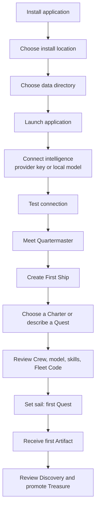
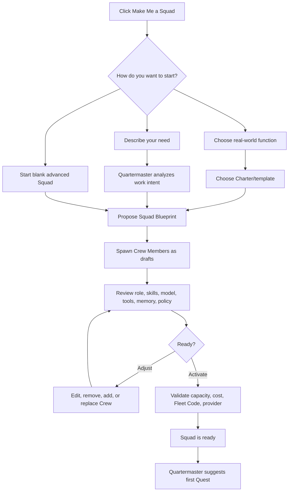

## 14. BYOK, BYOM, and BYOI
## 14.1 Core ownership promise

```text
Your key.
Your model.
Your infrastructure.
Your data.
Your memory.
Your Fleet.
```
## 14.2 Definitions

| Term | Meaning in product |
|---|---|
| **BYOK** | User connects their own provider account/API key; the product does not require platform inference credits |
| **BYOM** | User chooses cloud models, local models, self-hosted endpoints, or compatible model providers |
| **BYOI** | User runs the product locally, on a workstation, home server, VPS, private cloud, VPC, or other chosen infrastructure |
| **Self-hosted** | User controls application deployment and data boundary |
| **Portable** | User can export/import artifacts, Charters, maps, rules, and configuration |
## 14.3 Public wording rules

Do not use vague BYOK claims alone because BYOK can mean API-key ownership or encryption-key ownership in different contexts.

Use explicit copy:

```text
Use your own provider account.
Choose cloud, local, or OpenAI-compatible models.
Run locally, on your own server, or in private infrastructure.
You pay your selected model provider directly.
```
## 14.4 Cost transparency

The product must not reproduce the credit lock-in pain it was created to solve.

```text
Model provider cost:
User pays their selected provider directly.

Product value:
The product provides Fleet organization, orchestration,
Squad experience, safety controls, artifacts, learning,
local ownership, support, and collaboration.
```

Treasury should show:

- Provider/model usage by Voyage, Quest, Crew, Squad, Ship, and Fleet.
- Cost estimate/actual where provider data permits.
- Soft and hard budget thresholds.
- Forecast based on schedule/current usage.
- Cost anomaly and repeated-failure alerts.
- Suggested routing to lower-cost/local models where configured.

---
## 15. Business Model and Monetization
## 15.1 Economic philosophy

> Do not charge users for basic access to intelligence they already own.
>
> Charge when the product expands their operational capacity, reduces maintenance burden, enables collaboration, provides curated expertise, or supplies ongoing support.
## 15.2 What users own vs what the product provides

| User owns | Product provides |
|---|---|
| API/provider account | Quartermaster and Fleet orchestration |
| Model choice | Ship/Squad/Crew structure |
| Local model endpoint | Mission Board and Quest execution |
| Infrastructure/location | Artifacts, Maps, Charters, Logbook, Treasury |
| Data/memory/artifacts | Policy, approval, scoped learning, safety UX |
| Squad configuration | Maintained packs, collaboration, support, and expansion capacity |
## 15.3 Shipyard model

Shipyard is the product surface for capacity and upgrades.

> **Timber is a visual metaphor for capacity—not an inference credit currency.**

Do not sell consumable “timber” in the early product. Use it as visual language around capacity:

```text
Shipyard Capacity

Active Ships: 1 of 3
Crew Berths: 5 of 15
Voyage Lanes: 2 of 8

Need another persistent team?
Build another Ship.
```
## 15.4 Community

```text
Community — First Ship

• 1 Fleet / Dermaga
• Unlimited Workspaces, Projects, Maps, and Quests
• 1 active Ship
• 1 Quartermaster
• 1 Navigator
• Up to 5 persistent Crew Members
• 1 active Squad
• 2 concurrent Voyages
• 1–2 temporary agents under strict limits
• BYOK / BYOM / BYOI
• Local Logbook and Treasury
• Basic Mission Board
• Read-first defaults
• Approval required for external writes
• Import/export of core configuration and artifacts
```

Narrative:

> **Your first Ship is free to sail.**
>
> Create as many Workspaces, Projects, Maps, and Quests as you need. Build more persistent Ships only when your work requires a larger Fleet.
## 15.5 Monetization layers

| Layer | What the user purchases | Pricing style |
|---|---|---|
| Community | One useful local-first Fleet/Ship/Squad experience | Free |
| Pro capacity | More active Ships, more Crew berths, more Voyage lanes, advanced history/export | Subscription or major-version perpetual license |
| Squad Charters | Ready-to-run team blueprints, routines, artifacts, policies, evaluations | One-time purchase or maintained-pack subscription |
| Premium skills | Specialized safe capabilities | One-time or pack membership |
| Fleet Care | Managed update channel, pack maintenance, backup/sync, support | Optional subscription |
| Team | Shared Ships, approval routing, shared memory, audit, collaboration | Subscription per shared Ship/workspace |
| Private Dockyard | Private/VPC/on-prem deployment, support, governance | Project fee + support contract |
| Services | SOP-to-Quest conversion, custom Charter, integration, training | One-time engagement or retainer |
## 15.6 Pricing narrative

```text
Start with one Ship.

Bring your own key, model, and infrastructure.
When your work grows, build more Ships, recruit more Crew,
or add a Charter for a new kind of Quest.

You bring the intelligence.
We provide the Shipyard.
```
## 15.7 Squad Charter as a paid asset

A Squad Charter is not a prompt pack.

```text
Squad Charter
├── Specialist roles
├── Skills
├── Quest/SOP definitions
├── Artifact templates/contracts
├── Memory rules
├── Tool policies
├── Approval gates
├── Cost defaults
├── Evaluation fixtures
└── Update notes
```

Example paid Charters:

```text
Developer Delivery Charter
Marketing Launch Charter
Content Studio Charter
Research & Decision Charter
Agency Client Delivery Charter
```

---
## 16. UI/UX Design
## 16.1 UX philosophy

```text
Gamification makes work visible, progressive, and emotionally engaging.
Professional artifacts make work trustworthy and valuable.

Lore is the experience layer.
Functional clarity is the safety and business layer.
```
## 16.2 Three progressive experiences

| Experience | User | Primary interface | Hidden complexity |
|---|---|---|---|
| **Guided Work** | New/non-technical user | Quest, briefing, artifacts, approvals | Providers, tool schemas, logs, policy details |
| **Operations** | Professional/power user | Mission Board, Ships, Charters, Treasury, shared work | Raw traces and low-level runtime details |
| **Technical Control** | Developer/operator | Harbor, Fleet Code, Crow’s Nest, Logs, metrics, config, API/CLI | Nothing hidden; advanced controls visible |
## 16.3 First-run onboarding

Initial setup should be intentionally short:



The user should not be forced to configure channels, tools, webhooks, cron syntax, routing, runtime mode, memory backend, deployment topology, or raw policy syntax before first value.
## 16.4 Quartermaster Office: home screen

```text
Quartermaster Office

Good evening, Pirate King.

Fleet Status
• 2 Ships active
• 6 Quests in progress
• 3 Artifacts ready for review
• 1 Captain's Approval waiting
• Treasury: US$3.84 / US$8.00 today

Priority Briefing
1. Developer Ship found a release blocker.
2. Marketing Ship needs approval for campaign positioning.
3. Research Ship completed competitor analysis.

Recommended Actions
[Review release blocker]
[Choose positioning]
[Read competitor briefing]

Ask Quartermaster
[ What should the Fleet focus on next?                     ]
```
## 16.5 Navigation

### Full Fleet view

```text
Fleet Command
├── Quartermaster Office
├── Mission Board
├── Ships
│   ├── Developer Ship
│   │   ├── Navigator
│   │   ├── Squads
│   │   ├── Crew Members
│   │   ├── Quests
│   │   ├── Artifacts
│   │   └── Charter
│   ├── Marketing Ship
│   └── Research Ship
├── Workspaces & Projects
├── Harbor
├── Treasury
├── Logbook
├── Fleet Code
├── Crow's Nest
└── Shipyard
```

### Community simplified view

```text
Home
├── Quartermaster
├── Mission Board
├── My Ship
├── Results / Artifacts
├── Treasury
└── Settings
```
## 16.6 Crew Members submenu and Make Me a Squad

```text
Crew Members                                      [+ Make Me a Squad]

Active: 5 / 5
──────────────────────────────────────────────────────────
Repository Analyst       Developer Ship      Active
Engineering Planner      Developer Ship      Active
QA Reviewer              Developer Ship      Active
Release Coordinator      Developer Ship      Active
Documentation Steward    Developer Ship      Active
```

### Make Me a Squad flow


## 16.7 Crew Member card

```text
Release Coordinator
Developer Ship · Active

Purpose
Prepare release-readiness packages for assigned projects.

Skills
✓ Changelog drafting
✓ Release checklist creation
✓ Documentation impact analysis
✓ Risk summarization

Can access
✓ Approved repository context
✓ CI status
✓ Release documentation

Needs Captain's Approval to
! Create GitHub issue
! Publish release notes

Cannot
✕ Merge code
✕ Deploy software
✕ Rotate credentials

Model
Recommended profile: Balanced Engineering Model

Memory
Ship-scoped release conventions

[Run Quest] [Edit] [View Artifacts] [Pause]
```
## 16.8 Mission Board UX

```text
Mission Board

Backlog | Ready to Sail | Underway | Awaiting Captain | Treasures

Quest: Prepare Release v1.4
Project: Product Platform
Suggested Ship: Developer Delivery Ship
Status: Ready to Sail
Estimated Treasury: US$0.60–1.40

[View Map] [Assign Ship] [Set Sail] [Edit Quest]
```
## 16.9 Quest result UX

```text
Quest Complete

Your Crew returned with 5 Artifacts.
Quartermaster found 3 Discoveries.

Treasures ready for review
• Release Readiness Brief
• Changelog Draft
• Go / No-Go Recommendation

[Review Treasure]
[Accept Findings]
[Ask for Revisions]
[Teach the Ship]
```
## 16.10 Gamification rules

### Healthy gamification

| Mechanic | Product purpose |
|---|---|
| Quest progress | Makes workflow state understandable |
| Map steps | Shows SOP/dependency progression |
| Discovery | Highlights useful findings |
| Treasure | Marks validated value/outcomes |
| Logbook milestones | Shows operational history and trust growth |
| Crew growth | Shows approved learning, not autonomous self-modification |
| Fleet health | Shows status and pending decisions |
| Charter completion | Confirms safe configuration before activation |

### Prohibited gamification

| Anti-pattern | Why it is prohibited |
|---|---|
| Loot boxes/random rewards | No professional or operational value |
| Authority based on XP | Authority must come from Owner policy, not game progression |
| Streaks that drive unnecessary runs | Increases cost/noise without work value |
| Deceptive “timber” spend | Makes capacity look like an opaque credit economy |
| Rewarding risky autonomous actions | Encourages unsafe behavior |
| Upgrade prompts on failure | Creates coercive/hostile UX |
| Locking user Artifact/memory behind paywall | Violates ownership promise |

---
