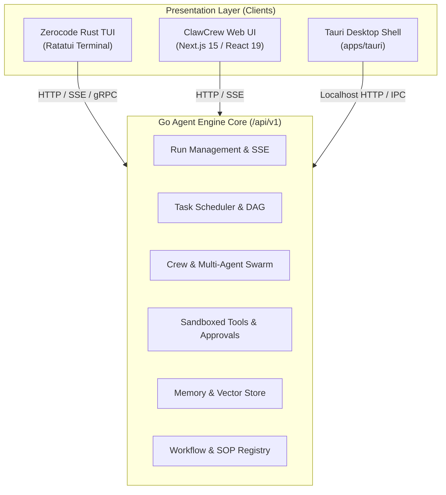

# Multi-Client Architecture & Platform Expansion (Phase 7)

## Overview

Following the migration to Go Agent Engine as the canonical state and AI Brain owner, all client presentation surfaces connect to the engine via the standardized `/api/v1` REST, SSE, and gRPC endpoints.

## 1. Web UI (Next.js 15 / React 19) (TASK-7.5)

- **Connection Protocol**: Standard browser `fetch` for REST commands (`POST /api/v1/runs`, `POST /api/v1/approvals`) and `EventSource` / SSE for monotonic real-time event streaming (`GET /api/v1/runs/{id}/events`).
- **State Management**: Zero local business state duplication. Client stores are on-demand materialized projections of Go Engine events.
- **Components**:
  - `TaskTimeline`: Interactive SVG / Canvas DAG graph matching the Go topological sort.
  - `CrewRoster`: Live agent status cards with WebSocket/SSE ping indicators.
  - `DiffViewer`: Syntax-highlighted unified diff for artifacts generated during runs.
  - `ApprovalModal`: Floating dialog prompting for Tool execution approvals.

## 2. Tauri Desktop Shell (`apps/tauri`) (TASK-7.6)

- **Process Architecture**:
  - The Go Agent Engine binary is bundled as a Tauri sidecar (`externalBin`).
  - Upon desktop shell launch, Tauri starts `engine.exe` on an ephemeral or configured localhost port (default: 8080 HTTP, 50051 gRPC).
  - The web frontend inside Tauri's webview interacts directly with localhost HTTP/SSE.
- **Security Boundaries**:
  - Localhost loopback binding (`127.0.0.1`) only; external network requests rejected without authentication token.
  - Native filesystem access restricted to configured `workspace_root`.

## 3. Shared Client Contract Guarantee

All client implementations share the exact same JSON schema and event sequence semantics:
- Monotonic sequence numbers on SSE events (`event.sequence`).
- Standardized error envelopes conforming to Clean Architecture.
- Zero local conflict resolution needed; Go Engine is the single source of truth.
