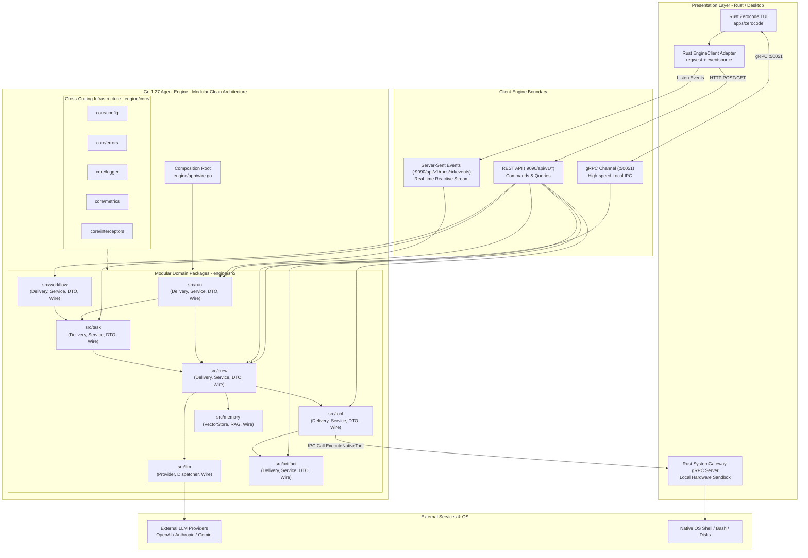
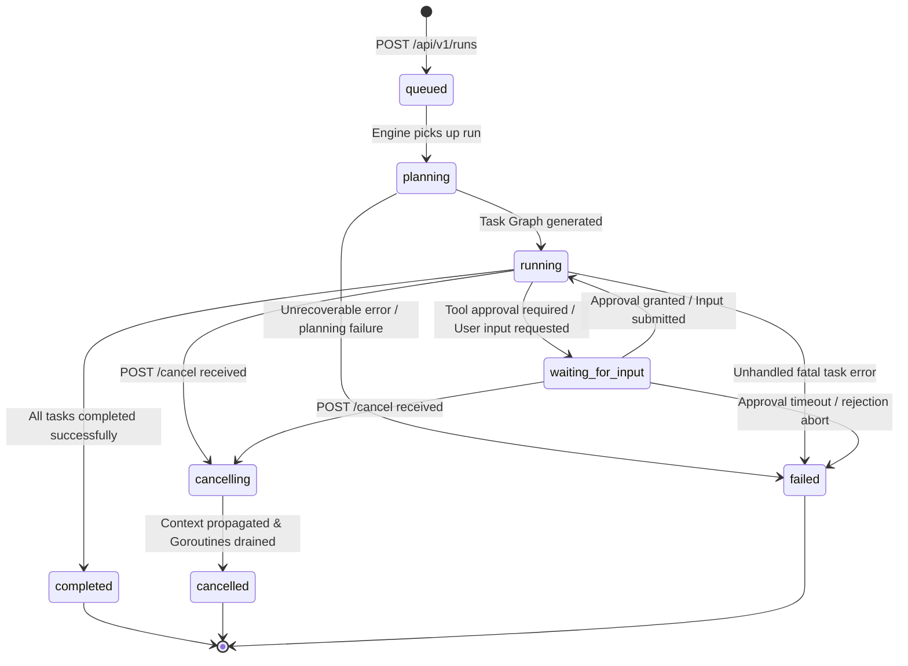
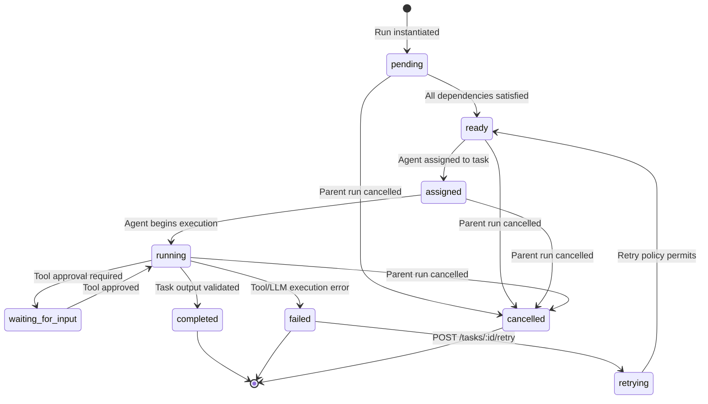
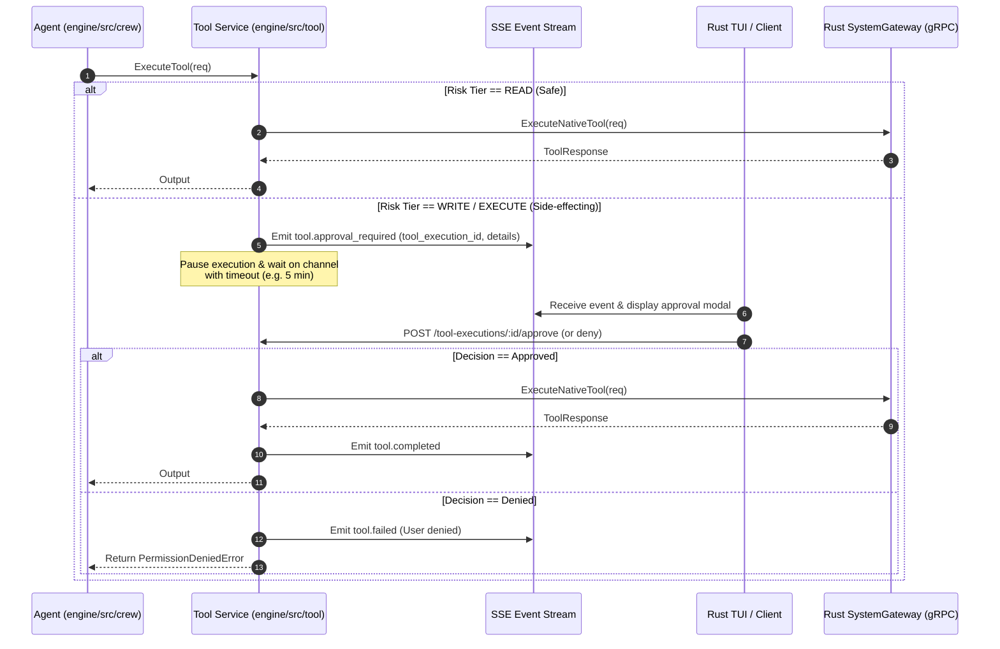

# Technical Specification — ClawCrew Modular Go Engine & Hybrid Architecture (Phase 2)

> **Branch Context**: `feat/enhance-agent-phase2`  
> **Status**: Living Technical Architecture Specification  
> **Related Documents**: [README](./README.md) | [PRD](./prd.md) | [API Specification](./api-spec.md) | [Task Breakdown](./task-breakdown.md) | [Migration Matrix](./migration-matrix.md)

---

## 1. High-Level Architecture Topology

Sistem Claw-Crew Phase 2 dibangun dengan pendekatan **Hybrid Sidecar Architecture**:
- **Klien Antarmuka (Rust Zerocode TUI / Tauri Desktop)**: Berjalan sebagai proses utama pengguna.
- **AI Brain & Execution Engine (Go 1.27)**: Berjalan sebagai *child daemon* lokal (`engine/bin/agent-engine`).
- **Protokol Komunikasi**: Menggunakan **REST over HTTP** untuk operasi Command/Query, **Server-Sent Events (SSE)** untuk streaming event satu arah berkategori real-time, serta **Local gRPC over loopback socket** untuk IPC berkecepatan tinggi antara Rust Gateway dan Go Engine.



---

## 2. Arsitektur Modular (Clean Code) di `engine/`

Sesuai pola yang sudah mapan pada fondasi `engine/` saat ini, seluruh kapabilitas baru diorganisasikan ke dalam struktur **Modular Clean Architecture**. Setiap domain fitur diletakkan secara mandiri di bawah direktori `engine/src/`.

### 2.1 Struktur Direktori Standar Per Modul
Setiap modul di dalam `engine/src/<domain>/` wajib memiliki 5 file standar berikut:

```text
engine/src/<domain>/
├── delivery.go       # Lapisan Delivery: HTTP/SSE route handlers & gRPC service registrations
├── services.go       # Lapisan Service (Usecase): Logika bisnis inti, state machines, konkurensi
├── interfaces.go     # Kontrak antarmuka: Abstraksi agar domain terisolasi dan testable
├── dto.go            # Data Transfer Objects: Request, Response, dan Payload Event (JSON v2 tags)
├── wire.go           # Google Wire Provider Set: Mendeklarasikan provider injection domain
└── <domain>_test.go  # Unit & integration tests per domain
```

### 2.2 Modul Eksisting & Penambahan Modul Baru di `engine/src/`

Struktur lengkap direktori `engine/` untuk Phase 2 adalah sebagai berikut:

```text
engine/
├── app/
│   ├── app.go                 # Inisialisasi struct App, lifecycle start/stop
│   ├── wire.go                # Composition root injeksi Wire untuk seluruh modul
│   └── wire_gen.go            # Kode Wire hasil auto-generate (type-safe compile-time)
├── cmd/
│   └── agent-engine/
│       └── main.go            # Entrypoint executable daemon Go
├── core/
│   ├── config/                # AppConfig, environment & flag parsing
│   ├── errors/                # Centralized error handling (Code, Layer, Wrap)
│   ├── interceptors/          # gRPC & HTTP recovery, tracing, logging interceptors
│   ├── logger/                # Logging terstruktur (slog/zap) + lumberjack log rotation
│   └── metrics/               # Prometheus server (:9090) & HTTP route multiplexer
├── src/
│   ├── crew/                  # [EKSISTING] Kru, agen, role prompt, status agen
│   ├── llm/                   # [EKSISTING] Provider abstraction, streaming tokenizer, dispatcher
│   ├── memory/                # [EKSISTING] SIMD vector store, cosine similarity, session memory
│   │
│   ├── run/                   # [MODUL BARU] Run lifecycle manager, SSE event hub, cancellation
│   ├── task/                  # [MODUL BARU] DAG task graph, dependency scheduler, sequential & parallel fan-out
│   ├── tool/                  # [MODUL BARU] Tool registry, approval gate (Approve/Deny), audit logger
│   ├── workflow/              # [MODUL BARU] SOP & Template parser, workflow versioning, run instantiator
│   └── artifact/              # [MODUL BARU] Artifact storage (diffs, reports, code), metadata & retrieval
└── pkg/
    ├── client/                # Shared client adapters (misal gRPC system gateway client)
    └── pb/                    # Protobuf Go generated code
```

### 2.3 Rincian Tanggung Jawab Modul Baru

#### 1. `engine/src/run/`
- **Tanggung Jawab**: Mengelola siklus hidup *Run* (inisiasi, pembatalan, pemulihan), menyimpan mapping `context.CancelFunc` per run yang sedang aktif, dan menyiarkan (*broadcast*) event Server-Sent Events (SSE) kepada subscriber klien.
- **Komponen Utama**:
  - `interfaces.go`: Mendefinisikan `RunManager` dan `EventBroadcaster`.
  - `services.go`: Implementasi state machine Run, pengelolaan buffer event per run, penanganan timeout global.
  - `delivery.go`: Handler HTTP `/api/v1/runs`, `/api/v1/runs/{run_id}`, `/api/v1/runs/{run_id}/cancel`, dan `/api/v1/runs/{run_id}/events` (SSE Flusher).
  - `wire.go`: `var Set = wire.NewSet(NewService, NewHTTPHandler)`.

#### 2. `engine/src/task/`
- **Tanggung Jawab**: Mengelola graf tugas (*Directed Acyclic Graph* / DAG), validasi dependensi antar-tugas, penugasan (*assignment*) tugas ke sub-agen tertentu, serta eksekusi tugas paralel (*fan-out / fan-in*) menggunakan `sync.WaitGroup` dan channels.
- **Komponen Utama**:
  - `interfaces.go`: Mendefinisikan `TaskScheduler` dan `TaskCoordinator`.
  - `services.go`: Pengecekan siklus dependensi (topological sort), evaluasi kesiapan task (`ready`), dispatching task ke agen, serta penanganan *retry*.
  - `delivery.go`: Handler HTTP `/api/v1/runs/{run_id}/tasks` dan `/api/v1/runs/{run_id}/tasks/{task_id}/retry`.
  - `wire.go`: `var Set = wire.NewSet(NewService, NewHTTPHandler)`.

#### 3. `engine/src/tool/`
- **Tanggung Jawab**: Registrasi alat (*tool registry*), validasi argumen tool, evaluasi kebijakan risiko (*risk tier*: Read, Write, Execute), menghentikan alur eksekusi sementara (*pause*) untuk menunggu persetujuan pengguna (*approval gate*), dan mencatat jejak audit (*audit log*).
- **Komponen Utama**:
  - `interfaces.go`: Mendefinisikan `ToolExecutor`, `ApprovalGate`, dan `ToolRegistry`.
  - `services.go`: Channel persetujuan (`chan ApprovalDecision`), mekanisme timeout persetujuan, isolasi path/sandboxing, dan pendelegasian eksekusi native tool ke Rust via gRPC.
  - `delivery.go`: Handler HTTP `/api/v1/runs/{run_id}/tool-executions`, serta endpoint `/approve` dan `/deny`.
  - `wire.go`: `var Set = wire.NewSet(NewService, NewHTTPHandler)`.

#### 4. `engine/src/workflow/`
- **Tanggung Jawab**: Parsing definisi Standard Operating Procedure (SOP) dan template alur kerja (format YAML/JSON), manajemen versi template, serta menginstansiasi template menjadi *Task Graph* konkret di dalam modul `task`.
- **Komponen Utama**:
  - `interfaces.go`: Mendefinisikan `WorkflowParser` dan `WorkflowRegistry`.
  - `services.go`: Validasi skema SOP, pemetaan peran agen ke langkah-langkah kerja, injeksi parameter default.
  - `delivery.go`: Handler HTTP `/api/v1/workflows` dan `/api/v1/workflows/{workflow_id}/instantiate`.
  - `wire.go`: `var Set = wire.NewSet(NewService, NewHTTPHandler)`.

#### 5. `engine/src/artifact/`
- **Tanggung Jawab**: Manajemen dokumen hasil kerja agen yang dihasilkan selama run (diff git patch, file source code baru, laporan sintesis riset, ringkasan eksekutif), penyimpanan metadata, dan penyajian konten via API.
- **Komponen Utama**:
  - `interfaces.go`: Mendefinisikan `ArtifactManager` dan `ArtifactRepository`.
  - `services.go`: Hashing konten, ekstraksi ringkasan (*summary*), deteksi tipe MIME, dan penyimpanan disk/in-memory.
  - `delivery.go`: Handler HTTP `/api/v1/runs/{run_id}/artifacts` dan `/api/v1/artifacts/{artifact_id}/content`.
  - `wire.go`: `var Set = wire.NewSet(NewService, NewHTTPHandler)`.

---

## 3. Dependency Injection dengan Google Wire

Setiap modul domain mendeklarasikan `wire.NewSet` yang membungkus konstruktor `NewService` dan `NewHTTPHandler`/`NewGRPCHandler`. 

### 3.1 Pola Wire Set Per Domain
Contoh pada `engine/src/run/wire.go`:

```go
package run

import "github.com/google/wire"

// Set mendefinisikan Wire provider set untuk modul run
var Set = wire.NewSet(
	NewService,
	NewHTTPHandler,
	wire.Bind(new(RunManager), new(*service)),
	wire.Bind(new(EventBroadcaster), new(*service)),
)
```

### 3.2 Composition Root pada `engine/app/wire.go`
Seluruh provider set disatukan secara *type-safe* pada level aplikasi tanpa menggunakan *reflection* runtime:

```go
//go:build wireinject
// +build wireinject

package app

import (
	"github.com/diezy-labs/claw-crew/engine/core/config"
	"github.com/diezy-labs/claw-crew/engine/pkg/client"
	"github.com/diezy-labs/claw-crew/engine/src/artifact"
	"github.com/diezy-labs/claw-crew/engine/src/crew"
	"github.com/diezy-labs/claw-crew/engine/src/llm"
	"github.com/diezy-labs/claw-crew/engine/src/memory"
	"github.com/diezy-labs/claw-crew/engine/src/run"
	"github.com/diezy-labs/claw-crew/engine/src/task"
	"github.com/diezy-labs/claw-crew/engine/src/tool"
	"github.com/diezy-labs/claw-crew/engine/src/workflow"
	"github.com/google/wire"
)

// InitializeApp membangun graf dependensi secara kompilasi via Google Wire
func InitializeApp(cfg *config.AppConfig) (*App, error) {
	wire.Build(
		NewGRPCServer,
		ProvideMetricsServer,
		client.Set,
		llm.Set,
		memory.Set,
		crew.Set,
		run.Set,
		task.Set,
		tool.Set,
		workflow.Set,
		artifact.Set,
		NewApp,
	)
	return &App{}, nil
}
```

---

## 4. Standarisasi Go Idioms & Quality Rules

Seluruh kode Go yang ditulis pada Phase 2 wajib mematuhi standar idiom Go, SonarQube Enterprise rules, dan praktik terbaik konkurensi berikut:

1. **Context First & No Struct Storage**:
   `ctx context.Context` wajib menjadi parameter pertama pada seluruh fungsi yang melakukan operasi I/O atau konkurensi (`ctx context.Context, ...`). **Dilarang keras** menyimpan `ctx` sebagai field di dalam struct. Selalu panggil `defer cancel()` saat membuat context turunan dengan timeout/cancellation.
2. **Centralized Error Handling via `core/errors`**:
   Semua error dari lapisan external atau repository harus dibungkus dengan custom error `core/errors` yang memuat kode status (`Code`), layer asal (`Layer`), dan pesan kontekstual. Evaluasi error menggunakan `errors.Is` dan `errors.As`.
3. **Pembersihan Sumber Daya Terjamin (`defer`)**:
   Setiap alokasi resource eksternal wajib langsung di-defer pelepasannya setelah inisiasi berhasil (`defer resp.Body.Close()`, `defer file.Close()`, `defer s.mu.RUnlock()`).
4. **Penamaan Antarmuka (Interface Naming Idiom)**:
   Antarmuka dengan satu metode wajib diakhiri dengan akhiran `-er` (contoh: `RunStarter`, `TaskScheduler`, `ToolApprover`, `ArtifactReader`).
5. **Konkurensi Bersih & Zero Goroutine Leak**:
   - Dilarang membuat goroutine liar (*unmanaged goroutines*) tanpa mekanisme penghentian.
   - Setiap goroutine pekerja wajib memantau `select { case <-ctx.Done(): return }`.
   - Gunakan `sync.WaitGroup` terukur untuk sinkronisasi sekumpulan sub-agen paralel.
   - Dilarang menggunakan *busy-waiting loop* (loop kosong menunggu flag boolean).
6. **Parsing Berkecepatan Tinggi (`encoding/json/v2`)**:
   Manfaatkan paket modern `encoding/json/v2` (`json.UnmarshalRead`, `json.MarshalWrite`) untuk memproses aliran streaming token JSON tanpa overhead alokasi memori berlebih.
7. **Keamanan Kredensial**:
   Tidak ada hardcoding token, API key, atau rahasia apa pun di dalam kode Go. Seluruh konfigurasi sensitif dipasok melalui argumen aman atau dimintakan secara dinamis via gRPC ke Secret Vault Rust.

---

## 5. Domain Models & Entities

```text
Crew
├── ID: string
├── Name: string
├── Description: string
├── Policy: CrewPolicy
└── Agents: []Agent

Agent
├── ID: string
├── CrewID: string
├── Name: string
├── Role: string (Prompt System Policy)
├── Capabilities: []string
├── Status: AgentStatus (idle, thinking, executing_tool, waiting_approval, completed, error)
└── Configuration: AgentConfig

Run
├── ID: string
├── CrewID: string
├── WorkflowID: string
├── Status: RunStatus (queued, planning, running, waiting_for_input, completed, cancelling, cancelled, failed)
├── Input: RunInput
├── WorkspaceRoot: string
├── StartedAt: time.Time
├── CompletedAt: *time.Time
├── Error: *ErrorInfo
└── Metadata: map[string]any

Task
├── ID: string
├── RunID: string
├── ParentTaskID: *string
├── AssignedAgentID: string
├── Title: string
├── Description: string
├── Status: TaskStatus (pending, ready, assigned, running, waiting_for_input, completed, failed, cancelled)
├── Dependencies: []string (task_ids)
├── Input: map[string]any
├── Output: map[string]any
├── Error: *ErrorInfo
├── Timestamps: ExecutionTimestamps
└── RetryCount: int

ToolExecution
├── ID: string
├── RunID: string
├── TaskID: string
├── AgentID: string
├── ToolName: string
├── RiskTier: RiskTier (read, write, execute)
├── Status: ToolStatus (requested, waiting_approval, approved, denied, executing, completed, failed)
├── RequestPayload: map[string]any
├── ResponsePayload: map[string]any
├── ApprovalDecision: *ApprovalDecision
└── Timestamps: ExecutionTimestamps

Artifact
├── ID: string
├── RunID: string
├── TaskID: string
├── AgentID: string
├── Kind: ArtifactKind (git_diff, source_file, markdown_report, json_data)
├── Name: string
├── MediaType: string
├── StorageLocation: string
├── Summary: string
├── ByteSize: int64
└── CreatedAt: time.Time

MemoryRecord
├── ID: string
├── Scope: MemoryScope (session, global, project)
├── Source: string
├── Content: string
├── Embedding: []float32
├── Score: float32
└── CreatedAt: time.Time
```

---

## 6. State Machines

### 6.1 Run State Machine



### 6.2 Task State Machine



### 6.3 Tool Execution & Approval Flow



---

## 7. Event Model & Server-Sent Events (SSE)

### 7.1 Karakteristik Event Stream
1. **Monotonically Increasing Sequence**: Setiap event yang dipancarkan dalam satu `run_id` memiliki nomor urut integer `sequence` yang dimulai dari 1.
2. **Dukungan Reconnection**: Klien dapat mengirim header `Last-Event-ID: evt_...` jika koneksi terputus; Go Engine dapat mengirimkan kembali event yang terlewat dari buffer memori.
3. **Policy Keamanan Ringkasan Pemikiran**: Event `agent.thought_summary` hanya berisi ringkasan tingkat tinggi yang aman dan terformat, **tidak pernah** mengekspos monolog internal atau *hidden chain-of-thought* LLM mentah.

### 7.2 Taksonomi Event
- `run.created`, `run.status_changed`, `run.completed`, `run.failed`, `run.cancelled`
- `task.created`, `task.assigned`, `task.status_changed`, `task.completed`, `task.failed`
- `agent.status_changed`, `agent.message`, `agent.thought_summary`
- `tool.requested`, `tool.approval_required`, `tool.started`, `tool.completed`, `tool.failed`
- `artifact.created`
- `memory.retrieved`
- `warning.created`

---

## 8. Reliability & Safety Policy

- **Request ID & Idempotensi**: Setiap request POST mendukung header `Idempotency-Key` untuk mencegah eksekusi run ganda saat jaringan tidak stabil.
- **Graceful Shutdown**: Saat daemon menerima sinyal `SIGINT`/`SIGTERM` dari Rust wrapper, Go Engine memberikan waktu *grace period* (default 5 detik) untuk menyelesaikan penulisan log, menutup stream SSE secara rapi, dan membatalkan semua context aktif.
- **Path Sandboxing**: Modul `tool` membatasi seluruh manipulasi file hanya di dalam direktori kerja yang disetujui (`WorkspaceRoot`). Percobaan manipulasi di luar root (misal `../../etc/passwd`) langsung ditolak dengan `CodePermissionDenied`.
- **Redaksi Data Sensitif**: Filter otomatis diterapkan pada logger dan payload event untuk menghapus token string yang cocok dengan regex kredensial (misal `sk-...`, `Bearer ...`).

---

## 9. Testing Strategy

| Level Pengujian | Cakupan & Fokus | Lokasi Kode |
|---|---|---|
| **Unit Tests** | Validasi state machine, dependency DAG sort, retry logic, DTO mapping | `engine/src/*/*_test.go` |
| **Contract Tests** | Memastikan Rust `engine_client` kompatibel dengan respons HTTP & stream SSE Go | `apps/zerocode/tests/contract/` |
| **Integration Tests**| Pengujian interaksi modul (Run -> Task -> Crew -> LLM Provider Mock -> Tool Mock) | `engine/tests/integration/` |
| **End-to-End Tests** | Menguji skenario lengkap: start run, stream SSE, approval gate, artifact generation | `tests/e2e/` |
| **Stress & Leak Tests**| Memastikan tidak ada goroutine leak & memory leak dengan 50 sub-agen paralel | `engine/src/crew/stress_test.go` |
| **Security Tests** | Verifikasi penolakan path traversal, redaksi token rahasia, audit logging | `engine/src/tool/tool_test.go` |
