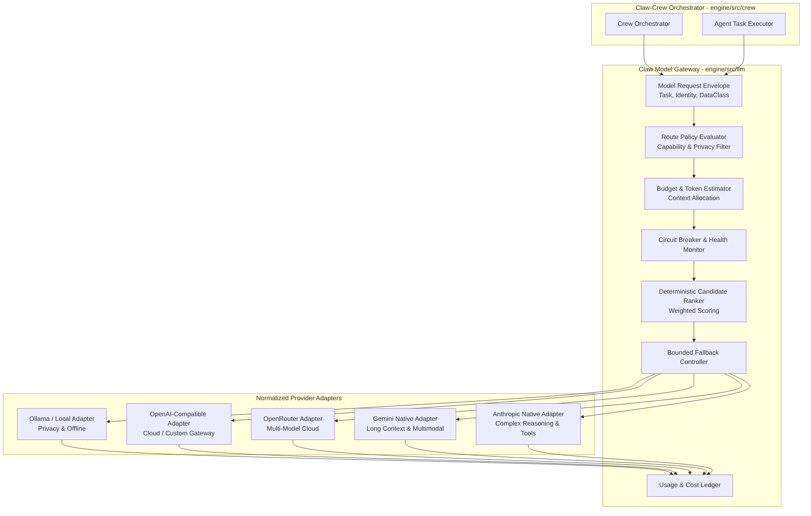

# Claw-Crew Phase 3 — Provider Routing & Model Governance: Overview

> **Status:** Proposed Phase 3 Specification  
> **Parent Directory:** [`docs/refactoring/`](../../)  
> **Primary Runtime:** Go `1.27.1` (`engine/src/llm/`)  
> **Comparator Reviewed:** `decolua/9router`  
> **Target Branch Context:** `feat/enhance-agent-phase2`  
> **Date:** 2026-09-28  

---

## 1. Executive Decision

Claw-Crew should add a **policy-driven, agent-aware Model Gateway inside the Go orchestrator**, but it should **not** become a generic AI proxy or attempt to replicate all of 9router.

```text
┌─────────────────────────────────────────────────────────────────────────────┐
│                             The Product Decision                            │
│                                                                             │
│ Build a policy-driven, agent-aware Model Gateway inside the Go engine.      │
│ It selects and governs models for Claw-Crew runs, tasks, and agents;        │
│ it is NOT a transparent replacement for every external SDK or third-party   │
│ client application.                                                         │
└─────────────────────────────────────────────────────────────────────────────┘
```

### 1.1 Comparator Analysis: 9router vs. Claw-Crew
- **9router** is an AI provider proxy and routing application. Its codebase centers on handling diverse external clients, account pooling, proxy tunnels, MITM interception, and universal protocol emulation.
- **Claw-Crew** is an autonomous agent workspace platform. Its Go engine already owns orchestration, multi-agent runs, vector memory, tool sandboxing, and desktop sidecar communication.

Therefore, the provider subsystem must directly serve the agent orchestrator (`engine/src/crew/` and `engine/src/llm/`), rather than turning Claw-Crew into a generic proxy service.

```text
The Phase 3 Objective:
Right model + right provider + right policy
for the specific task, workspace, privacy level, budget, capability requirement, and reliability target.
```

---

## 2. 9router Pattern Adoption Matrix

| 9router Pattern | Why It Is Useful | Claw-Crew Phase 3 Decision |
|---|---|---|
| **Provider Normalization** | Prevents provider alias and config drift. | **Adopt natively** in `engine/src/llm/provider.go`. |
| **Model Catalog Synchronization** | Keeps model availability and limits up to date. | **Adopt**, with an explicit verification gate before activation. |
| **Provider Nodes / Accounts** | Separates credentials, endpoints, and health state from model names. | **Adopt** as `ProviderAccount` DTO. |
| **Pricing & Usage Tracking** | Enables cost estimation and budget controls. | **Adopt**, clearly labeling `confidence` (reported vs estimate). |
| **Route Presets / Combos** | Reusable model selection profiles per task type. | **Adopt** as `RouteProfile` (`local-only`, `balanced`, `code`, etc.). |
| **Key & Secret References** | Prevents embedding API keys in database rows. | **Adopt** via OS keychain and secret references (`secret://`). |
| **Streaming Output Normalization** | Unifies SSE chunks across provider variations. | **Adopt** in `engine/src/llm/interfaces.go` (`ChatChunk`). |
| **Proxy Pools / Tunnel / MITM** | Routes traffic through rotating proxy pools. | **Reject** — High security risk, violates terms of service. |
| **Generic Client Proxy Routes** | Emulates OpenAI endpoints for third-party tools. | **Defer** — Not aligned with core agent workspace needs. |

---

## 3. High-Level Architecture Topology



---

## 4. Document Index

This documentation suite is organized into focused, modular specifications:

| Document | Focus & Key Contents |
|---|---|
| [**`prd.md`**](./prd.md) | **Product Requirements Document**: CMG goals, non-goals, capability matrix, user profiles, and UI/UX plan. |
| [**`tech-spec.md`**](./tech-spec.md) | **Technical Specification (Engine Standards)**: Clean Architecture mapping in `engine/src/llm/`, Go 1.27 contracts (`interfaces.go`, `dto.go`, `services.go`), Wire DI, token budgeting, and caching. |
| [**`routing-algorithm.md`**](./routing-algorithm.md) | **Route Selection & Scoring**: 15-stage deterministic selection pipeline, weighted multi-attribute formula, hard constraints, and safe fallback rules. |
| [**`api-spec.md`**](./api-spec.md) | **API & Tauri Specification**: REST endpoints (`/api/v1/provider-accounts`, `/api/v1/route-policies`), Tauri IPC commands, and explainable decision DTOs. |
| [**`security-governance.md`**](./security-governance.md) | **Security & Compliance**: Secret reference architecture, data classification matrix, terms-of-service compliance, and anti-patterns. |
| [**`evaluation-scorecard.md`**](./evaluation-scorecard.md) | **Evaluation & Canary Rollout**: Golden test fixtures, route quality scorecards, model verification lifecycle, and delivery phases. |

---

## 5. Architectural Alignment with Existing Engine

The Model Gateway directly extends the existing `engine/src/llm/` package:
- **Interfaces:** Extends `Provider` and `MultiProvider` in `engine/src/llm/interfaces.go` with `ProviderAdapter`, `RouteSelector`, and `UsageLedger`.
- **Clean Architecture:** Standard separation into `interfaces.go`, `dto.go`, `services.go`, `delivery.go`, and `wire.go`.
- **Composition Root:** Registers via `llm.ProviderSet` in `engine/app/wire.go`.
- **Error Taxonomy:** Maps upstream provider errors to standard `appErrors.Code` (`CodeTimeout`, `CodeUnavailable`, `CodePermissionDenied`, `CodeLLMStreamError`).
