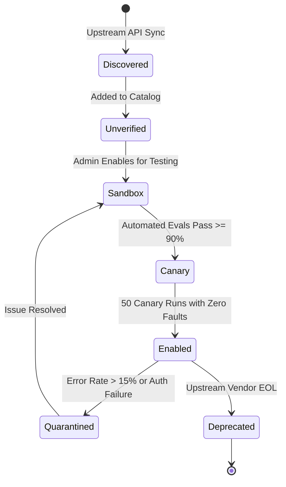

# Claw-Crew Phase 3 — Provider Routing: Evaluation & Canary Rollout

> **Status:** Proposed Evaluation Strategy & Rollout Plan  
> **Target:** `evals/provider-routing/` & model promotion lifecycle  
> **Parent Directory:** [`docs/refactoring/phase3/provider-routing/`](./)  

---

## 1. Route Quality Evaluation Framework

Provider flexibility without empirical quality measurement introduces unpredictable task degradation. Lowering costs by switching models is counterproductive if task success rates collapse.

Claw-Crew evaluates every route profile against flagship skill fixtures:

```text
evals/
├── provider-routing/
│   ├── codebase-audit/        # Evaluates syntax correctness & AST understanding
│   ├── deep-research/         # Evaluates citation grounding & long-context retention
│   ├── structured-extraction/ # Evaluates strict JSON schema adherence
│   ├── tool-execution/        # Evaluates tool call formatting & parameter accuracy
│   └── safety-policy/         # Evaluates prompt injection resistance & secret protection
├── policies/
│   ├── local-only.yaml
│   ├── economy.yaml
│   ├── balanced.yaml
│   └── premium.yaml
└── scorecards/
    ├── correctness.yaml
    ├── groundedness.yaml
    └── latency-cost.yaml
```

---

## 2. Route Quality Scorecard Metrics

| Metric | Target | Definition & Measurement Method |
|---|---|---|
| **Task Completion Rate** | $\ge 92\%$ | Fraction of tasks completing with valid terminal output without human fix. |
| **Structured Output Validity** | $100\%$ | Strict JSON schema validation for all machine-consumed payloads. |
| **Tool Call Correctness** | $\ge 98\%$ | Accurate tool selection, parameter formatting, and schema compliance. |
| **Groundedness Coverage** | $\ge 90\%$ | Percentage of factual statements backed by cited source artifacts in RAG. |
| **Cost per Accepted Task** | Profile-specific | Actual reported cost divided by number of user-accepted outcomes. |
| **P95 Turn Latency** | Profile-specific | 95th percentile latency across all generated turns for that profile. |
| **Fallback Frequency** | $\le 5\%$ | Rate of requests triggering secondary routes (signals provider instability). |
| **Data Boundary Violations**| **0% (Zero)** | Zero instances of confidential data reaching unauthorized cloud endpoints. |

---

## 3. Model Lifecycle & Canary Rollout

Newly discovered or configured models must pass through an incremental safety pipeline before being promoted to production agent routes:



### Invariants:
1. **No Auto-Promotion:** A model discovered via dynamic catalog sync begins in `unverified` and is hidden from production crews.
2. **Canary Traffic:** In `canary` state, the model is routed only to opted-in developer workspaces or low-risk synthetic eval tasks.
3. **Automated Quarantine:** If an enabled provider accounts 5 consecutive upstream 5xx errors or auth failures, the circuit breaker moves the account to `quarantine`, excluding it from primary and fallback selection.

---

## 4. Phase 3 Delivery Plan Overview

| Phase | Milestone Name | Key Objective & Deliverables | Exit Criteria |
|---|---|---|---|
| **3.0** | Design & Safety Baseline | Contracts, ADRs, normalized error taxonomy, data classification. | Zero credential leakage; typed error envelopes. |
| **3.1** | Adapter Foundation | Local Ollama + OpenAI-compatible + OpenRouter adapters. | Single agent turn runs across both local and cloud routes. |
| **3.2** | Catalog & Health | Model catalog storage, health checks, circuit breakers, UI inspector. | UI explains route decisions and rejected candidates. |
| **3.3** | Token & Budget Control | Context budgeter, token estimation, cost ledger, CAS fallback gates. | Agent cannot breach per-run spending caps. |
| **3.4** | RAG-Aware Routing | Embedding provider classes, retrieval volume routing, eval suites. | Citation verification and long-context cost optimization. |
| **3.5** | Multi-Workspace Governance | Workspace provider allowlists, scheduled health pings, canary rollouts. | Safe operational governance across multi-workspace setups. |
