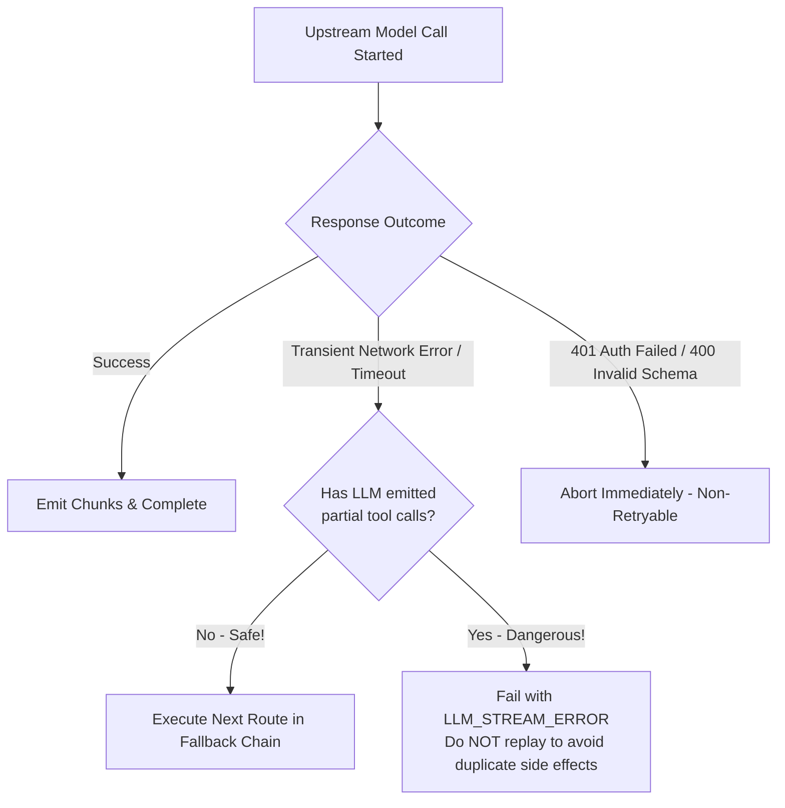

# Claw-Crew Phase 3 — Provider Routing: Technical Specification

> **Status:** Proposed Technical Specification  
> **Package Target:** `github.com/diezy-labs/claw-crew/engine/src/llm`  
> **Runtime / Toolchain:** Go `1.27.1`  
> **Parent Directory:** [`docs/refactoring/phase3/provider-routing/`](./)  

---

## 1. Clean Architecture & Package Layout

In accordance with the existing design in `engine/src/llm/` and surrounding domains (`engine/src/crew/`, `engine/src/tool/`), the Model Gateway implementation resides directly in `engine/src/llm/`. It rejects creating detached `internal/modelgateway` trees and preserves the existing Clean Architecture layering:

```text
engine/
├── core/
│   ├── errors/                 # appErrors.New, Wrap, ErrorEnvelope
│   ├── logger/                 # Structured log/slog via logger.Get()
│   ├── id/                     # UUID and prefix generator (id.New)
│   ├── metrics/                # Prometheus metrics registration
│   └── tracing/                # Correlation context & tracing
├── app/
│   ├── wire.go                 # Composition root (Google Wire)
│   └── wire_gen.go             # Wire generated injector
└── src/
    ├── crew/                   # Orchestrator consuming llm.MultiProvider & llm.RouteSelector
    └── llm/                    # Phase 3 Claw Model Gateway (CMG)
        ├── interfaces.go       # Core contracts (Provider, MultiProvider, RouteSelector, UsageLedger)
        ├── dto.go              # DTOs: ProviderAccount, ModelDescriptor, RoutePolicy, RouteDecision
        ├── provider.go         # Standard Provider implementations (OpenAI, Anthropic, Gemini, Ollama)
        ├── dispatcher.go       # ToolDispatcher for function calling integration
        ├── route_service.go    # Deterministic route selection & fallback controller
        ├── catalog_service.go  # Model catalog storage & discovery manager
        ├── budget_service.go   # Context budgeter & token estimator
        ├── delivery.go         # REST API handlers for provider accounts & route policies
        ├── wire.go             # Google Wire ProviderSet (wire.NewSet)
        ├── llm_test.go
        ├── mock_provider.go
        ├── multi_provider.go
        ├── stream_cancellation_test.go
        └── route_selector_test.go
```

---

## 2. Domain Models & Data Transfer Objects (`dto.go`)

The domain models extend `engine/src/llm/dto.go` (and `interfaces.go`) to support multi-provider accounts, fine-grained capability descriptors, and explainable route decisions:

```go
package llm

import (
	"time"
)

// ProviderType identifies the upstream provider protocol family
type ProviderType string

const (
	ProviderTypeOllama         ProviderType = "ollama"
	ProviderTypeOpenAICompat   ProviderType = "openai_compatible"
	ProviderTypeOpenRouter     ProviderType = "openrouter"
	ProviderTypeGeminiNative   ProviderType = "gemini_native"
	ProviderTypeAnthropicNative ProviderType = "anthropic_native"
	ProviderTypeAzureOpenAI    ProviderType = "azure_openai"
)

// HealthStatus represents the connectivity state of a provider endpoint
type HealthStatus string

const (
	HealthStatusHealthy   HealthStatus = "healthy"
	HealthStatusDegraded  HealthStatus = "degraded"
	HealthStatusDown      HealthStatus = "down"
	HealthStatusQuarantine HealthStatus = "quarantine"
)

// PricingConfidence denotes the reliability level of cost calculations
type PricingConfidence string

const (
	ConfidenceProviderReported PricingConfidence = "provider_reported"
	ConfidenceCatalogEstimate  PricingConfidence = "catalog_estimate"
	ConfidenceUnknown          PricingConfidence = "unknown"
)

// ProviderAccount represents a configured account and endpoint without raw credentials
type ProviderAccount struct {
	ID                string            `json:"id"`                 // e.g. "pa_openrouter_primary"
	ProviderType      ProviderType      `json:"provider_type"`
	DisplayName       string            `json:"display_name"`
	EndpointURL       string            `json:"endpoint_url"`
	CredentialRef     string            `json:"credential_ref"`    // e.g. "secret://workspace/default/openrouter-key"
	Enabled           bool              `json:"enabled"`
	HealthStatus      HealthStatus      `json:"health_status"`
	AllowedWorkspaces []string          `json:"allowed_workspaces"`
	Labels            []string          `json:"labels,omitempty"`
	LastHealthCheckAt *time.Time        `json:"last_health_check_at,omitempty"`
}

// CapabilitySet enumerates supported LLM features for capability-based filtering
type CapabilitySet struct {
	TextGeneration   bool `json:"text_generation"`
	Streaming        bool `json:"streaming"`
	ToolCalling      bool `json:"tool_calling"`
	StructuredOutput bool `json:"structured_output"`
	JSONSchema       bool `json:"json_schema"`
	Vision           bool `json:"vision"`
	Embeddings       bool `json:"embeddings"`
	PromptCaching    bool `json:"prompt_caching"`
}

// ModelLimits defines context window and generation ceilings
type ModelLimits struct {
	ContextWindowTokens int `json:"context_window_tokens"`
	MaxOutputTokens     int `json:"max_output_tokens"`
}

// ModelPricing records cost per million tokens in USD
type ModelPricing struct {
	InputPerMillionUSD  float64           `json:"input_per_million_usd"`
	OutputPerMillionUSD float64           `json:"output_per_million_usd"`
	Confidence          PricingConfidence `json:"confidence"`
	UpdatedAt           time.Time         `json:"updated_at"`
}

// ModelDescriptor represents a verified model available in the catalog
type ModelDescriptor struct {
	ID                string          `json:"id"` // e.g. "openrouter/qwen/qwen-2.5-coder-32b"
	ProviderAccountID string          `json:"provider_account_id"`
	ProviderModelID   string          `json:"provider_model_id"`
	DisplayName       string          `json:"display_name"`
	Capabilities      CapabilitySet   `json:"capabilities"`
	Limits            ModelLimits     `json:"limits"`
	Pricing           ModelPricing    `json:"pricing"`
	Enabled           bool            `json:"enabled"`
	VerifiedAt        *time.Time      `json:"verified_at,omitempty"`
}

// ModelRequest encapsulates prompt, identity, policy, and capability constraints
type ModelRequest struct {
	RequestID          string            `json:"request_id"`
	WorkspaceID        string            `json:"workspace_id"`
	RunID              string            `json:"run_id"`
	TaskID             string            `json:"task_id"`
	AgentID            string            `json:"agent_id"`
	Purpose            string            `json:"purpose"` // e.g. "code_generation", "deep_research"
	DataClassification string            `json:"data_classification"` // e.g. "public", "internal", "confidential"
	RouteProfile       string            `json:"route_profile"`       // e.g. "balanced", "local-only", "code"
	RequiredCaps       CapabilitySet     `json:"required_capabilities"`
	MinContextTokens   int               `json:"min_context_tokens"`
	MaxEstimatedCostUSD float64          `json:"max_estimated_cost_usd"`
	ChatRequest        *ChatRequest      `json:"chat_request"`
	PinnedModelID      string            `json:"pinned_model_id,omitempty"`
}

// RouteCandidate specifies a selected model and provider target
type RouteCandidate struct {
	ProviderAccountID string `json:"provider_account_id"`
	ModelID           string `json:"model_id"`
}

// RouteDecision provides full explainability for route selection and fallbacks
type RouteDecision struct {
	ID                 string           `json:"id"`
	RequestID          string           `json:"request_id"`
	Selected           RouteCandidate   `json:"selected"`
	Fallbacks          []RouteCandidate `json:"fallbacks"`
	ReasonCodes        []string         `json:"reason_codes"`
	RejectedCandidates []RejectedTarget `json:"rejected_candidates,omitempty"`
	EstimatedCostUSD   float64          `json:"estimated_cost_usd"`
	PricingConfidence  PricingConfidence `json:"pricing_confidence"`
	SelectedAt         time.Time        `json:"selected_at"`
}

// RejectedTarget explains why a candidate was disqualified
type RejectedTarget struct {
	ModelID    string `json:"model_id"`
	ReasonCode string `json:"reason_code"` // e.g. "missing_tool_calling", "exceeds_budget"
}
```

---

## 3. Core Domain Interfaces (`interfaces.go`)

The core interfaces in `engine/src/llm/interfaces.go` expand cleanly to accommodate gateway routing while preserving complete backward compatibility with existing `Provider` and `MultiProvider` callers:

```go
package llm

import (
	"context"
)

// ProviderAdapter represents an upstream model provider protocol adapter
type ProviderAdapter interface {
	ProviderType() ProviderType
	CheckHealth(ctx context.Context, account *ProviderAccount) (HealthStatus, error)
	DiscoverModels(ctx context.Context, account *ProviderAccount) ([]ModelDescriptor, error)
	StreamChat(ctx context.Context, account *ProviderAccount, modelID string, req *ChatRequest, chunkCh chan<- *ChatChunk) error
}

// RouteSelector evaluates policies and selects optimal primary and fallback routes
type RouteSelector interface {
	SelectRoute(ctx context.Context, req *ModelRequest) (*RouteDecision, error)
	SimulateRoute(ctx context.Context, req *ModelRequest) (*RouteDecision, error)
}

// UsageLedger persists and queries token usage and cost accounting
type UsageLedger interface {
	RecordAttempt(ctx context.Context, req *ModelRequest, decision *RouteDecision, chunk *ChatChunk) error
	RecordUsage(ctx context.Context, runID, taskID string, usage *TokenUsage, conf PricingConfidence) error
	GetRunUsage(ctx context.Context, runID string) (*TokenUsage, error)
}

// CatalogService manages the persistent model registry and dynamic provider discovery
type CatalogService interface {
	GetModel(ctx context.Context, modelID string) (*ModelDescriptor, error)
	ListModels(ctx context.Context, workspaceID string) ([]ModelDescriptor, error)
	RegisterAccount(ctx context.Context, account *ProviderAccount) error
	GetAccount(ctx context.Context, accountID string) (*ProviderAccount, error)
	ListAccounts(ctx context.Context, workspaceID string) ([]ProviderAccount, error)
	RefreshHealth(ctx context.Context, accountID string) (HealthStatus, error)
}
```

---

## 4. Context Budgeting & Token Management (`budget_service.go`)

Cost optimization must never silently degrade reasoning correctness, safety boundaries, or user goals. The `ContextBudgeter` allocates tokens across distinct priority partitions:

```text
┌────────────────────────────────────────────────────────┐
│ Total Model Context Window                             │
│                                                        │
│ 1. System & Agent Safety Policy (Fixed Protected)      │
│ 2. User Primary Objective       (Fixed Protected)      │
│ 3. Current Task State           (Fixed Protected)      │
│ 4. Tool Definitions & Schemas   (Capability Budget)    │
│ 5. Retrieved Evidence & RAG     (Ranked Dynamic)       │
│ 6. Conversation Summary         (Rolling Provenance)   │
│ 7. Recent Message History       (Recency Budget)       │
│ 8. Mandatory Output Reserve     (Reserved for Gen)     │
└────────────────────────────────────────────────────────┘
```

### Context Budgeting Rules:
1. **Protected Partition:** The user's primary prompt, agent safety policy, and tool schemas are **never** truncated.
2. **Dynamic Compression:** If estimated tokens exceed the context window, retrieval evidence is re-ranked and compressed first, followed by summarization of older conversation turns.
3. **Hard Ceiling Enforcement:** If the total request exceeds the model's physical limit or the workspace budget ceiling, the request is rejected immediately with `appErrors.CodeInvalidArgument` prior to calling the upstream provider.

---

## 5. Circuit Breaker & Fallback Controller (`route_service.go`)

### 5.1 Circuit Breaker States
Each `ProviderAccount` maintains a rolling health window:
- **CLOSED (Healthy):** Normal routing.
- **OPEN (Tripped):** 3 consecutive upstream network/timeout failures trip the circuit; excluded from candidate selection for 60 seconds.
- **HALF-OPEN:** Allows a single canary request to test recovery.

### 5.2 Safe Fallback Rules


---

## 6. Dependency Injection (`wire.go`)

Following the existing patterns across `engine/src/`, `engine/src/llm/wire.go` provides clean Wire bindings:

```go
package llm

import (
	"github.com/google/wire"
)

// ProviderSet bundles LLM providers, gateway routing, catalog, and dispatcher
var ProviderSet = wire.NewSet(
	NewCatalogService,
	NewRouteSelector,
	NewUsageLedger,
	NewContextBudgeter,
	NewMultiProvider,
	NewToolDispatcher,
	NewDeliveryHandler,
)
```

In `engine/app/wire.go`, `llm.ProviderSet` satisfies dependencies for `crew.NewService` and the HTTP composition root.
