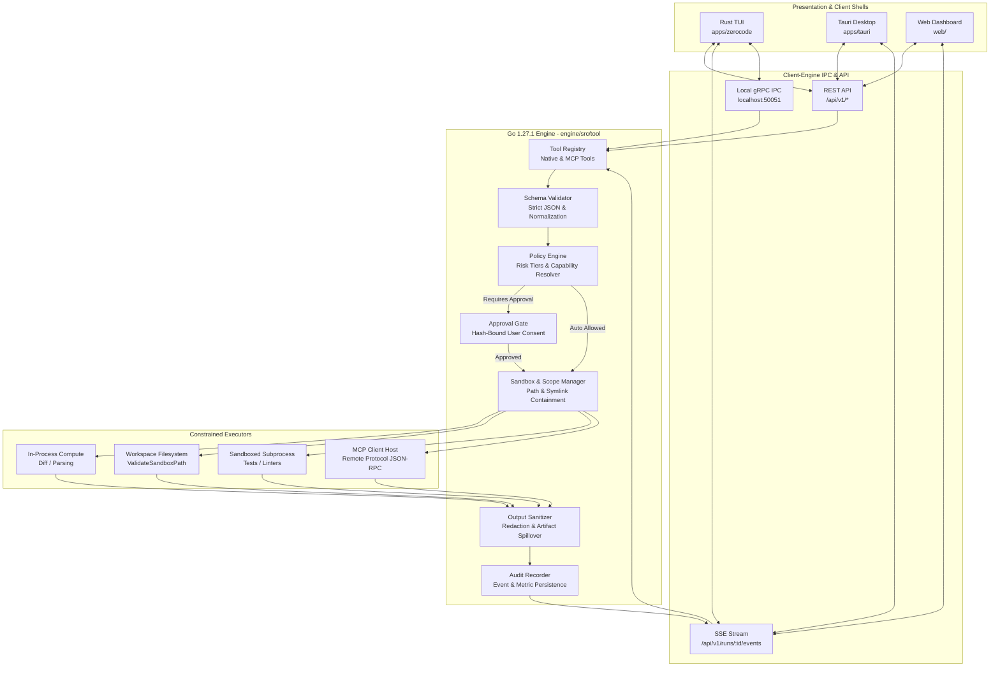

# Claw-Crew Phase 3 — Tool Calling Platform: Overview & Roadmap

> **Status:** Proposed Phase 3 Specification  
> **Parent Directory:** [`docs/refactoring/`](../../)  
> **Primary Runtime:** Go `1.27.1` (`engine/src/tool/`)  
> **Presentation / Shell:** Rust TUI (`apps/zerocode`), Tauri Desktop (`apps/tauri`), Web (`web/`)  
> **Date:** 2026-09-28  

---

## 1. Executive Summary

Tool calling (function calling) is the mechanism that enables Large Language Models (LLMs) to request structured actions beyond text generation—such as querying a repository, executing tests, fetching web evidence, generating artifacts, proposing code diffs, or invoking external APIs via the Model Context Protocol (MCP).

In Claw-Crew, tool execution is **never** an unrestricted shell or client-driven passthrough. The foundational architecture enforces a server-side Go control plane:

```text
┌─────────────┐       Tool Call Request        ┌───────────────────────────────────┐
│     LLM     │ ─────────────────────────────> │       Go 1.27 Orchestrator        │
│ (Requester) │                                │  (Policy Enforcement Authority)   │
└─────────────┘                                └─────────────────┬─────────────────┘
       ▲                                                         │
       │                                         1. Validate Schema & Canonical Hash
       │                                         2. Check Risk Tier & Capabilities
       │                                         3. Evaluate Scope (Path & Egress)
       │                                         4. Enforce User Approval if Required
       │                                                         │
       │            Safe, Sanitized Result                       ▼
       └────────────────────────────────────── ┌───────────────────────────────────┐
                                               │         Constrained Runner        │
                                               │ (Native / Sandbox / Remote MCP)   │
                                               └───────────────────────────────────┘
```

> **Core Principle:**  
> *Models may propose actions. The Go engine decides whether, where, how, and under which constraints those actions execute.*

---

## 2. Problem Statement & Evolutionary Opportunity

### 2.1 The Phase 2 Foundation
In Phase 2, Claw-Crew established a Go engine (`engine/`) with clean multi-agent orchestration, LLM streaming, basic tool dispatching (`engine/src/llm/dispatcher.go`), sandboxed path checks (`engine/src/tool/services.go`), and human-in-the-loop approval gates.

The immediate next challenge is expanding tool calling into a **governed, extensible execution platform** capable of:
- Auditing complex codebases and citing findings without side effects.
- Running unit tests and linters in isolated process sandboxes.
- Gathering web evidence without falling victim to prompt injection or SSRF.
- Proposing workspace patches with compare-and-swap (CAS) hash validation.
- Integrating external services seamlessly via the Model Context Protocol (MCP).

### 2.2 Why Naive Tool Calling Fails
Exposing broad tools like `execute_command(string)` or `write_file(string, string)` introduces catastrophic failure modes:
1. **Arbitrary Command Execution:** Malicious prompts can invoke destructive host commands.
2. **Path Traversal & Symlink Escapes:** Subagents can escape workspace roots without canonical resolution.
3. **Prompt Injection Egress:** Untrusted web content can instruct the model to exfiltrate secrets.
4. **Non-Idempotent Replays:** Retrying side-effecting operations (e.g. Git push, external webhooks) leads to duplicate side effects.
5. **Context Overflow & Token Waste:** Unbounded stdout/stderr dumps consume model context and bloat token costs.

---

## 3. High-Level Architecture Topology



---

## 4. Phase 3 Tool Calling Document Index

The Phase 3 Tool Calling platform documentation is categorized into modular, focused specifications:

| Document | Purpose & Focus Area |
|---|---|
| [**`prd.md`**](./prd.md) | **Product Requirements Document**: Problem statement, tool calling vs RAG, maturity levels (L0–L8), functional requirements (FR-01 to FR-10), and non-functional requirements. |
| [**`tech-spec.md`**](./tech-spec.md) | **Technical Specification (Engine Standards)**: Clean Architecture mapping in `engine/src/tool/`, domain contracts, Go 1.27.1 idioms, execution contexts, sandboxing, MCP client integration, and Wire dependency injection. |
| [**`api-spec.md`**](./api-spec.md) | **API Specification**: REST endpoints (`/api/v1/tools`, `/api/v1/approvals`), SSE streaming contracts, JSON error envelopes, and client UI/UX flows. |
| [**`security-governance.md`**](./security-governance.md) | **Security & Governance**: Capability hierarchy, one-time canonical approval binding, threat model (SSRF, prompt injection, TOCTOU), and secret redaction. |
| [**`testing-evals.md`**](./testing-evals.md) | **Testing & Evaluation Strategy**: Unit testing, race conditions (`go test -race`), golden evals fixtures, prompt injection resistance, and observability metrics. |
| [**`task-breakdown.md`**](./task-breakdown.md) | **Implementation Plan & Workflows**: Phase T0 to T5 task checklists, real-world crew workflows (Codebase Audit, Safe Patch, Research, SEO), and Definition of Done. |

---

## 5. Architectural Alignment with Existing Engine

The Tool Calling platform directly builds upon the clean architecture of `engine/`:
- **Location:** Resides in `engine/src/tool/` with clean interface separation (`interfaces.go`, `dto.go`, `services.go`, `delivery.go`, `wire.go`).
- **Core Integration:** Uses `engine/core/errors` for structured error envelopes, `engine/core/logger` for contextual `log/slog`, `engine/core/id` for unique request/execution IDs, and `engine/core/metrics` for Prometheus tracking.
- **Security Primitives:** Reuses and strengthens `ValidateSandboxPath` to enforce strict workspace containment, blocking lexical `..` escapes and symlink bypasses.
- **Wire DI:** Registers through `wire.NewSet` in `engine/src/tool/wire.go` into the composition root (`engine/app/wire.go`).
