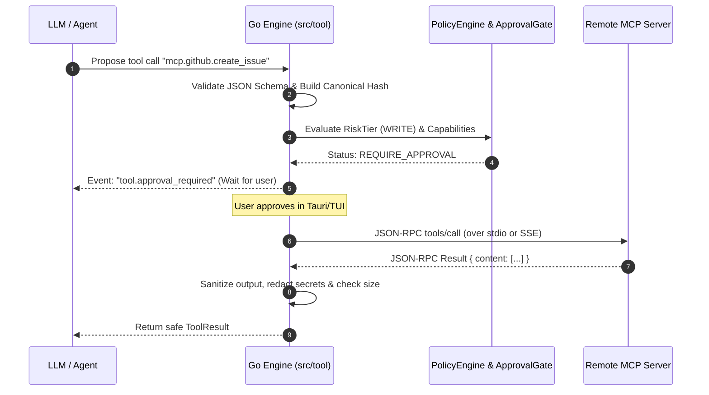

# Claw-Crew Phase 3 — Tool Calling Platform: Technical Specification

> **Status:** Proposed Technical Specification  
> **Package Target:** `github.com/diezy-labs/claw-crew/engine/src/tool`  
> **Runtime / Toolchain:** Go `1.27.1`  
> **Parent Directory:** [`docs/refactoring/phase3/tool-calling/`](./)  

---

## 1. Clean Architecture & Package Layout

In alignment with existing `engine/src/` domains (`crew`, `task`, `run`, `artifact`, `llm`, `memory`), the Tool Calling platform is organized strictly around Clean Architecture principles. It rejects sprawling generic packages and places all domain abstractions, DTOs, business services, and transport handlers in `engine/src/tool/`.

```text
engine/
├── core/
│   ├── errors/                 # Standard appErrors.New, Wrap, ErrorEnvelope
│   ├── logger/                 # Structured log/slog via logger.Get()
│   ├── id/                     # Prefix-based UUID generation (id.New)
│   ├── metrics/                # Prometheus metrics registration
│   └── tracing/                # Correlation and span contexts
├── app/
│   ├── wire.go                 # Composition root (Google Wire)
│   └── wire_gen.go             # Wire generated dependency injector
└── src/
    ├── artifact/               # Storage for large tool outputs/diffs
    ├── crew/                   # Orchestrator consuming ToolDispatcher
    ├── llm/                    # Provider streaming & ToolDispatcher
    └── tool/                   # Phase 3 Tool Calling Platform
        ├── interfaces.go       # Core contracts (Tool, Registry, ApprovalGate, Service)
        ├── dto.go              # DTOs, ExecutionContext, RiskTier, ApprovalStatus
        ├── services.go         # Implementation of tool execution, sandboxing, approvals
        ├── delivery.go         # REST API handlers and SSE event stream bridges
        ├── plugin.go           # Dynamic tool registration and external hooks
        ├── mcp_client.go       # Model Context Protocol (MCP) JSON-RPC client
        ├── wire.go             # Google Wire ProviderSet (wire.NewSet)
        ├── approval_enforcement_test.go
        ├── direct_dispatch_denial_test.go
        ├── path_containment_test.go
        └── tool_test.go
```

---

## 2. Domain Models & Data Transfer Objects (`dto.go`)

The domain models build directly upon the existing `engine/src/tool/dto.go` types while extending support for fine-grained risk classification, canonical hashing, and artifact pointers:

```go
package tool

import (
	"encoding/json/v2"
	"time"
)

// RiskTier categorizes the safety profile of a tool (Preserving existing engine standards)
type RiskTier string

const (
	RiskTierRead    RiskTier = "READ"
	RiskTierWrite   RiskTier = "WRITE"
	RiskTierExecute RiskTier = "EXECUTE"
)

// RiskClass provides granular risk categorization for policy engines
type RiskClass string

const (
	RiskClassRead                RiskClass = "read"
	RiskClassCompute             RiskClass = "compute"
	RiskClassNetworkRead         RiskClass = "network_read"
	RiskClassWriteDraft          RiskClass = "write_draft"
	RiskClassWriteWorkspace      RiskClass = "write_workspace"
	RiskClassExecuteSandboxed    RiskClass = "execute_sandboxed"
	RiskClassExecutePrivileged   RiskClass = "execute_privileged"
	RiskClassExternalAction      RiskClass = "external_action"
	RiskClassCredentialAccess    RiskClass = "credential_access"
)

// ApprovalStatus represents the state of a tool approval gate (Preserving existing engine standards)
type ApprovalStatus string

const (
	ApprovalPending  ApprovalStatus = "pending"
	ApprovalApproved ApprovalStatus = "approved"
	ApprovalDenied   ApprovalStatus = "denied"
	ApprovalTimedOut ApprovalStatus = "timed_out"
	ApprovalExpired  ApprovalStatus = "expired"
)

// IdempotencyMode defines how retries are handled across transient failures
type IdempotencyMode string

const (
	IdempotencySafe                  IdempotencyMode = "safe"
	IdempotencyKeyRequired           IdempotencyMode = "idempotent_key_required"
	IdempotencyCompareAndSwap        IdempotencyMode = "compare_and_swap"
	IdempotencyAtMostOnce            IdempotencyMode = "at_most_once"
	IdempotencyManualRecovery        IdempotencyMode = "manual_recovery"
)

// ExecutionContext defines the security, audit, and scoping boundary (BUG-005 compliant)
type ExecutionContext struct {
	ActorID            string   `json:"actor_id"`
	SessionID          string   `json:"session_id,omitempty"`
	WorkspaceID        string   `json:"workspace_id,omitempty"`
	CrewID             string   `json:"crew_id,omitempty"`
	RunID              string   `json:"run_id,omitempty"`
	TaskID             string   `json:"task_id,omitempty"`
	RequestID          string   `json:"request_id,omitempty"`
	ApprovalState      string   `json:"approval_state,omitempty"`
	AllowedRoots       []string `json:"allowed_roots,omitempty"`
	DataClassification string   `json:"data_classification,omitempty"`
}

// ToolDefinition describes a registered tool and its schema constraints
type ToolDefinition struct {
	ID               string          `json:"id"`
	Version          string          `json:"version"`
	DisplayName      string          `json:"display_name"`
	Description      string          `json:"description"`
	InputSchema      json.RawMessage `json:"input_schema"`
	OutputSchema     json.RawMessage `json:"output_schema,omitempty"`
	RiskTier         RiskTier        `json:"risk_tier"`
	RiskClass        RiskClass       `json:"risk_class"`
	Capabilities     []string        `json:"capabilities"`
	RequiresApproval bool            `json:"requires_approval"`
	TimeoutSeconds   int             `json:"timeout_seconds"`
	MaxOutputBytes   int64           `json:"max_output_bytes"`
	IdempotencyMode  IdempotencyMode `json:"idempotency_mode"`
	Source           string          `json:"source"` // "native" or "mcp:<server_name>"
}

// ApprovalRequest binds user consent to an immutable, cryptographically hashed payload
type ApprovalRequest struct {
	ApprovalID              string          `json:"approval_id"`
	ToolRequestID           string          `json:"tool_request_id"`
	ToolName                string          `json:"tool_name"`
	RiskTier                RiskTier        `json:"risk_tier"`
	RiskClass               RiskClass       `json:"risk_class"`
	ExecutionContext        ExecutionContext `json:"execution_context"`
	NormalizedArgumentsHash string          `json:"normalized_arguments_hash"`
	RawArguments            string          `json:"raw_arguments"`
	ResolvedTargets         []TargetResource `json:"resolved_targets"`
	Summary                 string          `json:"summary"`
	PreviewDiff             string          `json:"preview_diff,omitempty"`
	ExpiresAt               time.Time       `json:"expires_at"`
	Status                  ApprovalStatus  `json:"status"`
	ResolvedAt              *time.Time      `json:"resolved_at,omitempty"`
}

// TargetResource specifies physical assets affected by the tool execution
type TargetResource struct {
	Type         string `json:"type"`          // "file", "network_host", "git_branch"
	Target       string `json:"target"`        // e.g. "engine/src/tool/services.go"
	ExpectedHash string `json:"expected_hash"` // SHA-256 for CAS validation
}

// ToolExecution records an invocation of a tool (Preserving existing engine standards)
type ToolExecution struct {
	ID             string         `json:"id"`
	ActorID        string         `json:"actor_id"`
	RunID          string         `json:"run_id"`
	TaskID         string         `json:"task_id,omitempty"`
	ToolName       string         `json:"tool_name"`
	Arguments      string         `json:"arguments"`
	RiskTier       RiskTier       `json:"risk_tier"`
	ApprovalStatus ApprovalStatus `json:"approval_status"`
	Output         string         `json:"output,omitempty"`
	ArtifactIDs    []string       `json:"artifact_ids,omitempty"`
	ErrorMessage   string         `json:"error_message,omitempty"`
	CreatedAt      time.Time      `json:"created_at"`
	ResolvedAt     *time.Time     `json:"resolved_at,omitempty"`
}
```

---

## 3. Core Domain Interfaces (`interfaces.go`)

All business interfaces reside in `engine/src/tool/interfaces.go`:

```go
package tool

import (
	"context"
)

// Tool represents a runnable tool definition
type Tool interface {
	Name() string
	Description() string
	RiskTier() RiskTier
	Definition() *ToolDefinition
	Execute(ctx context.Context, args string, workspaceRoot string) (string, error)
	ExecuteWithContext(ctx context.Context, execCtx *ExecutionContext, args string) (string, []string, error)
}

// Registry manages registered native and MCP tools
type Registry interface {
	Register(t Tool) error
	Get(name string) (Tool, error)
	List() []Tool
	ListByScope(workspaceID string, allowedCapabilities []string) []Tool
}

// PolicyEngine evaluates if a tool call is permitted or requires explicit user approval
type PolicyEngine interface {
	Evaluate(ctx context.Context, execCtx *ExecutionContext, toolDef *ToolDefinition, args string) (PolicyVerdict, error)
}

type PolicyVerdict string

const (
	VerdictAllow           PolicyVerdict = "ALLOW"
	VerdictRequireApproval PolicyVerdict = "REQUIRE_APPROVAL"
	VerdictDeny            PolicyVerdict = "DENY"
)

// ApprovalGate coordinates user approval pauses for side-effecting tools
type ApprovalGate interface {
	RequestApproval(ctx context.Context, runID, toolName, args string, tier RiskTier) (bool, string, error)
	RequestApprovalWithContext(ctx context.Context, execCtx *ExecutionContext, toolName, args string, tier RiskTier) (bool, string, error)
	Resolve(executionID string, approved bool, reason string) error
	GetExecution(id string) (*ToolExecution, error)
	ListExecutions(runID string) []*ToolExecution
}

// Service coordinates tool execution, sandboxing, and approval gates
type Service interface {
	ExecuteTool(ctx context.Context, runID, toolName, args, workspaceRoot string, requireApproval bool) (string, error)
	ExecuteWithContext(ctx context.Context, execCtx *ExecutionContext, toolName, args, workspaceRoot string, requireApproval bool) (string, error)
	Approve(executionID string) error
	Deny(executionID, reason string) error
	ListExecutions(runID string) []*ToolExecution
}
```

---

## 4. Execution Pipeline & Sandboxing (`services.go`)

### 4.1 Strict Path Containment (`ValidateSandboxPath`)
The engine leverages the existing, hardened `ValidateSandboxPath` function in `engine/src/tool/services.go` to prevent directory traversal and symlink escapes (BUG-005):

```go
// ValidateSandboxPath verifies that targetPath resolves inside workspaceRoot and blocks traversal & symlink escapes
func ValidateSandboxPath(workspaceRoot, targetPath string) (string, error) {
	if workspaceRoot == "" {
		workspaceRoot = "."
	}

	cleanRoot, err := filepath.Abs(filepath.Clean(workspaceRoot))
	if err != nil {
		return "", fmt.Errorf("invalid workspace root: %w", err)
	}

	realRoot, err := filepath.EvalSymlinks(cleanRoot)
	if err != nil {
		realRoot = cleanRoot
	}

	var combined string
	if filepath.IsAbs(targetPath) {
		combined = filepath.Clean(targetPath)
	} else {
		combined = filepath.Join(cleanRoot, filepath.Clean(targetPath))
	}

	absCombined, err := filepath.Abs(combined)
	if err != nil {
		return "", fmt.Errorf("invalid path: %w", err)
	}

	// Lexical boundary verification
	rel, err := filepath.Rel(cleanRoot, absCombined)
	if err != nil || strings.HasPrefix(rel, "..") {
		return "", appErrors.New(appErrors.CodePermissionDenied, 
			fmt.Sprintf("path traversal blocked: %s is outside %s", targetPath, cleanRoot), 
			appErrors.LayerService)
	}

	// Symlink escape resolution (prevent pointing outside realRoot)
	evalTarget := absCombined
	if _, statErr := os.Lstat(absCombined); statErr == nil {
		if realTarget, symErr := filepath.EvalSymlinks(absCombined); symErr == nil {
			evalTarget = realTarget
		}
	}

	relReal, err := filepath.Rel(realRoot, evalTarget)
	if err != nil || strings.HasPrefix(relReal, "..") {
		return "", appErrors.New(appErrors.CodePermissionDenied, 
			fmt.Sprintf("symlink escape blocked: points to %s outside %s", evalTarget, realRoot), 
			appErrors.LayerService)
	}

	return absCombined, nil
}
```

### 4.2 Subprocess Sandboxing (`executeSandboxedProcess`)
For commands like linters and test suites:
1. **Isolated Working Directory:** Executed strictly within the validated workspace root.
2. **Environment Scrubbing:** Strips process environment of all host credentials (`AWS_*`, `GITHUB_TOKEN`, `OPENAI_API_KEY`). Only explicit allowlisted variables (`PATH`, `HOME`, `GOROOT`, `GOPATH`) are injected.
3. **Resource & Output Constraints:**
   - Dedicated child process group to guarantee cancellation (`syscall.Kill(-pgid, syscall.SIGKILL)` on Unix, `GenerateConsoleCtrlEvent` on Windows).
   - Standard output and error capped at `MaxOutputBytes` (default 50 KB). Excess bytes are streamed to `engine/src/artifact/` with an excerpt returned to the agent.

---

## 5. Model Context Protocol (MCP) Integration (`mcp_client.go`)

Claw-Crew integrates MCP natively within `engine/src/tool/` as an external tool provider without bypassing engine security policies:



### Key MCP Client Invariants:
1. **Untrusted Metadata:** Discovered tool descriptions and schemas from MCP servers are treated as untrusted input and sanitized.
2. **Risk Classification:** Discovered MCP tools default to `RiskTierWrite` unless explicitly allowlisted as read-only by workspace policy.
3. **Transport Timeouts:** Every MCP JSON-RPC call carries the active task `context.Context` with an enforced 30s timeout.

---

## 6. Dependency Injection (`wire.go`)

Following the standard pattern across all `engine/src/` domains, `engine/src/tool/wire.go` provides clean dependency injection through Google Wire:

```go
package tool

import (
	"github.com/google/wire"
)

// ProviderSet bundles all tool package services for Wire injection
var ProviderSet = wire.NewSet(
	NewRegistry,
	NewPolicyEngine,
	NewApprovalGate,
	NewService,
	NewDeliveryHandler,
)
```

In `engine/app/wire.go`, `tool.ProviderSet` is injected alongside `crew.ProviderSet`, `llm.ProviderSet`, and `artifact.ProviderSet` into the composition root.
